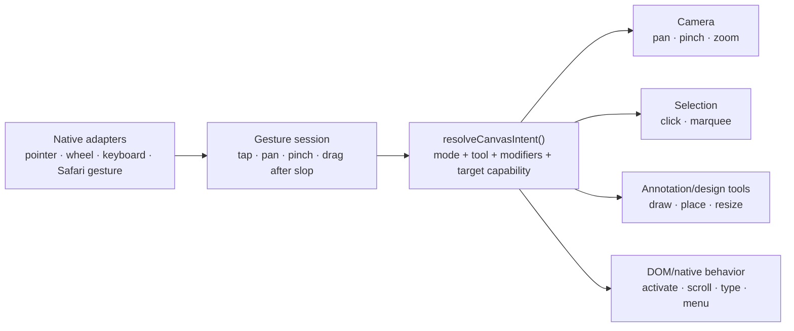

# Unify canvas input routing across mouse, keyboard, trackpad, and touch

## Overview

Replace the canvas's competing, propagation-dependent gesture handlers with one small input-routing pipeline. The viewport will observe every relevant input stream first, classify the gesture, resolve it against the active mode/tool and target capabilities, and dispatch exactly one semantic intent: pan, pinch, marquee, draw, manipulate, activate, native scroll, or context menu.

This fixes the reported mobile failure where a drag beginning inside a lane/container can be invisible to the camera, while preserving UNO's intentional desktop grammar: Design-mode selection, Shift selection, Cmd/Ctrl-click detail opening, Hand-tool navigation, wheel/trackpad navigation, keyboard zoom, Cmd/Ctrl-A, Escape precedence, and nested scrolling.

The implementation is deliberately a compact version of the boundary used by tldraw, React Flow, Excalidraw, BlockSuite, and MapLibre. It is not a canvas-framework migration.

## Problem statement

The current canvas has several independent gesture owners:

- `ZoomPanViewport` attaches React bubble-phase pointer handlers to the viewport (`src/components/editor/ZoomPanViewport.tsx:137-145`).
- `useZoomPanViewport` records a touch only after its `handlePointerDown` runs (`src/hooks/useZoomPanViewport.ts:988-1060`); unrecorded touches are ignored by `handlePointerMove` (`src/hooks/useZoomPanViewport.ts:1063`).
- `MarqueeSelection` claims primary pointerdown in native capture phase and stops propagation (`src/components/editor/MarqueeSelection.tsx:52-74`).
- Annotation objects and nested blueprint controls own separate pointer streams and frequently call `stopPropagation()`.
- Wheel input already uses a more robust window-capture listener with containment and scroll-ownership checks (`src/hooks/useZoomPanViewport.ts:799-897`).

This creates two classes of failure:

1. **The viewport may never hear pointerdown.** A descendant can stop the React event before it bubbles to the viewport. The camera never records the pointer, so subsequent touch moves do nothing.
2. **Gesture meaning is implicit in handler order.** Whether a drag pans, selects, or draws depends on which listener ran first and stopped propagation, rather than one explicit policy.

Merge `aac9cde` correctly fixed a separate WebKit problem by applying `touch-action: none` through the transformed board subtree. That prevents Safari from taking the gesture natively, but it cannot make a stopped React event reach the viewport. Both protections are required.

### Desktop grammar gap discovered during planning

The source comments and earlier plans say Space-drag remains available in Design mode (`src/components/editor/MarqueeSelection.tsx:38`), but no current source code tracks Space keydown/up. In practice, Select mode's capture listener claims every eligible primary drag unless the Hand tool is active. This plan makes Space-drag real and tests it as a first-class contract.

## Goals

- A pan or pinch can begin over empty canvas, a phase, lane, container, cell, or non-scrollable decorative child.
- One policy table explains the desktop and mobile interaction grammar.
- Keyboard modifiers that change a pointer/wheel gesture are evaluated by the same router as that gesture.
- Feature commands that are not pointer modifiers remain with their feature owners.
- Direct manipulation remains imperative during a gesture; React state is synchronized only after the stream settles.
- Nested scroll regions, text editing, menus, dialogs, resize handles, and context menus keep native/feature ownership.
- Existing selections, annotations, and camera state survive mode/tool changes exactly as they do today.

## Non-goals

- Adopting React Flow, tldraw, d3-zoom, or another canvas framework.
- Rewriting camera-fit or phase/scenario transition animation; that is planned separately in `2026-08-19-002-refactor-smooth-camera-transitions-plan.md`.
- Changing UNO's unusual but intentional cell-selection semantics.
- Adding mobile authoring; the mobile shell remains view-only.
- Moving every application shortcut into one global keyboard manager. Only key state that modifies canvas gestures belongs in the input router.

## Existing behavior that is a compatibility contract

| Input | Context | Required result |
| --- | --- | --- |
| Primary drag | View, non-interactive canvas content | Pan |
| Primary drag | Design + Select, empty canvas | Marquee selection |
| Primary drag | Design + Hand | Pan |
| Space + primary drag | Any desktop canvas tool/mode | Temporary pan; restore the prior tool on release |
| Middle-button drag | Desktop canvas | Pan without changing tools |
| Shift + cell click | Design | Range selection from the anchor |
| Cmd/Ctrl + cell click | Canvas | Open detail without changing the gathered selection (`src/lib/cellPickGrammar.ts:73-78`) |
| Plain cell click | Design | Toggle membership, not replace |
| Plain empty click | Design | Do not clear a long-lived gathered selection |
| Shift + marquee | Design | Add hits to selection |
| Cmd/Ctrl-A | Design, outside editable controls | Select all cells in reading order |
| Escape | Canvas | Close the highest-priority overlay first; clear canvas selection only if no overlay handled it |
| Wheel/trackpad scroll | Canvas | Pan unless a nested scrollable can consume the delta |
| Ctrl-wheel / trackpad pinch; Cmd-wheel | Canvas | Zoom around the pointer without browser page zoom |
| Cmd/Ctrl `+`, `-`, `0` | Outside editable controls | Zoom in, zoom out, fit |
| Right-click | Cell/control | Preserve current context-menu behavior; never begin a pan |
| One-finger drag | Mobile Map | Pan after touch slop, including when starting on a cell/container |
| One-finger tap | Mobile Map | Activate the tapped item if movement stays below slop |
| Two-finger gesture | Any mobile canvas tool | Pan/pinch the camera; navigation takes precedence over drawing |

## Proposed architecture



### 1. Pure policy module

Add `src/lib/canvasInputPolicy.ts`. It contains no DOM or React code.

```ts
export type CanvasIntent =
  | 'pending-tap'
  | 'pan'
  | 'pinch'
  | 'marquee'
  | 'draw'
  | 'manipulate'
  | 'activate'
  | 'native-scroll'
  | 'context-menu'
  | 'ignore'

export type CanvasInputSnapshot = {
  mode: 'view' | 'design'
  tool: CanvasTool
  pointerType: 'mouse' | 'touch' | 'pen'
  button: number
  modifiers: { space: boolean; shift: boolean; meta: boolean; ctrl: boolean; alt: boolean }
  target: CanvasTargetCapability
  activePointerCount: number
}

export function resolveCanvasIntent(input: CanvasInputSnapshot): CanvasIntent
```

Policy rules are ordered and explicit:

1. Two active touches always resolve to camera pinch/pan.
2. Right-click resolves to context menu; middle drag resolves to pan.
3. Space + primary mouse/pen resolves to temporary pan, unless focus is inside an editable field.
4. A feature-owned drag handle resolves to manipulate.
5. A scrollable/text/menu capability remains native.
6. Active draw/place tools resolve primary pen/mouse/touch to their tool.
7. Design + Select + empty canvas resolves to marquee.
8. View + canvas content resolves to pan.
9. Interactive content begins as `pending-tap`; touch movement past slop may promote it to pan.

### 2. Declarative target capabilities

Replace a growing `panIgnoreSelector` and handler-order assumptions with a small DOM contract:

```html
data-canvas-interaction="canvas | activate | text | scroll | drag-handle | menu"
```

The router walks from `event.target` to the viewport and chooses the closest explicit capability. Native element semantics provide defaults (`input`, `textarea`, `select`, `button`, links, `contenteditable`), so ordinary controls do not need attributes.

Initial annotations should be limited to surfaces whose semantics cannot be inferred:

- resize grips and draggable dividers → `drag-handle`
- portalled or embedded scroll regions → `scroll`
- canvas phase/container chrome that navigates only on click → `activate`
- board/cell decorative regions → `canvas`

Do not introduce a runtime component-registration broker. DOM capabilities are inspectable, work through portals when hit-tested, and are sufficient for UNO's scale.

### 3. One input controller

Add `src/hooks/useCanvasInputController.ts` and call it once from `ZoomPanViewport`.

Responsibilities:

- Attach native capture listeners to the active viewport root for pointerdown.
- Track active pointers and one gesture session in refs, not React state.
- Use pointer capture/window move-up-cancel listeners so a gesture survives leaving its original child.
- Attach wheel capture once and reuse the current containment/scroll chaining behavior.
- Track only gesture-modifying keyboard state (`Space`) via window keydown/keyup.
- Clear key and pointer state on `blur`, `visibilitychange`, unmount, and pointer cancellation.
- Apply movement slop before promoting a pending tap:
  - mouse/pen: retain the current 4 px marquee threshold;
  - touch: retain the current 10 px touch threshold.
- Snapshot the resolved intent when a drag crosses slop. Releasing Space mid-drag does not change the active gesture; the next gesture uses the new key state.
- Suppress the synthetic click only after an actual camera/tool drag, never after a tap or cancelled pending gesture.

The controller dispatches semantic callbacks supplied by the viewport, selection, and annotation owners. It must not import business components.

### 4. Keyboard and mouse composition

The implementation distinguishes two categories:

**Gesture modifiers, centralized**

- Space + primary drag → temporary pan.
- Shift at pointerdown → additive/range selection behavior.
- Cmd/Ctrl at click → detail-open behavior.
- Ctrl/Meta on wheel → zoom rather than pan.

**Commands, retained by feature owners**

- Cmd/Ctrl-A stays in `CanvasSelectionProvider`.
- Escape stays layered: dialogs/menus/panels first, then canvas selection.
- Cmd/Ctrl-Z stays with session changes.
- Arrow and Enter/Space accessibility handlers remain on their controls.
- Cmd/Ctrl `+`, `-`, `0` may remain in the camera hook, but share the router's editable-target guard utility.

Add `src/lib/keyboardTarget.ts` with `isEditableKeyboardTarget()` so zoom, selection, Space-pan, and future shortcuts use one guard.

Space behavior:

- `keydown` outside an editable control sets `spaceHeld` and prevents page scrolling only while the canvas is the active surface.
- Repeated keydown is ignored.
- Pointerdown while held resolves to pan and sets the grabbing cursor.
- The selected tool is not mutated; Space is a temporary override.
- `keyup`, blur, or visibility loss clears the held visual state. An in-progress pan ends only on pointerup/cancel.

### 5. Component migration

1. `ZoomPanViewport.tsx`
   - stop spreading bubble-phase `pointerHandlers` onto the viewport;
   - mount the new controller once;
   - expose `data-canvas-space-pan` / `data-canvas-gesture` for cursor and tests.
2. `useZoomPanViewport.ts`
   - retain camera transform, wheel math, fit, zoom limits, and React trailing sync;
   - expose imperative camera operations needed by the controller;
   - remove pointer/touch and keyboard-adapter code only after parity tests pass;
   - do not change `animateTransform` in this plan.
3. `MarqueeSelection.tsx`
   - remove its global capture listeners;
   - expose `begin/update/finish/cancelMarquee` callbacks to the controller;
   - keep intersection ordering and `pickModeForMarquee` unchanged.
4. `CanvasAnnotationLayer.tsx`
   - keep tool-specific drawing/manipulation state;
   - consume routed tool intents instead of relying on propagation to exclude the camera;
   - retain capture for a tool-owned active drag where needed.
5. Blueprint controls and editor chrome
   - annotate only ambiguous target capabilities;
   - remove pointer `stopPropagation()` calls only when their sole purpose was to block canvas pan;
   - retain click propagation guards that prevent nested activations until separately audited.

## Implementation phases

### Phase 1 — Pin the current grammar

- Add table-driven tests for `cellPickGrammar`, wheel ownership, zoom shortcuts, Hand tool, and current touch slop.
- Add a failing DOM regression test: touch pointerdown and drag starting inside a descendant that calls `stopPropagation()` must still move the camera.
- Add a failing Space-drag test in Design + Select.
- Record the expected tool/mode/input matrix in `src/lib/canvasInputPolicy.test.ts`.

Deliverable: tests demonstrate the container bug and the missing Space implementation before production handlers change.

### Phase 2 — Introduce policy and keyboard state

- Implement `canvasInputPolicy.ts` and `keyboardTarget.ts` as pure functions.
- Cover every row in the compatibility table, including mouse, pen, touch, modifier precedence, controls, scroll areas, and two-finger navigation.
- Implement Space state cleanup for keyup, blur, visibility loss, and unmount.

Deliverable: no UI behavior changes yet; pure policy is reviewable independently.

### Phase 3 — Route pointer/touch through one controller

- Implement the native capture adapter and gesture session.
- Route pan/pinch into existing imperative camera functions.
- Route marquee into existing selection operations.
- Preserve pointer capture, click suppression, touch ghost cleanup, Safari gesture suppression, and trailing React synchronization.
- Verify the original touch drag inside lanes/containers on a real iPhone/iPad-class Safari device.

Deliverable: the reported bug is fixed without changing selection semantics.

### Phase 4 — Route annotation/design tools and simplify components

- Integrate annotation draw/place/manipulate callbacks.
- Add target capability attributes to ambiguous controls.
- Remove obsolete propagation-based arbitration and duplicate pointer maps.
- Keep a temporary assertion/log in development if more than one owner attempts to claim a gesture.

Deliverable: handler order no longer decides global gesture meaning.

### Phase 5 — Browser validation and cleanup

- Add a focused Playwright browser suite if no existing real-browser harness is available. Keep it limited to canvas input so the dependency has a clear purpose.
- Run mouse, trackpad, keyboard, touch-emulation, and real-device smoke tests.
- Remove stale comments claiming behaviors that are no longer implemented by the named component.
- Document the policy table next to the pure resolver, not in multiple components.

## System-wide impact

### Interaction graph

```text
pointerdown capture
  -> resolve target capability
  -> snapshot mode/tool/modifiers
  -> begin pending gesture
pointermove
  -> remain tap below slop OR resolve one intent
  -> camera / marquee / tool owner updates imperatively
pointerup or cancel
  -> owner commits once
  -> React camera/selection state synchronizes
  -> click is suppressed only if a drag consumed the stream
```

Wheel remains:

```text
window wheel capture
  -> active viewport containment
  -> nested scrollability check
  -> pan OR pointer-centered zoom
  -> imperative transform
  -> trailing React sync
```

### State lifecycle risks

- **Stuck Space state:** clear on keyup, blur, visibility change, and unmount.
- **Ghost touch pointers:** clear on primary fresh contact and all cancel/unmount paths, retaining the current defensive behavior.
- **Tool switch mid-gesture:** the gesture keeps the owner selected at claim time; tool changes affect the next gesture.
- **Viewport unmount mid-gesture:** cancel without committing a synthetic click or leaving a cursor/selection rectangle.
- **Multiple mounted viewports:** only the viewport containing the event can claim it; wheel keeps `stopImmediatePropagation()` after ownership is established.
- **Portalled overlays:** default to UI ownership unless hit testing identifies the active viewport and the overlay explicitly opts into canvas navigation.

### Accessibility

- Never intercept Space when focus is in an editable control or a keyboard-activated button/menu.
- Preserve Enter/Space activation for focused phase sections and controls.
- Do not make pointer-only Hand mode the sole navigation path; keyboard zoom and Space-pan remain available.
- Cursor changes supplement rather than replace the visible Hand-tool state.

## SpecFlow edge-case analysis

The following cross-layer scenarios must be handled explicitly:

1. **Touch starts on a cell, crosses slop, then a second finger lands.** Pending activation is cancelled; the session rebases as pinch without opening the cell.
2. **Space is pressed while a text field is focused.** The character/page semantics remain native; no canvas pan state is armed.
3. **Space is held, a pan starts, then Space is released before pointerup.** The active pan continues without turning into a marquee mid-stream.
4. **Trackpad scroll begins over an overflowing cell editor.** The editor consumes deltas until its edge, after which scroll chaining hands the remaining direction to the canvas.
5. **A drawing tool is active and two fingers land.** One-finger draw is cancelled/suspended according to existing tool cancellation behavior; two fingers navigate.
6. **Right-click follows a gathered selection.** The context menu opens without clearing or adding to the selection and without moving the camera.
7. **Pointer cancellation occurs after slop.** The owner cleans transient UI, camera state is synchronized once, and no click fires.
8. **Two canvas viewports are mounted in different tab surfaces.** Exactly one claims a wheel/pointer stream.
9. **Cmd/Ctrl-click synthesized by the agent UI bridge.** It keeps the current idempotent detail-open semantics and does not enter the camera router as a drag.

## Acceptance criteria

### Functional

- [ ] One-finger pan works when starting on empty canvas, phase background, lane, container, cell content, and non-interactive decoration.
- [ ] A tap on the same interactive surfaces still activates the intended item when movement stays below slop.
- [ ] Two-finger pan/pinch works regardless of the first finger's target and active tool.
- [ ] Design + Select retains marquee; Shift-marquee adds; plain empty click does not clear.
- [ ] Hand-tool drag, Space + primary drag, and middle-button drag all pan without changing the selected tool.
- [ ] Shift-click, Cmd/Ctrl-click, Cmd/Ctrl-A, Escape precedence, and keyboard zoom match the compatibility table.
- [ ] Nested scrollable content consumes wheel input until it reaches the relevant edge.
- [ ] Right-click/context-menu and resize-handle drags do not pan.
- [ ] Drawing and manipulation tools receive exactly one stream and cannot simultaneously pan/select.

### Non-functional

- [ ] Pointermove, touchmove, and wheel do not set React state per frame.
- [ ] No new document-wide registry or general-purpose event bus is introduced.
- [ ] `canvasInputPolicy.ts` is pure and exhaustively table-tested.
- [ ] Production gesture ownership no longer depends on descendant `stopPropagation()`.
- [ ] Existing `touch-action` and Safari `gesture*` protections remain intact.

### Quality gates

- [ ] Vitest unit and DOM integration tests pass.
- [ ] Browser test reproducing a descendant-stopped pointer event passes in Chromium and WebKit.
- [ ] Real-device Safari smoke confirms pan/pinch inside a populated board.
- [ ] Mouse + keyboard smoke covers View, Design Select, Hand, annotation Select, and drawing tools.
- [ ] `npm run typecheck`, `npm test`, `npm run lint`, and `npm run build` pass.

## Success metrics

- Zero difference in pan delta when the same gesture starts on empty canvas versus a non-interactive descendant.
- One semantic owner per gesture in development instrumentation.
- No React commits during continuous pan/pinch frames; one trailing camera sync after idle/end.
- No regression in the existing cell-selection grammar tests.

## Dependencies and sequencing

- Implement this plan before the camera-transition plan because both touch `useZoomPanViewport.ts`.
- Keep the camera API boundary narrow so the transition plan can replace animation internals without reopening input arbitration.
- No database or Supabase changes are required.

## Risks and mitigations

- **Large refactor hides behavior drift:** land in phases with parity tests before deletion.
- **Capture listener steals legitimate controls:** capability resolution and editable/native guards run before gesture claim.
- **Space conflicts with button activation/page scroll:** arm only for an active canvas surface outside editable/interactive keyboard focus.
- **Touch drawing cancellation loses a stroke:** define and test the one-finger-to-two-finger promotion path per tool.
- **Browser test dependency cost:** keep the suite focused and use it only for behaviors jsdom cannot prove, especially propagation and pointer capture.

## Alternatives considered

### Patch every `stopPropagation()` call

Rejected. There are roughly 70 occurrences across editor/blueprint code, many are correct for nested click behavior, and every future child can recreate the bug.

### Change viewport handlers to React `onPointerDownCapture`

Useful as a minimal emergency patch, but insufficient as the final design. It lets the camera hear input, yet leaves marquee, annotation, Hand, and camera handlers competing through capture order.

### General component registration broker

Rejected for now. It adds lifecycle and priority machinery that UNO does not need. A pure policy plus declarative DOM capabilities provides the useful boundary with less code.

### Adopt React Flow or tldraw

Rejected. Their boundaries validate the design, but UNO's semantic blueprint layout and DOM-heavy cells do not map cleanly enough to justify a framework migration.

## Documentation plan

- Keep the authoritative interaction matrix in `canvasInputPolicy.ts` and its tests.
- Update stale Space-drag and propagation comments during migration.
- Add a short developer note explaining target capabilities and the rule: components declare what they are; the router decides global gesture ownership.

## Sources and references

### Internal

- Viewport event attachment: `src/components/editor/ZoomPanViewport.tsx:137-145`
- Pointer/touch state and slop: `src/hooks/useZoomPanViewport.ts:988-1185`
- Wheel capture and nested scroll ownership: `src/hooks/useZoomPanViewport.ts:799-897`
- Keyboard zoom: `src/hooks/useZoomPanViewport.ts:1280-1317`
- Marquee capture and selection: `src/components/editor/MarqueeSelection.tsx:21-165`
- Selection commands: `src/components/editor/CanvasSelectionProvider.tsx:229-265`
- Cell modifier grammar: `src/lib/cellPickGrammar.ts:8-151`
- Hand tool: `src/components/editor/CanvasAnnotationToolbar.tsx:307-323`
- Safari subtree fix: commit `aac9cde`
- Marquee introduction and Hand follow-up: commits `003ee9c`, `cd56965`

### External implementations

- [React Flow XYPanZoom boundary](https://github.com/xyflow/xyflow/blob/main/packages/system/src/xypanzoom/XYPanZoom.ts)
- [tldraw canvas event adapter](https://github.com/tldraw/tldraw/blob/main/packages/editor/src/lib/hooks/useCanvasEvents.ts)
- [tldraw gesture adapter](https://github.com/tldraw/tldraw/blob/main/packages/editor/src/lib/hooks/useGestureEvents.ts)
- [Excalidraw central pointer handling](https://github.com/excalidraw/excalidraw/blob/master/packages/excalidraw/components/App.tsx)
- [BlockSuite pan and keyboard-combination tests](https://github.com/toeverything/blocksuite/blob/master/tests/edgeless/pan.spec.ts)
- [MapLibre handler manager](https://github.com/maplibre/maplibre-gl-js/blob/main/src/ui/handler_manager.ts)

