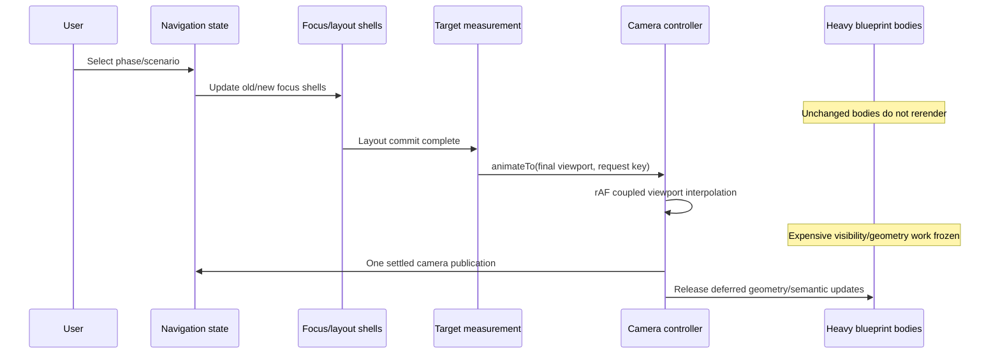

# Make phase and scenario camera transitions responsive and smooth

## Overview

Remove the main-thread stall that precedes phase/scenario camera motion, then replace independent pan/zoom lerping with a coupled viewport transition. Navigation should update only the old and new focus shells, measure the final target once, and hand one cancellable request to an imperative camera controller. Heavy blueprint bodies must remain stable while the camera is moving.

The intended experience is immediate cause and effect: click a phase or scenario, see motion begin on the next frame, travel along a stable path, and land exactly once without resize-driven corrections or delayed semantic rerenders.

## Problem statement

The visible symptom is a janky zoom animation, but the primary bottleneck occurs before animation math can help:

- Phase → scenario produced a roughly 326 ms Long Animation Frame in the measured development board.
- Scenario → phase produced a roughly 332 ms Long Animation Frame.
- Approximately 273–281 ms was attributed to the interaction's React callback/render work.
- The DOM contained roughly 6,300 elements, including about 663 blueprint cells and 22 panels.
- Useful camera samples sometimes did not begin until 300–435 ms after the click; subsequent frame gaps reached roughly 50–109 ms.
- ResizeObserver work added smaller 6–19 ms callbacks around the same transition.

Chrome defines a Long Animation Frame as a frame delayed beyond 50 ms. UNO is therefore spending several frame budgets reconciling the board before the camera can present continuous motion.

### Why React does so much work

`ServiceOverviewView` reads the full `EditorContext` (`src/components/editor/ServiceOverviewView.tsx:304-317`) and maps every phase (`src/components/editor/ServiceOverviewView.tsx:987-1012`). `PhaseScenarioOverview` also reads `useEditor()` directly (`src/components/blueprint/PhaseScenarioOverview.tsx:121`) and maps scenario panels (`:317-355`). `ServicePhaseSection`, `PhaseScenarioOverview`, and `ScenarioBlueprintPanel` are not currently memoized boundaries.

The outer `memo(ServiceOverviewView)` at `src/components/editor/ServiceOverviewView.tsx:1134` prevents unrelated parent-prop rerenders, but React context changes still rerender a memoized consumer. Navigation changes `view`, selected IDs, `cameraTargetId`, and `focusNonce` in the combined provider (`src/contexts/EditorContext.tsx:21-82`, `:252-320`, `:365-386`).

The focused scenario also changes real layout: it leaves the shared-height overview contract and may switch to a stacked/merged posture (`src/components/blueprint/PhaseScenarioOverview.tsx:320-343`). That layout change is necessary; reconciling every unaffected phase and cell is not.

### Why the motion path can still feel wrong after the stall

`animateTransform` currently applies the same eased scalar to independent linear interpolation of `pan.x`, `pan.y`, and `zoom` (`src/hooks/useZoomPanViewport.ts:377-405`). During a large zoom ratio, independently interpolating translation and scale can make the apparent destination drift or curve before converging.

The current hook already contains good safeguards that must be preserved:

- camera transforms are written imperatively during continuous input;
- React camera state is synchronized after the gesture settles;
- semantic zoom commits to the destination tier from the first animation frame;
- resize refits avoid blindly restarting the same ease;
- reduced motion can bypass animation.

## Goals

- Navigation-to-first-camera-frame is under 50 ms on the baseline board.
- Unchanged phases/scenarios do not rerender when focus moves elsewhere.
- The target layout is committed and measured once per navigation transaction.
- Exactly one owner controls a programmatic camera transition.
- Direct user input cancels the active transition without snapping back.
- Pan and zoom follow one coupled viewport path with straight, monotonic screen movement.
- Resize/arrow geometry and expensive semantic work do not compete with active camera frames.
- Phase → scenario, scenario → phase, phase → phase, repeated-target recenter, and reduced-motion navigation share the same lifecycle.

## Non-goals

- Virtualizing the entire blueprint in the first implementation. Render isolation should be measured before adding culling complexity.
- Replacing HTML blueprint cells with canvas/WebGL rendering.
- Adding a MapLibre-style zoom-out flight arc for ordinary hierarchical navigation.
- Redesigning phase/scenario information architecture or navigation semantics.
- Reintroducing the rejected flight breadcrumb from `docs/plans/2026-08-08-002-feat-desktop-ui-refinements-plan.md`.
- Rewriting direct input routing; that is covered by `2026-08-19-001-fix-unified-canvas-input-routing-plan.md`.

## Proposed architecture



The work has three layers and must be implemented in this order:

1. **Render isolation:** remove the 300 ms React barrier.
2. **Navigation transaction:** one commit, one measurement, one cancellable camera owner.
3. **Motion geometry:** coupled viewport interpolation and adaptive timing.

Changing easing before layer 1 is complete cannot fix the delayed first frame.

## Technical approach

### 1. Establish a reproducible performance baseline

Add a development-only measurement utility or browser test helper that records:

- click/pointer timestamp;
- first camera transform timestamp;
- animation completion timestamp;
- Long Animation Frames and script attribution when supported;
- frame-gap distribution during the transition;
- React Profiler commit durations and rendered phase/scenario IDs;
- ResizeObserver callback count/duration during the transaction.

Use a fixed representative fixture: the current full service overview with approximately 663 cells. Record Phase → Scenario and Scenario → Phase separately because they change layout differently. Capture performance gates from a production build served locally; use development mode only for React Profiler labels and render-count diagnosis.

Do not turn raw timing into a brittle unit test. Use tolerant browser performance gates and deterministic render-count/interpolation unit tests.

### 2. Split context readers from heavy renderers

#### 2.1 Separate provider concerns

Refactor `src/contexts/EditorContext.tsx` into `EditorDataContext` and `EditorNavigationContext` so board data/display preferences and navigation/focus state are independently consumable. This is the chosen first implementation because it uses React's existing primitives and keeps the change understandable. Do not create a new general state library. If measured context fan-out remains above the render-count acceptance criteria after the split, treat a small selector-based `useSyncExternalStore` as a separately justified fallback rather than building it speculatively.

Navigation context contains:

- `view`, selected phase/scenario IDs, expanded phase IDs;
- `cameraTargetId`, `focusNonce`, one-shot fit-skip intent;
- stable navigation commands (`selectPhase`, `selectScenario`, `goHome`, `openDetail`).

Data/display context contains:

- `slides`, loading/error state;
- stable per-scenario display view values and setter.

Avoid passing a fresh aggregate `nav` object to consumers that only need one field. Provider values and command identities must remain stable when their inputs do not change.

#### 2.2 Introduce thin controller boundaries

Split `ServiceOverviewView` into:

- `ServiceOverviewController`: reads contexts, builds stable per-phase view models, and owns navigation-to-camera request construction;
- `ServiceOverviewCanvas`: receives minimal props and renders the board;
- `MemoizedServicePhaseSection`: receives one phase model plus primitive focus/dim flags.

Remove `useEditor()` from `PhaseScenarioOverview`. Pass stable `onNavigate` and resolved display-view values/model data as props.

Memoize these heavy boundaries after their inputs are stabilized:

- `ServicePhaseSection`;
- `PhaseScenarioOverview`;
- `ScenarioBlueprintPanel` or its expensive grid body.

Memoization alone is not the fix. Fresh arrays, objects, and inline callbacks must be eliminated or moved behind stable per-ID view models. Use a custom comparator only where normalized identity cannot be made stable; document every compared field.

#### 2.3 Separate focus chrome from heavy bodies

Structure each phase/scenario as:

```tsx
<FocusShell dimmed={...} active={...}>
  <MemoizedScenarioBody model={stableModel} />
</FocusShell>
```

Only the old/new `FocusShell` and a scenario whose layout genuinely changes should rerender. Unchanged blueprint grids remain mounted with identical props.

At the phase level, a focus move should update at most:

- the previously focused phase shell;
- the newly focused phase shell;
- the active scenario body if it enters/leaves the shared-height overview layout.

Remove per-panel `transition-[opacity,filter]` and animated `filter` from `ScenarioBlueprintPanel` (`src/components/blueprint/ScenarioBlueprintPanel.tsx:432-457`). Follow the newer `CanvasPhaseSection` rule: animate wrapper opacity only and land any saturation change without transition (`src/components/editor/CanvasPhaseSection.tsx:163-182`). Prefer one composited shell over transitions on descendants.

### 3. Create one navigation transaction

Add `src/lib/camera/CameraController.ts` and a small React bridge in `src/hooks/useCanvasCamera.ts`, or extract equivalent modules from `useZoomPanViewport` without changing its public viewport component contract.

Suggested request type:

```ts
type CameraTransitionRequest = {
  key: string
  reason: 'phase' | 'scenario' | 'overview' | 'recenter' | 'focus-cells'
  target: CameraViewport
  duration?: number
  animate: boolean
}
```

Controller responsibilities:

- own the live transform and active animation frame ID;
- accept one resolved target viewport, not a DOM element that may keep changing;
- cancel/replace an older request atomically;
- cancel on direct pan, pinch, wheel, zoom button, or keyboard zoom;
- write transforms imperatively per frame;
- publish React camera state once at completion/cancellation;
- expose `isMoving` to coordinate deferred work without publishing every frame through React;
- honor reduced motion with an immediate atomic commit.

Navigation lifecycle:

1. Navigation action updates focus/layout state and produces a unique request key (`focusNonce` continues to support repeated-target recentering).
2. React commits only affected focus/layout shells.
3. A layout effect resolves the final target bounds once after the target layout exists.
4. The next animation frame starts the camera request.
5. Resize changes during the transition are recorded, not used to restart the animation.
6. At landing, apply at most one equality-guarded correction if viewport/target geometry materially changed.

This replaces loosely coupled `fitKey`, content-settle, ResizeObserver, and animation effects with a named transaction boundary while preserving the existing reveal choreography unless measurement proves it must be simplified.

### 4. Keep expensive work off camera frames

Use tldraw's principle: camera motion should not trigger expensive visibility/mounting/semantic decisions on every intermediate zoom.

During `camera.isMoving`:

- do not publish React pan/zoom state per frame;
- freeze the semantic render tier to the destination tier, preserving current behavior;
- defer phase-loop and arrow ResizeObserver geometry reconciliation;
- do not rebuild path/compare models because of camera state;
- avoid mounting/unmounting large subtrees based on intermediate visibility;
- keep focus pointer blocking on lightweight shells.

At idle/landing:

- publish the final transform once;
- release one coalesced geometry update;
- run any visibility/semantic correction once;
- clear the transaction state.

Consolidate or gate observers in:

- `CanvasPhaseSection`;
- `PhaseOverviewPhaseLoopArrow`;
- aligned phase/scenario height hooks;
- trigger-arrow geometry components.

Observer callbacks should schedule through one equality-guarded coordinator rather than each forcing state during the flight. Do not disconnect observers merely to suppress them; cache their latest measurement and flush after motion.

### 5. Replace independent transform interpolation

Choose viewport-rectangle interpolation for UNO because it is compact and easy to test.

Represent a camera by the visible scene rectangle:

```ts
type CameraViewport = { x: number; y: number; width: number; height: number }
```

For viewport screen size `W × H` and current `{ pan, zoom }`:

```ts
sceneX = -pan.x / zoom
sceneY = -pan.y / zoom
sceneWidth = W / zoom
sceneHeight = H / zoom
```

Interpolate the rectangle edges/size with one eased progress value, then convert each frame back into `{ pan, zoom }`. Because both endpoints share the viewport aspect ratio, width/height remain consistent. Land bit-exactly on the target at progress `1`.

Alternative implementation: Excalidraw's geometric zoom plus affine interpolation of `pan × zoom`. It also produces straight, monotonic screen trajectories but is less immediately readable. Use it only if viewport-rectangle tests reveal a pacing problem.

Required interpolation invariants:

- exact start and target endpoints;
- finite values for pure pan and near-equal zoom;
- zoom remains within configured min/max;
- target center moves monotonically toward its destination;
- no scene point moves away from its destination before converging;
- resize/cancel starts the next action from the actual live transform, not stale React state.

### 6. Motion timing

- Preserve the existing structural easing token unless user testing demonstrates a problem after stalls are removed.
- Use an adaptive duration based on screen-space travel and zoom ratio, clamped to a restrained range (initial tuning target: 240–420 ms).
- Recenter to an already-near target should be shorter than overview → scenario.
- Do not use a zoom-out-and-back `flyTo` arc for normal phase/scenario hierarchy changes; it adds spatial drama where direct continuity is clearer.
- `prefers-reduced-motion: reduce` commits the destination immediately and still performs the one-time settled sync.

### 7. Preserve and repair agent camera control

The camera controller becomes the single semantic camera API for humans, UI controls, compare surfaces, and the in-app agent. Component extraction must not strand the agent behind stale closures or force it to simulate wheel/pointer events.

Required agent-facing behavior:

- `open_phase` and `open_scenario` continue through `AgentUiBridge`, create the same navigation transaction as a human sidebar selection, and await a deterministic layout/camera outcome before claiming completion.
- the live `zoom` UI command and `canvas_camera` command remain registered once for the explicitly active viewport and call the same `CameraController` primitives used by human controls.
- the existing `focusCells` registry remains available to difference-ledger and compare callers and delegates to `CameraController.focusCells`.
- `open_cell_panel` still opens the visible panel and is verified through the `cell-panel` UI-context contributor after navigation settles; replace the fixed 250 ms assumption with a deterministic target/context wait bounded by the command timeout.
- `annotate_cells` continues to un-project cells into annotation coordinates correctly at any camera transform and after a transition.
- `get_ui_state` gains a lightweight camera contributor such as `Canvas camera: 70%, idle, active scenario, target scenario` so the agent can ground whether a camera command landed without inspecting DOM transforms.

Fix an existing parity defect while creating the controller: `agentFocusCell()` currently calls `scrollBlueprintCellIntoView()`, which intentionally returns without scrolling when the cell is inside `[data-zoom-pan-viewport]` (`src/lib/blueprintCellConnections.ts:314-327`). The tool can therefore claim “Scrolled the canvas” while doing nothing. Route `focus_cell` through the active viewport's registered `focusCells`/camera controller instead and return the controller's real `flown` or `miss` result. Never report success on a missing/unmounted target.

Implement an active camera registration in `src/lib/agent/uiBridge.ts` or extend `src/lib/canvasFocusCells.ts` with an explicitly active viewport entry. Keep scenario-keyed registrations for compare/deep-link callers. Resolve registrations at call time, as today, so a remounted viewport cannot be driven through a stale function.

Do not use component mount order as active ownership. `registerAgentUiCommand()` currently stores singleton commands in a map keyed only by name, so two mounted `ZoomPanViewport`s can make the most recently registered `zoom` callback win even if its surface is hidden. Register singleton camera commands only from a thin controller with an explicit `active` flag, clean them up on ownership change, and add a development/test collision assertion. Avoid a general command-bus redesign unless another independent need appears.

Make programmatic camera completion observable. `CameraController` returns a Promise with a discriminated result such as `completed`, `miss`, `cancelled`, or `superseded`, plus the final target/zoom when completed. Human callers may fire-and-forget; agent bridge and UI-command callers await or accurately report cancellation. The current synchronous `focusCells` result only proves that an animation was launched, not that it landed.

Render isolation creates a second ownership hazard. `ScenarioBlueprintPanel` currently registers the `compare` UI-context contributor plus `jump_divergence` and `differences_filter` when a compare model exists. If heavy inactive panels stay mounted after memoization, those registrations can remain live and redirect agent commands to stale scenario state. Move surface registrations into the thin active controller or gate them by explicit active scenario/tab state; do not rely on incidental unmounting. Apply the same audit to `zoom`, scenario `focusCells`, cell-panel commands, path filters, selection, Make Slice, shell/tab/presentation commands, and changes/revert commands.

The CLI LLM harness cannot prove these visual effects: it imports the real tool declarations but mocks `get_ui_state` and tool results. Add browser-level agent-control integration tests alongside the harness smoke. The harness remains responsible for model tool choice/order; the browser test is responsible for proving the real app moved.

### Agent-native camera/render capability map

| Capability | Current production path | Risk introduced/exposed by this plan | Planned contract and verification |
| --- | --- | --- | --- |
| Overview/phase/scenario navigation | `AgentUiBridge` calls shell callbacks synchronously | Success may be returned before layout and camera landing | Await the shared navigation transaction; verify selected shell, active owner, and `completed/cancelled/superseded` outcome |
| Focus a cell | `agentFocusCell` calls `scrollBlueprintCellIntoView` | Existing transformed-canvas no-op falsely reports success | Resolve active camera at invocation, call `focusCells`, await result, verify target is visible |
| Pan/zoom/fit/cancel | dynamic `zoom`; no semantic relative pan | Multiple mounted viewports can register the same name | One active `canvas_camera` plus compatible `zoom` alias; test exact owner, live-transform start, cancellation, endpoint |
| Focus compare divergence | `jump_divergence` uses scenario focus registry | Immediate `flown` means launched, not landed; inactive compare panel may own command | Active compare controller awaits camera result and reports real landing/miss |
| Open cell panel | synthetic Cmd-click plus fixed 250 ms wait | Planned 240–420 ms camera can outlive the wait; Hand/dim state can block click | Await navigation/focus, normalize semantic interaction state, verify requested panel context with deterministic wait |
| Select/make slice/path filters | provider and surface UI commands | Context split/memoization can retain stale closures or skip visible refresh | Keep semantic stores shared; test selection/context and current active surface after tab switch |
| Annotate/clear | provider writes annotation data directly | Stale transform during flight can misproject marks | Use live transform or await/cancel landing; verify cell-aligned bounds during and after transitions |
| Compare filters/ledger | panel-scoped commands and contributor | Preserved inactive bodies can advertise stale scenario commands | Gate registration by explicit active scope; verify command list/context on scenario switch |
| Agent data writes and revert | tool registry invalidates shared queries; changes sheet commands | Memoized view models can suppress visible agent-authored updates | Version affected scenario view model on query invalidation; assert affected content rerenders and unaffected phase count remains zero |
| Runtime grounding | shell/compare/panel/selection/changes contributors | Camera/tool/active owner are currently invisible | Add ref-backed camera/tool contributor; verify one current context and no per-frame React subscription |

### Full agent surface inventory and disposition

Treat this as the review checklist for the implementation PR. A named surface may be unchanged, but it cannot be silently omitted from impact verification.

- **Read/grounding tools — no behavioral redesign:** `read_reference`, `list_scenarios`, `get_blueprint`, `get_compare_diff`, `get_cell`, `list_slices`, `get_slice`, `list_owner_tags`, `get_change_history`, `list_findings`. Rerun registry/parity tests and verify the active camera/context additions do not change response data or require a mounted viewport for non-UI reads.
- **Navigation and UI tools — directly affected:** `get_ui_state`, `open_phase`, `open_scenario`, `focus_cell`, `list_ui_commands`, `ui_command`, `open_cell_panel`, `set_canvas_mode`, `set_sidebar`, `annotate_cells`. Exercise every tool through the production registry; assert outcome and visible/current context, not result wording alone.
- **Blueprint write tools — indirectly affected by memoization:** `create_phase`, `create_scenario`, `create_path`, `duplicate_path`, `duplicate_scenario`, `create_slice`, `update_slice`, `replace_slice_frames`, `add_step`, `add_lane`, `upsert_cell`, `update_cell_content`, `update_cell_spec`, `set_cell_dependency`, `rename_path`, `record_finding`, `set_finding_status`. Keep their mutation wrappers, session ledger, authorization, and invalidation paths unchanged. Use representative structural, cell-content, cell-spec, slice, dependency, and finding writes to prove visible affected models refresh; static parity covers the rest of the dispatch roster.
- **Safety/read-before-write tool — unchanged:** `get_deletion_impact` remains available and read-only. This refactor must not broaden deletion capability.
- **Dynamic canvas/surface commands — lifecycle audit required:** `zoom`, planned `canvas_camera`, planned `set_canvas_tool`, `select_cells`, `clear_cell_selection`, `clear_annotations`, `toggle_path_filter`, `restore_default_paths`, `open_make_slice`, `jump_divergence`, `differences_filter`, `panel_surface`, `differences_open`, `differences_close`, `cell_panel_tab`, `cell_panel_expand`, and `cell_panel_close`.
- **Dynamic shell/session commands — lifecycle smoke required:** `go_overview`, `activate_base_tab`, `open_slice_tab`, `present_slice`, `exit_presentation`, `close_slice_tab`, `toggle_phase_expanded`, `set_scenario_view`, `undo_last_change`, `keep_all_changes`, `revert_my_changes`, and `revert_all_changes`.

For dynamic commands, test discoverability, correct active owner, one invocation, visible effect, context update, and cleanup after the owning surface becomes inactive. For write tools, test shared-workspace convergence: an agent change must appear in the same board the human sees and must remain represented in the existing session ledger/revert UI.

### Comprehensive agent regression strategy

Use three layers because each catches a different class of failure:

1. **Static/source parity:** retain `scripts/tests/toolParity.test.mjs` to prove the app registry, tool specs, write roster, and harness declarations stay one-sourced. Add a focused UI-command ownership test for registration, active switching, cleanup, duplicate detection, and stale-closure prevention.
2. **LLM harness behavior:** add/retain cases that require `get_ui_state` before acting and exercise `open_scenario` → `focus_cell` → `open_cell_panel`, compare navigation, and annotation/write follow-up. This proves tool choice and sequencing only; its mocked results are not visual evidence.
3. **Real-browser agent-control contract:** invoke the production tool registry and UI bridge against the mounted app. Cover overview → phase → scenario → cell, relative pan, zoom/fit/cancel, user interruption, compare divergence, panel open/close, mode/tool, cell selection, annotation alignment, path filters, agent-authored data refresh, revert, tab/viewport switching, and `get_ui_state`/`list_ui_commands` after each ownership change. Assert visible DOM/transform outcomes, not success strings alone.

Run a mobile variant that checks the intended product boundary: mobile read/navigation/focus/panel/camera actions still work, while desktop-only authoring tools and commands are neither exposed nor accidentally callable. This prevents “full control” from being confused with advertising unsupported mobile editing.

## Implementation phases

### Phase 1 — Instrument and pin render behavior

- Add baseline browser measurement for both navigation directions.
- Add React Profiler/render-count instrumentation in development/tests.
- Add tests proving that an unchanged phase body does not render when another phase becomes focused.
- Add interpolation invariant tests around the current transform so later math changes are isolated.

Deliverable: repeatable evidence, not subjective “feels smoother” evaluation.

### Phase 2 — Isolate heavy rendering

- Split editor data/navigation subscriptions.
- Introduce thin controller and stable phase/scenario view models.
- Memoize heavy phase and scenario bodies with stable props.
- Move focus/dim/pointer blocking to lightweight wrappers.
- Remove animated filters from scenario panels.
- Inventory every `registerAgentUiCommand`/`registerAgentUiContextContributor` owner affected by extraction. Move compare/camera/surface registrations to thin active controllers or gate them with explicit active state before preserving inactive bodies.
- Add tests proving a scenario/tab switch removes stale `compare`, `jump_divergence`, `differences_filter`, and camera ownership while retaining the correct current shell, selection, path, panel, and changes surfaces.
- Prove agent query invalidation updates the affected memoized scenario model while leaving unrelated phase render counts at zero.

Deliverable: first camera work begins within 50 ms on the baseline board before animation math changes.

### Phase 3 — Introduce the camera transaction/controller

- Extract live transform and programmatic transition ownership.
- Resolve final target once after layout commit.
- Make user input cancellation authoritative.
- Freeze/defer expensive observer-driven work while moving and flush once after landing.
- Preserve repeated-target recenter and one-shot no-animation entry behavior.
- Re-register `zoom`, scenario-keyed `focusCells`, and the active agent camera bridge against the controller using identity-stable callbacks.
- Register `canvas_camera` and the `zoom` compatibility alias from the explicit active owner; add collision/cleanup tests.
- Route `agentFocusCell` through the real active camera, make camera results awaitable, update compare jump callers, and add the ref-backed camera UI-context contributor.
- Make `open_phase`, `open_scenario`, `focus_cell`, and follow-on `open_cell_panel` report verified transaction outcomes rather than launch-time assumptions or a fixed 250 ms delay.

Deliverable: one request, one animation, one settled publication per navigation.

### Phase 4 — Coupled viewport interpolation

- Implement rectangle/affine conversion helpers as pure functions.
- Replace independent pan/zoom lerp.
- Add adaptive duration and exact endpoint landing.
- Validate phase → scenario, scenario → phase, distant phase → phase, and interrupted transitions.

Deliverable: no swoop/drift after responsiveness is fixed.

### Phase 5 — Performance and visual acceptance

- Rerun the same baseline on desktop and a representative mobile/tablet device.
- Compare LoAF, first-frame delay, frame gaps, React commits, and observer work.
- Test reduced motion and low-power/mobile Safari behavior.
- Remove temporary instrumentation or gate it behind a development flag.

## System-wide impact

### Interaction graph

```text
selectScenario(id)
  -> navigation state updates selected IDs + focusNonce
  -> only old/new focus shells and active layout body commit
  -> layout effect measures final scenario bounds
  -> CameraController.animateTo(resolved viewport)
  -> rAF applies coupled transforms without React renders
  -> controller lands exactly
  -> one React camera sync + one geometry flush
```

Reverse navigation follows the same path with an overview/phase target rather than a separate animation mechanism.

### Failure and cancellation propagation

- Missing/unmounted target: cancel the request, keep the current camera, and fall back to a guarded full-board fit only when navigation semantics require it.
- Superseding navigation: cancel the older request and start from the live transform after the new target commits.
- User input: cancel immediately; the user's current gesture owns the camera from that point.
- Resize/rotation: record the new viewport, finish/cancel according to policy, then apply one corrected target. Never restart every observer notification.
- Reduced motion: skip rAF while preserving the same completion/cleanup path.
- Component unmount: cancel rAF and observers; do not publish to an unmounted React bridge.

### State lifecycle risks

- **Context split divergence:** navigation commands and data must still share the same slide identities. Add provider integration tests.
- **Memoization with stale props:** stable callbacks/models must include every value used by a body. Prefer normalized primitives over clever comparators.
- **Measurement race:** start only after the target layout commit; use the request key to discard measurements for superseded navigation.
- **Deferred geometry stale at landing:** cache the latest observer payload and flush exactly once.
- **Animation/input race:** both routes read/write one live transform; never begin from React's trailing copy.
- **Semantic tier mismatch:** destination tier is selected from request target and remains fixed during the transition.

## SpecFlow edge-case analysis

1. **User clicks Scenario B while the flight to Scenario A is active.** A is cancelled; B measures after its layout commit and begins from the live mid-flight transform.
2. **User wheel-pans during a programmatic flight.** The flight cancels before the wheel delta is applied; it cannot resume or snap back.
3. **The same sidebar row is selected twice.** `focusNonce` creates a new recenter request even though the selected ID did not change.
4. **A focused scenario changes from fixed row height to natural stacked height.** Measurement occurs after that specific body commits; unaffected phases remain memoized.
5. **A ResizeObserver fires repeatedly during the move.** Latest geometry is cached; no React state is written per notification; one correction occurs after landing if required.
6. **The target is removed by a concurrent data refresh.** The stale request key is discarded and the camera retains its current live transform or performs the documented fallback fit.
7. **Reduced motion is enabled.** Focus/layout changes and final camera position remain correct without intermediate frames or reveal deadlocks.
8. **Navigation begins during initial loading/landing choreography.** The explicit transaction supersedes passive fit/reveal work; only one camera owner remains active.
9. **The viewport rotates on mobile during a transition.** Current motion cancels or lands from the live transform, new bounds are measured once, and no identity flash occurs.
10. **A phase has no visible scenario/path content after filters.** Target resolution uses the phase shell or documented empty-state bounds rather than producing `NaN`/zero-scale geometry.
11. **The agent calls `open_scenario`, then `focus_cell`, then `open_cell_panel`.** Navigation settles through one transaction; focus moves through the active camera registry; the panel opens on the visible target; every result is verified rather than assumed.
12. **The agent calls `zoom` while a programmatic navigation is active.** The navigation cancels, the agent zoom starts from the live transform, and the command remains registered exactly once.
13. **An agent write invalidates blueprint data while heavy bodies are memoized.** The affected scenario model rerenders with the new cell/path data; render isolation must never turn into stale agent-authored content.
14. **The agent annotates cells immediately after a flight.** Annotation boxes un-project to the correct cells using the landed live transform.
15. **An inactive memoized compare panel remains mounted.** Its contributor and UI commands are absent; `jump_divergence` resolves only the active scenario's camera.
16. **Two viewports register during a tab transition.** Explicit active ownership determines `zoom`/`canvas_camera`; invocation never follows last-mount order and cleanup cannot delete the new owner's registration.
17. **A camera command is superseded while an agent is awaiting it.** The first call returns `superseded`, the latest call returns its actual result, and neither reports the other target as landed.
18. **The agent opens a panel immediately after a long navigation.** The bridge waits for the transaction/target rather than timing out at 250 ms, then verifies the requested cell in `cell-panel` context.

## Acceptance criteria

### Functional

- [ ] Phase → scenario, scenario → phase, phase → phase, and repeated-target recenter use one camera transaction path.
- [ ] Direct pan, pinch, wheel, keyboard zoom, and zoom buttons cancel active programmatic motion immediately.
- [ ] Camera lands exactly on the existing fit target and respects top/side insets.
- [ ] Focus/dim states and pointer blocking remain correct throughout the move.
- [ ] Semantic zoom tier and labels do not flicker between intermediate tiers.
- [ ] Reduced motion jumps to the same final target and does not strand reveal/observer state.
- [ ] `open_phase`, `open_scenario`, `focus_cell`, `open_cell_panel`, `zoom`, `canvas_camera`, compare jump, and `annotate_cells` drive the real post-refactor canvas and return verified outcomes.
- [ ] `focus_cell` no longer calls the transformed-canvas no-op scroll path or reports success when no camera target was resolved.
- [ ] Camera/navigation calls distinguish `completed`, `miss`, `cancelled`, and `superseded`; launch-time success is not described as landing.
- [ ] `get_ui_state` reports current camera zoom/motion/active surface/target without subscribing the heavy board to per-frame state.
- [ ] `list_ui_commands` exposes exactly one active camera owner and only the compare/surface commands belonging to the visible scenario/tab.
- [ ] Agent-authored data invalidations rerender affected blueprint bodies despite memoization; unaffected phases remain isolated.

### Performance

- [ ] Navigation-to-first-camera-frame is below 50 ms on the fixed baseline board in a locally served production build.
- [ ] No navigation-attributed Long Animation Frame exceeds 50 ms after warm-up on the baseline run, or any remaining exception is documented with attribution.
- [ ] P95 camera frame gap is below 25 ms and no gap exceeds 50 ms during the measured transition.
- [ ] Unchanged phase bodies record zero React renders during a focus move elsewhere.
- [ ] Camera rAF performs no React state update per frame.
- [ ] Observer-driven geometry work is coalesced to at most one flush after landing.

### Motion quality

- [ ] Interpolation unit tests prove exact endpoints, finite pure-pan/near-equal-zoom behavior, and monotonic destination travel.
- [ ] Large overview ↔ scenario zoom ratios show no visible destination swoop or move-away-then-return path.
- [ ] Duration remains within the chosen clamp and shorter moves feel proportionally shorter.

### Quality gates

- [ ] Provider/context integration tests pass.
- [ ] Render-isolation tests pass for unchanged phases and scenarios.
- [ ] Browser performance scenario records before/after artifacts.
- [ ] Desktop Chromium, desktop Safari, mobile Safari, and reduced-motion smoke tests pass.
- [ ] Browser-level agent-control smoke invokes the production registry/bridge and verifies the full capability map, including active-owner/context cleanup, compare jump, relative pan, camera outcomes, panel sequencing, annotation alignment, and an agent-authored cell refresh.
- [ ] Mobile agent-control smoke verifies supported read/navigation/focus/panel/camera behavior and the intentional absence of desktop authoring commands.
- [ ] `node scripts/agent-harness/run.mjs --smoke`, `scripts/tests/toolParity.test.mjs`, and the focused dynamic-command ownership tests pass; if tool/command descriptions change, `cases.md`/`cases.mjs` and the vendored canvas adapter are updated together.
- [ ] Repository search and parity tests confirm `src/lib/agent/skill/references/canvas-adapter.md` and both harness case files contain no obsolete camera command names, arguments, or completion claims.
- [ ] `npm run typecheck`, `npm test`, `npm run lint`, and `npm run build` pass.

## Success metrics

| Metric | Current observation | Target |
| --- | ---: | ---: |
| Phase → scenario LoAF | ~326 ms | no navigation frame > 50 ms |
| Scenario → phase LoAF | ~332 ms | no navigation frame > 50 ms |
| React work in slow frame | ~273–281 ms | no heavy-board commit on unchanged phases |
| Click → first useful camera sample | ~300–435 ms | < 50 ms |
| Large frame gaps during motion | ~50–109 ms | p95 < 25 ms; max < 50 ms |
| Agent `focus_cell` on transformed canvas | can report success on a no-op | verified camera `flown`/`miss` result |

Performance numbers are acceptance baselines for this representative board, not universal production SLAs. Record hardware, browser, build mode, fixture, and warm-up conditions with each comparison.

## Dependencies and sequencing

- Prefer landing the unified input-routing plan first because both plans edit `useZoomPanViewport.ts`.
- The camera controller must expose the narrow imperative API the input router consumes: pan by delta, zoom at point, set/animate viewport, cancel, and read live transform.
- If work proceeds in parallel branches, coordinate ownership of `useZoomPanViewport.ts` and land render isolation before the final controller extraction.
- No database, Supabase, schema, or server changes are required.

## Risks and mitigations

- **Premature camera rewrite masks the actual bottleneck:** enforce Phase 2 first-frame target before replacing interpolation.
- **Context splitting spreads API churn:** add compatibility hooks temporarily and migrate heavy canvas consumers first.
- **Memoization hides stale data:** use stable normalized view models and render correctness tests, not broad custom equality functions.
- **Observer deferral breaks arrows at landing:** retain latest measurement and assert one post-flight equality-guarded flush.
- **Overly aggressive performance thresholds become flaky:** separate deterministic render/invariant tests from tolerant browser benchmarks.
- **Adaptive duration feels inconsistent:** clamp tightly and tune from measured screen-space distance, not content size alone.

## Alternatives considered

### Change only the easing function or duration

Rejected. It does not address the measured 273–281 ms React work before useful camera frames.

### Add `memo()` only to `ServiceOverviewView`

Already present and insufficient. A memoized context consumer rerenders when its consumed context changes. The reader/body boundary and props must be split.

### Virtualize or unmount off-screen phases immediately

Deferred. It increases geometry, accessibility, search, and navigation complexity. First prevent unchanged mounted content from rerendering; add culling only if measurement still requires it.

### Use MapLibre/van Wijk `flyTo`

Rejected for normal hierarchy navigation. Its zoom-out arc is excellent for distant map travel but can make a phase/scenario transition feel like leaving and returning. It may be revisited for distant “find cell” navigation.

### Use the browser View Transitions API

Rejected for the core camera. UNO is transforming one persistent world, not swapping two document snapshots; screenshot transitions do not remove the React commit or provide continuous canvas coordinates.

## Documentation plan

- Document the camera transaction lifecycle next to `CameraController`.
- Keep interpolation invariants beside the pure geometry helpers and tests.
- Add a performance-baseline note with reproduction fixture and measurement method.
- Update comments around `fitKey`, ResizeObserver settle behavior, and context memoization as old mechanisms are removed.

## Sources and references

### Internal

- Combined editor context: `src/contexts/EditorContext.tsx:21-84`, `:252-320`, `:365-386`
- Overview context consumption: `src/components/editor/ServiceOverviewView.tsx:304-317`
- Phase mapping: `src/components/editor/ServiceOverviewView.tsx:987-1012`
- Existing outer memo and prior rationale: `src/components/editor/ServiceOverviewView.tsx:1125-1134`
- Scenario context consumption/mapping: `src/components/blueprint/PhaseScenarioOverview.tsx:106-121`, `:317-355`
- Scenario panel focus transitions: `src/components/blueprint/ScenarioBlueprintPanel.tsx:432-457`
- Phase opacity-only precedent: `src/components/editor/CanvasPhaseSection.tsx:163-182`
- Current independent transform interpolation: `src/hooks/useZoomPanViewport.ts:377-405`
- Resize/fit safeguards: `src/hooks/useZoomPanViewport.ts:610-786`
- Viewport `zoom` command and focus registration: `src/components/editor/ZoomPanViewport.tsx:100-121`
- Cell-focus registry: `src/lib/canvasFocusCells.ts:1-34`
- Agent navigation/focus/panel bridge: `src/lib/agent/uiBridge.ts:1-104`
- Transformed-canvas scroll no-op: `src/lib/blueprintCellConnections.ts:314-327`
- Agent tool dispatch: `src/lib/agent/tools/registry.ts:198-241`
- Harness one-source/parity guard: `scripts/agent-harness/run.mjs:13-24`, `scripts/tests/toolParity.test.mjs`
- Previous uninterrupted-navigation work: commit `fb5d347`

### External implementations and guidance

- [React: memoized context consumers still rerender](https://react.dev/reference/react/memo#updating-a-memoized-component-using-a-context)
- [React: useContext caveats and provider optimization](https://react.dev/reference/react/useContext)
- [tldraw editor/camera implementation](https://github.com/tldraw/tldraw/blob/main/packages/editor/src/lib/editor/Editor.ts)
- [Excalidraw coupled viewport interpolation and animation ownership](https://github.com/excalidraw/excalidraw/blob/master/packages/excalidraw/components/App.viewport.ts)
- [React Flow pan/zoom interpolation boundary](https://github.com/xyflow/xyflow/blob/main/packages/system/src/xypanzoom/XYPanZoom.ts)
- [MapLibre camera lifecycle and smooth flight algorithm](https://github.com/maplibre/maplibre-gl-js/blob/main/src/ui/camera.ts)
- [Chrome Long Animation Frames API](https://developer.chrome.com/docs/web-platform/long-animation-frames)
- [web.dev: optimize interaction responsiveness and large-DOM presentation delay](https://web.dev/articles/optimize-inp)
