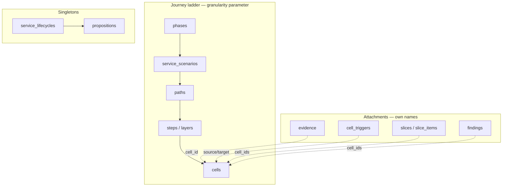

# Agent tool surface — one naming rule, one ladder, full entity coverage

## Overview

The canvas agent has **38 tools**. They work — 46 observed user turns, 100%
success — but the surface grew one tool at a time and now carries four
structural problems: no naming rule, granularity welded to the id type,
six entities the agent cannot see at all, and one query that pays for a join
and throws the result away.

This plan defines the rule, consolidates the journey-ladder reads behind an
explicit `granularity` parameter, normalizes the write verbs to CRUD, and
closes every verified coverage gap. It phases the work so that the parts which
add **no new capability** ship first and the part still gated by plan 003's
build trigger ships last.

**Net:** 38 → 42 tools. 3 retire into one, 8 rename, 9 arrive, ~210 lines of
duplicated index code retire from uno-bot, and both consumers share one RPC and
one `include` contract.

---

## Problem statement

### P1 — There is no naming rule, and one name has to disclaim itself

`get_blueprint`'s own description (`src/lib/agent/tools/specs.ts:83`) ends with:

> "(\"Blueprint\" unqualified means the whole workspace; this tool returns one
> scenario's grid.)"

A name that needs a disclaimer is a broken name. **`blueprint` is not an entity**
— the schema has `phases`, `service_scenarios`, `paths`, `steps`, `layers`,
`cells`; "blueprint" is the corpus.

The inconsistencies compound:

| Symptom | Evidence |
|---|---|
| `list_` vs `get_` chosen arbitrarily | `list_scenarios` and `get_blueprint` are the same query at two settings |
| `set_` means both UI state and data write | `set_canvas_mode` / `set_sidebar` (UI) vs `set_cell_dependency` / `set_finding_status` (data) |
| Two verbs for one operation class | `add_step` / `add_lane` vs `create_path` / `create_phase` |
| One-off verbs | `record_finding` (a create), `rename_path` (a narrow update) |
| Tool noun ≠ table noun | `add_lane` writes the `layers` table |

### P2 — Granularity is welded to the id type, so consumers rebuild the same index

Today the level you get is implied by which id you pass. There is no way to say
"give me the path level." The result is duplication across consumers:

- **uno-bot** `fetchBlueprintIndex` (`src/integrations/blueprint.ts:819`) runs
  `select name, service_scenarios(name, paths(name)) from phases order by
  order_position` — exactly `granularity: ['phase','scenario','path']`. It is
  supported by `blueprint-index.ts` (**159 lines**), `fetchBlueprintIndex`
  (**51 lines**), 5 cache/TTL references and a `BLUEPRINT_INDEX` env flag that
  currently ships **off**.
- **canvas** `list_scenarios` (**23 lines**) is the same walk, two rungs shallower.

Two consumers independently built the same structural index. That is the
strongest available evidence that granularity's absence is *why* the ad-hoc
functions exist.

There is also a band nothing covers: **wide address + full body.**
`get_blueprint` returns a whole scenario projected to `content` + `id`;
`get_cell` returns one cell in full. "This one path, full bodies" is unreachable
without N round trips.

### P3 — Six entities the agent cannot see

Measured by grepping `src/lib/agent/tools/registry.ts`:

| Entity | Read tool | Write tool | Status |
|---|---|---|---|
| `evidence` | **none** | **none** | UI has it (`src/hooks/useEvidence.ts`, `src/lib/evidenceMutations.ts`); agent is blind. Straight parity gap. |
| `propositions` | **none** | **none** | Singleton per `service_lifecycle_id` — `pricing`, `funding`, `partners`, `revenue_model`, `delivery_cost`. Never readable. |
| `cell_triggers` | **none** (see P4) | `set_cell_dependency` | **Write-without-read.** The agent sets edges it can never observe. |
| `layers` | grid only | `add_lane` | No live list of the layer vocabulary in use. `read_reference('lane-roles')` is a static doc, not current data. |
| references | — | — | `REFERENCE_NAMES` is interpolated into `read_reference`'s *description string* (`specs.ts:68`) — a static enumeration hiding in prose. |
| `agent_sessions` | `get_change_history` (this browser session only) | — | The persisted chat history across sessions is unreachable. |

Minor: `getCell` (`src/lib/agent/tools/read.ts:255-280`) omits `links`, which
`search_blueprint` *does* return — the two disagree about what a cell is.

### P4 — 🐛 `get_blueprint` joins `cell_triggers` on every call and discards the result

`PATH_BLUEPRINT_SELECT` (`src/lib/workflowQueries.ts:7-44`) fetches:

```
cells (
  id, layer_id, step_id, slot_position, content, picture, description, links,
  outgoing:cell_triggers!cell_triggers_source_cell_id_fkey (
    id, target_cell_id, kind, label, note
  )
)
```

The renderer (`src/lib/agent/tools/read.ts:126-158`) emits only:

```
Path "<name>" (<id>, type <type>)
Steps: 1. "<name>" (<id>) | 2. …
Lane "<name>" (<id>, role <role>):
  [step N] "<content>" (<uuid>)
```

`grep -n "trigger\|outgoing" src/lib/agent/tools/read.ts` returns **two hits,
neither in the renderer** — one is the word "needs" in an error string, one is
`read.ts:250` saying *"triggers/needs edges are not compared."*

**The join is paid for and thrown away.** The agent has never seen an edge.

> ⚠️ **This corrects plan 003.** That plan deferred `include_edges` partly on the
> premise that *"the canvas agent has `get_blueprint` (which already returns
> triggers via `PATH_BLUEPRINT_SELECT`)"*. That premise is false. The deferral
> should be re-decided on the corrected facts — see
> [Phase 2](#phase-2--close-the-coverage-gaps).

### P5 — No ranked retrieval exists

`public.search_blueprint` shipped 2026-08-19 with one consumer (uno-bot). The
canvas agent has no way to find a cell by what it *says*. Plan 003 designed this
tool and **deliberately gated it** on a build trigger. That gate is respected
here — see [Phase 4](#phase-4--ranked-retrieval-still-gated).

---

## Proposed solution

### The rule: three mechanisms, one trigger each

| Mechanism | Carries | Trigger |
|---|---|---|
| **Name** | operation contract + entity family | contracts differ, or record types differ |
| **`granularity` param** | zoom level on the journey ladder | same walk, different rung |
| **`include` param** | attachments on rows already requested | hangs off a row, not a rung of it |

**Test for name-vs-parameter:** can you reach it by walking parent→child through
the grid? `phase → scenario → path → step/layer → cell` is one walk — that is a
parameter. `evidence` attaches to a cell but is not a coarser or finer cell —
that is a name.

`include` is **not new**: uno-bot already ships `include: [edges, findings,
slices, index]` (`agents/uno-bot/src/tools/blueprint-search.ts:26`). Reusing it
keeps both consumers on one contract.

### The three verb contracts

| Verb | Contract | Payload |
|---|---|---|
| `search_` | ranked for a query | truncated at `k`, snippets |
| `list_` | complete set at a level | **always projected** — never full bodies |
| `get_` | named ids | full bodies, **bounded by ids** |

`list_` and `search_` stay separate because their success criteria are opposite:
enumeration must be **complete**, ranking must be **relevant**. A model that
calls the ranked door for an enumeration question gets silent top-k truncation
and reports a partial list as the full one.

`list_` and `get_` stay separate because `get_` requires ids. That requirement
*is* the payload guardrail — it makes "955 cells at full body" impossible by
construction rather than by a conditional check.

### Write verbs: CRUD, with `set_` reserved for UI

`set_` means UI state only. Data writes are `create_` / `update_` / `upsert_` /
`duplicate_`.

### The family matrix

Rows are entity families; columns are verbs. **Blank cells are meaningful** — a
closed vocabulary has nothing to rank, a singleton has nothing to list.

| Family | `search_` | `list_` | `get_` |
|---|---|---|---|
| **blueprint** (ladder) | ✓ `granularity` | ✓ `granularity` | ✓ `granularity` + ids |
| **slices** | — | `list_slices()` | `get_slice(id)` |
| **evidence** | — | `list_evidence(cell_id?)` | `get_evidence(ids)` |
| **cell_links** | — | `list_cell_links(cell_id?)` | — |
| **findings** | — | `list_findings(status?)` | — |
| **proposition** | — | — | `get_proposition()` singleton |
| **vocabulary** | — | `list_layers()`, `list_owner_tags()` | — |
| **references** | — | `list_references()` | `get_reference(name)` |
| **session** | *(deferred)* | `list_sessions()` | `get_session(id)`, `get_ui_state()`, `get_change_history()` |



---

## Technical approach

### The ladder surface

```ts
// src/lib/agent/tools/specs.ts
search_blueprint(query, granularity?, filters?, k?)   // ranked, snippets
list_blueprint(granularity, scope?)                    // complete, projected
get_blueprint(granularity, ids[], include?)            // named, full bodies
```

Same noun. Same `granularity`. Three contracts. `get_blueprint` **keeps its
name** — it was only wrong because the granularity was hidden; made explicit,
the name is accurate and the disclaimer deletes. Zero prompt churn on the
most-used tool.

`granularity` is an **array**: `['phase','scenario']`, `['step','layer','cell']`.
`scope` names a parent id. `include` names attachments.

### Computed tools generalize by signature, not by pretending

**`compare(granularity, ids[])`** — what changes per rung is the alignment key:

| Granularity | Aligns by | Status |
|---|---|---|
| `cell` | nothing — direct field diff | works, trivial |
| `step` | layer | works |
| `path` | step position (`"Step N"`) | **works today** |
| `scenario` | — no shared spine | loud error |
| `phase` | — no shared spine | loud error |

Two scenarios have different steps; there is nothing to line up. Generalizing
those needs a matching heuristic — a different and much harder problem.
Unsupported granularities return an explicit *"no alignment key for this
granularity"*, never a silently bad diff.

**`measure_deletion_impact(granularity, ids[])`** — supported: `phase`,
`scenario`, `path`, `slice`. Blocked: `step`, `layer` — **not** by design but by
the correctness note at `src/lib/agent/tools/registry.ts:122`:

> "`lane` and `step` are answerable server-side but their counts do not match
> what their delete removes, so quoting them would put a wrong number in front
> of a human about to delete."

Widening the supported set is a delete-semantics job, tracked separately.

### Sessions: source from the store, not the table

`agent_sessions` has **no owner column**, and `supabase/migrations/20260804210000_agent_sessions.sql:37`
grants a blanket policy:

```sql
create policy "authenticated manage agent sessions" ...
```

A tool that queries the table directly would expose **every authenticated user's**
chat history. Instead, `list_sessions()` / `get_session(id)` read the same store
the UI session switcher reads (`src/lib/agent/sessions.ts` — localStorage plus
the merged DB list). The agent then sees exactly what the user sees: true
parity, zero new exposure, same pattern `get_ui_state` and `get_change_history`
already use.

**`search_sessions` is deliberately omitted.** Usage is 30 sessions from one
user; the complete list fits well under any context limit. Search exists for
when complete is too big. Add it when that is true.

> 🔒 The missing owner column on `agent_sessions` is a **pre-existing** gap, not
> one these tools create. It deserves its own fix regardless.

---

## Complete before → after

### Retire (3 → 1)

| Now | Becomes |
|---|---|
| `list_scenarios()` | `list_blueprint(granularity:['phase','scenario'])` |
| `get_blueprint(scenario_id)` | `list_blueprint(granularity:['step','layer','cell'], scope)` |
| `get_cell(cell_id)` | `get_blueprint(granularity:'cell', ids:[…])` |

### Rename (8)

| Now | Becomes | Why |
|---|---|---|
| `read_reference` | `get_reference` | verb convention |
| `record_finding` | `create_finding` | a create is a create |
| `set_finding_status` | `update_finding` | data, not UI; extensible to other fields |
| `add_step` | `create_step` | same class as `create_path` |
| `add_lane` | `create_layer` | same class, and matches the `layers` table |
| `rename_path` | `update_path(name?, path_type?)` | narrow verb → extensible update |
| `set_cell_dependency` | `create_cell_link` | data write wearing a UI verb |
| `get_compare_diff` | `compare(granularity, ids[])` | generalized signature |
| `get_deletion_impact` | `measure_deletion_impact(granularity, ids[])` | generalized signature |

*(`set_canvas_mode` and `set_sidebar` keep `set_` — genuinely UI state.)*

### New (9)

| Tool | Closes |
|---|---|
| `search_blueprint(query, granularity?, filters?, k?)` | P5 — **Phase 4, still gated** |
| `list_cell_links(cell_id?)` | P3/P4 — write-without-read |
| `list_evidence(cell_id?)` | P3 — UI/agent parity |
| `get_evidence(ids)` | P3 |
| `create_evidence` / `update_evidence` | P3 — write side |
| `get_proposition()` / `update_proposition()` | P3 — singleton |
| `list_layers()` | P3 — live vocabulary |
| `list_references()` | P3 — enumeration out of a description string |
| `list_sessions()` / `get_session(id)` | P3 — cross-session recall |

### Candidate merge (needs a decision)

`update_cell_content` (content, summary, owner, perceived_owner) and
`update_cell_spec` (function, form, value_props) are two tools on one entity.
The split may exist for validation reasons — **check before merging.** If it is
historical, merge into `update_cell`.

### Unchanged

`upsert_cell` (genuinely C-or-U) · `duplicate_path` / `duplicate_scenario` (own
group, per decision) · `create_phase` / `create_scenario` / `create_path` /
`create_slice` · `update_slice` / `replace_slice_frames` · `list_slices` /
`get_slice` · `list_findings` · `list_owner_tags` · `get_ui_state` /
`get_change_history` · all 8 navigation tools · `list_ui_commands` / `ui_command`

---

## Implementation phases

### Phase 1 — Convention, no new capability

Ships first because it changes **zero** behaviour.

- [ ] Write the rule into `src/lib/agent/tools/specs.ts` header comment
- [ ] Apply the 8 renames in `specs.ts` + `registry.ts`
- [ ] Update `MOBILE_READ_TOOL_NAMES` (`specs.ts:26-42`) — hardcoded strings; a
      missed rename **silently drops the tool from mobile**
- [ ] Update `WRITE_TOOL_NAMES` (`specs.ts:44+`)
- [ ] Update `scripts/agent-harness/cases.mjs` `WRITES` set — a name missing here
      makes a "no writes happened" check **pass**, hiding drift
- [ ] Prose sweep: 6–15 files per name (measured, word-boundary):
      `get_reference` 14 · `add_lane` 15 · `add_step` 13 · `set_cell_dependency` 12 ·
      `get_cell` 9 · `get_blueprint` 8 · `list_scenarios` 8 · `record_finding` 8 ·
      `rename_path` 8 · `set_finding_status` 6
- [ ] Run `node scripts/generate-docs-index.mjs` (AGENTS.md:73)

**Harness gap this phase must close:** `scripts/tests/toolParity.test.mjs` has
`test('every write tool is dispatchable')` (line 87) but **no read equivalent**.
With 8 renames and 9 new read tools, a spec/registry mismatch on a read tool
fails silently.

- [ ] Add `test('every read tool is dispatchable')`

**Success:** `npm test` green, `toolParity` covers reads, no name appears in two
spellings anywhere in the repo.

### Phase 2 — Close the coverage gaps

- [ ] **Fix P4 first.** Either render the already-joined edges in `getBlueprint`,
      or drop them from `PATH_BLUEPRINT_SELECT`. Paying for a join and
      discarding it is not a defensible middle. Recommendation: render them —
      the data is free and `set_cell_dependency` has been writing blind.
- [ ] `list_cell_links(cell_id?)`
- [ ] `list_evidence` / `get_evidence` / `create_evidence` / `update_evidence`
- [ ] `get_proposition()` / `update_proposition()`
- [ ] `list_layers()`
- [ ] `list_references()` — and shrink `get_reference`'s description accordingly
- [ ] `list_sessions()` / `get_session(id)`, sourced from `sessions.ts`
- [ ] Add `links` to `getCell`'s projection (`read.ts:259`) so it agrees with
      `search_blueprint`
- [ ] Re-decide 003's `include_edges` deferral on the corrected P4 facts

**Success:** every table in `src/types/database.ts` is either agent-reachable or
has a written reason why not.

### Phase 3 — Granularity + uno-bot consolidation

- [ ] Add `granularity` (array) + `scope` + `include` + `fields` to the portal
- [ ] Introduce `list_blueprint`; retire `list_scenarios` and `get_cell`
- [ ] Re-back `get_blueprint` on the portal with explicit `granularity`; delete
      the self-disclaiming sentence
- [ ] Eval cases that would catch a `kind='cell'`-only regression
- [ ] **plus-uno:** replace `fetchBlueprintIndex` with
      `granularity:['phase','scenario','path']`; delete `blueprint-index.ts`
      (159 lines), `fetchBlueprintIndex` (51 lines), the cache, and the
      `BLUEPRINT_INDEX` flag; drop `index` from `INCLUDABLE`
- [ ] Run `agents/uno-bot/scripts/run-retrieval-evals.mjs` — must stay 26/26

**Success:** one RPC serves both consumers; uno-bot sheds ~210 lines; retrieval
evals unchanged.

### Phase 4 — Ranked retrieval (still gated)

`search_blueprint` as an agent tool. **Do not build until plan 003's trigger
fires.** Its spec, capability-boundary table, honesty wording and roster
decisions are already written there and carry forward unchanged.

One trigger deserves re-reading after Phase 3: 003's condition #2 is *"a second
consumer needs it — making 'one contract' a live coordination cost rather than a
principle."* Phase 3 makes uno-bot and canvas share the RPC, which is arguably
that condition firing. **Decide explicitly; do not let it fire by accident.**

---

## Alternatives considered

**A. One polymorphic `get(id, granularity)` for everything.** Rejected. Tool
*names* are how the model selects, in one shot, with no exploring. Collapsing
`get`/`list`/`search` trades 2 tools for measurable selection error. It also
forces a conditional-required-param (`fields:'full'` requires `scope`), which is
a worse contract than two tools with unconditional ones.

**B. CRUD verbs on the read side.** Rejected. "Read" collapses get/list/search
and erases exactly the distinction that prevents silent truncation. CRUD is
storage vocabulary; agent tools need retrieval vocabulary. CRUD **is** adopted
on the write side, where it fits.

**C. A `get_` per entity (`get_phase`, `get_path`, `get_step`…).** Rejected.
That is 5 tools running one query against one nested walk. The ladder is a
continuum; the attachments are not. Only the attachments earn names.

**D. Rename `service_scenarios` → `scenarios` in the DB.** Rejected. `service_`
is a live family (`services` → `service_lifecycles` → `service_scenarios`;
`service_lifecycles` is used at `src/lib/lifecycle.ts:19` and
`registry.ts:72`). Renaming one member orphans the convention, and the cost —
FKs, PostgREST embeds, generated types, the RPC, migrations — buys nothing,
because **the agent never sees table names.** The tool layer already says
`scenario` (`filter_scenario`, `filter_phase`).

**E. `search_sessions`.** Deferred. 30 sessions fits in one complete list.

**F. Fold `duplicate_*` into `create_*(copy_of:)`.** Rejected by decision —
duplicate is its own group; the verb carries real meaning.

---

## System-wide impact

### Interaction graph

`specs.ts` is the single source: `scripts/agent-harness/run.mjs` bundles it with
rolldown at startup and imports `TOOL_SPECS` / `WRITE_TOOL_NAMES` /
`MOBILE_READ_TOOL_NAMES` (`toolParity.test.mjs:6-19`). So a spec edit propagates
to the eval harness automatically — **but `registry.ts` is text-parsed**, not
imported (it pulls in supabase-js and Vite `?raw` markdown, unloadable from
Node). Spec↔registry agreement is therefore assertion-based, and the read-side
assertion does not exist yet. That is why Phase 1 adds it.

`cases.mjs` keeps its own `WRITES` set to avoid an import cycle. Drift there
hides itself: a missing name makes a "no writes happened" check pass.

### Error & failure propagation

- Unsupported `granularity` on `compare` / `measure_deletion_impact` → explicit
  throw naming the granularity, never a partial result.
- `get_blueprint` with ids the caller does not own → RLS returns fewer rows, not
  an error. The renderer must report *requested N, returned M*.
- Portal errors surface through `registry.ts`'s `throw new Error(error.message)`
  path, unchanged.

### State lifecycle risks

Read-only for Phases 1–2 except the new evidence/proposition writes, which go
through the same wrappers the UI calls (`evidenceMutations.ts`) — so RLS,
validation, session logging and revert capture come free, per the `specs.ts:4-9`
contract. **No new write path may bypass that wrapper.**

Rename risk: persisted `agent_messages` payloads contain **old tool names**.
Replaying or summarizing an old session will show names that no longer exist.
Non-breaking (history is display-only) but worth a note in the change sheet.

### API surface parity

| Surface | Needs the change? |
|---|---|
| canvas agent (`specs.ts` / `registry.ts`) | ✅ all phases |
| eval harness (`run.mjs`) | ✅ automatic via rolldown |
| `cases.mjs` WRITES set | ✅ manual, drift hides itself |
| `MOBILE_READ_TOOL_NAMES` | ✅ manual, hardcoded strings |
| skill playbooks (`src/lib/agent/skill/references/*.md`) | ✅ prose sweep |
| uno-bot (`plus-uno`) | ✅ Phase 3 only |
| CLI/IDE consumers | inherits the RPC contract free |

### Integration test scenarios

1. **Rename completeness** — every tool in `TOOL_SPECS` dispatches in
   `registry.ts`; every name in `MOBILE_READ_TOOL_NAMES` and `WRITE_TOOL_NAMES`
   exists in `TOOL_SPECS`. (Catches the silent mobile-drop.)
2. **Ladder equivalence** — `list_blueprint(granularity:['phase','scenario'])`
   returns the same ids as today's `list_scenarios`; and
   `granularity:['step','layer','cell'], scope:<id>` matches today's
   `get_blueprint`. (Catches consolidation regressions.)
3. **Edge visibility** — a cell with a known outgoing trigger appears with that
   edge in `get_blueprint` output. (Would have caught P4.)
4. **Payload bound** — `get_blueprint(granularity:'cell')` with no `ids` is
   refused, loudly. (Prevents a 955-cell full-body response.)
5. **Session scoping** — `list_sessions()` returns only what the UI switcher
   shows, verified against a second authenticated user's sessions existing in
   the table. (Prevents the RLS over-read.)

---

## Acceptance criteria

### Functional

- [ ] Every tool name matches the rule: verb = contract, noun = family or corpus
- [ ] `set_` appears only on UI-state tools
- [ ] `get_blueprint`'s description contains no disclaimer sentence
- [ ] `list_blueprint` reproduces `list_scenarios` and `get_blueprint` output
- [ ] Every table in `src/types/database.ts` is agent-reachable or has a written
      exemption
- [ ] `get_blueprint` renders the `cell_triggers` it already joins — **or** the
      join is removed
- [ ] `getCell` projection includes `links`
- [ ] `compare` and `measure_deletion_impact` take `(granularity, ids[])` and
      throw explicitly on unsupported granularities

### Non-functional

- [ ] `list_sessions` reads `sessions.ts`, never `agent_sessions` directly
- [ ] No new write path bypasses the UI wrapper (`specs.ts:4-9`)
- [ ] Portal latency unchanged: 22ms filter-only / 55ms keyword / 89ms fused
- [ ] uno-bot retrieval evals stay **26/26**

### Quality gates

- [ ] `toolParity.test.mjs` asserts read-tool dispatchability
- [ ] Ladder-equivalence test passes before `list_scenarios` is deleted
- [ ] `node scripts/generate-docs-index.mjs` run after the doc sweep
- [ ] No tool name exists in two spellings anywhere in either repo

---

## Success metrics

| Metric | Before | Target |
|---|---|---|
| Tool count | 38 | 42 |
| Names violating the rule | 10 | 0 |
| Entities with zero agent reach | 6 | 0 |
| Duplicated index implementations | 2 | 1 |
| uno-bot index lines | ~210 | 0 |
| Read tools covered by dispatch test | 0 | all |
| Discarded joins | 1 | 0 |

---

## Risks & mitigation

| Risk | Severity | Mitigation |
|---|---|---|
| Rename misses `MOBILE_READ_TOOL_NAMES` → tool silently absent on mobile | **High** — silent | Phase 1 test asserts set membership against `TOOL_SPECS` |
| Rename misses `cases.mjs` WRITES → write-detection silently passes | **High** — silent | existing `toolParity` test 75 covers it; keep it green |
| Consolidation changes output shape → playbooks break | Medium | ladder-equivalence test before deletion |
| Renames confuse the model mid-rollout | Low | one atomic release; no dual-name period |
| Phase 4 fires 003's trigger by accident | Medium | explicit decision required, written into Phase 3 exit |
| Merging `update_cell_*` loses a validation split | Medium | **check why they split before merging** |
| Old `agent_messages` payloads reference dead names | Low | display-only; note in change sheet |

---

## Future considerations

- **Attachments joining the search index.** The portal already returns a `kind`
  column, so evidence and slices could become searchable rows later without a
  signature change.
- **Cross-scenario `compare`.** Needs a step-matching heuristic. The
  `(granularity, ids[])` signature accepts it the day the algorithm exists.
- **Widening `measure_deletion_impact`** to `step` / `layer` once delete
  semantics match their counts.
- **`agent_sessions.user_id`** — worth fixing on its own merit.

---

## Documentation plan

- `src/lib/agent/tools/specs.ts` header — the rule, as the canonical statement
- `docs/engineering/access-and-security.md` — session-tool scoping rationale
- `src/lib/agent/skill/references/*.md` — prose sweep for renamed tools
- `docs/plans/2026-08-19-003-…-plan.md` — annotate the corrected P4 premise
- plus-uno `docs/` — uno-bot index retirement

---

## Sources & references

### Internal

- Tool specs & rosters: `src/lib/agent/tools/specs.ts:26` (mobile), `:44` (writes), `:65` (specs), `:83` (the disclaimer)
- Read dispatch: `src/lib/agent/tools/registry.ts:104`
- Deletion-impact correctness note: `src/lib/agent/tools/registry.ts:122`
- `getBlueprint` renderer: `src/lib/agent/tools/read.ts:126-158`
- `getCell` projection: `src/lib/agent/tools/read.ts:255-280`
- Compare edge exclusion: `src/lib/agent/tools/read.ts:250`
- Discarded trigger join: `src/lib/workflowQueries.ts:7-44`
- Portal signature: `src/types/database.ts:792-820`
- Evidence / propositions columns: `src/types/database.ts:211`, `:510`
- Session tables + blanket RLS: `src/types/database.ts:25`, `supabase/migrations/20260804210000_agent_sessions.sql:34-44`
- Session store: `src/lib/agent/sessions.ts:8-14`
- Parity tests: `scripts/tests/toolParity.test.mjs:46,75,87`
- Harness one-sourcing: `scripts/agent-harness/run.mjs`

### Related work

- `docs/plans/2026-08-19-003-feat-canvas-agent-search-tool-plan.md` — the
  `search_blueprint` tool spec, capability boundary and build trigger. Carried
  forward unchanged **except** its `PATH_BLUEPRINT_SELECT` premise, corrected in
  P4 above.
- plus-uno `docs/plans/2026-08-19-001-feat-blueprint-hybrid-retrieval-plan.md` —
  the portal itself (status: complete).

### AI-era note

Design was developed conversationally with Claude Opus 5 across an extended
session; every code claim in this plan was verified by reading the file, and
three of the author's own earlier claims were retracted on evidence during that
process (the 41k-token context estimate, the "agent cannot find anything"
framing, and the `get_cells`-in-the-ladder grouping). The P4 finding contradicts
a prior plan — **re-verify it before acting on it.**

---

## Outcome — built 2026-08-20, branch `refactor/agent-tool-surface`

Four commits. All 448 tests, typecheck and lint green at each one.

| Commit | Phase |
|---|---|
| `7530402` | 1 — naming rule, 9 renames, 2 parity tests |
| `d5dcbe0` | 2 — the discarded join, 8 new reads, 1 new write |
| `6d63a9d` | 3 — `granularity` migration, `list_blueprint` |
| `c83ad43` | 4 — `search_blueprint` tool |

### Verified

- **v2 callers unaffected.** Baseline taken *before* the migration and
  re-run after: `q => 'host key'` returns the same single row and the same
  `total_matched` (1); `filter_scenario => 'Warm-Up'` returns the same 5
  rows and the same total (76).
- **Granularity is exact.** `['phase','scenario','path']` returns **66 =
  6 + 22 + 38** — precisely the counts plan 003 recorded and precisely what
  uno-bot's index returns.
- **Eval fixtures hold** at the keyword level, checked against the RPC
  directly (BR7 Handshake 1/3, BR8 host key 1/1, BR9 I-9 8/8 in Tech Setup,
  BR12 7/7 on path, BR19 8/8 on path). The paraphrase cases exercise the
  vector arm, which this change does not touch.

### Corrections to this plan, found while building

1. **`get_cell` does NOT retire into the portal.** The plan said
   `get_blueprint(granularity:'cell', ids)` would replace it. The portal
   returns a `snippet`; `get_cell` returns the full record —
   `function`, `form`, `value_props`, owners. Retiring it would have been a
   capability loss. It stays.
2. **`get_blueprint` does NOT retire either.** It renders a *grid* — lanes
   × steps, plus the arrows — which the portal's flat rows cannot express.
   Rendering, not retrieval. Only `list_scenarios` retired.
3. **uno-bot does not shed ~210 lines.** `blueprint-index.ts` is a
   *renderer* (`renderBlueprintIndex`, `INDEX_LEGEND`, `futureLabel`) plus
   unrelated cap helpers, and `fetchBlueprintIndex`'s bulk is a 10-minute
   TTL cache and a subrequest-budget guard for the Worker's 50-call cap —
   Worker concerns, not duplicated retrieval. The genuine duplication is a
   single PostgREST embed. Swapping it for an RPC would add flat→nested
   reshaping to save one select, so **it was not done.** The shared
   contract that mattered — one fusion implementation — already exists.
4. **`add_step` / `add_lane` are also Postgres RPC names**
   (`authoringRpc.ts:355`) and authoring-ledger entry kinds. The tool
   rename is correct and the RPC call sites are untouched; a repo-wide sed
   would have broken the app. A tool name is not an RPC name — now stated
   in the `specs.ts` header.

### Not built, and why

- **`update_evidence` / `update_proposition`.** Both need a new revert
  function registered in `revertChange.ts` to keep the ledger's undo pair
  intact. `create_evidence` shipped because `addEvidence` and its
  `delete_evidence` inverse already exist. Inventing revert semantics blind
  is exactly what the `specs.ts` write contract forbids.
- **`update_cell_content` + `update_cell_spec` merge.** Still unchecked
  whether the split carries a validation reason.
- **`measure_deletion_impact` widening** to `step` / `layer`, which stays
  blocked by the `registry.ts` correctness note.

### Deliberate override

`search_blueprint` was gated in plan 003 on a build trigger that has **not**
fired — zero search-shaped requests across 46 observed user turns. It was
built here as an explicit scope decision. The gate was overridden, not met.

### Operational note

The migration ran against production via `apply_migration`, which was
confirmed transactional first (a deliberately failing `drop`+`create`
rolled the drop back). `search_blueprint` is `security definer` with a
pinned `search_path`; grants are unchanged — `anon`, `authenticated`,
`service_role`.
