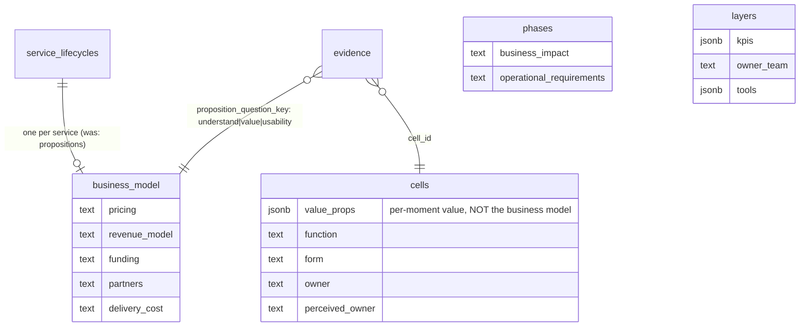

# Revive the spec layer

## Overview

Ten spec columns exist across `cells`, `phases`, `layers` and `propositions`.
Their migrations shipped. Their column-level grants shipped. **Four audit
checks were written against them.** Almost none of them contain data, because
with one exception nothing in the app can write to them.

This is not a modelling problem or a missing-feature problem. It is a
**finished back end with no front door**. The plan builds the doors.

**Measured today:**

| Column | Level | Filled |
|---|---|---|
| `cells.value_props` | cell | 11 / 955 |
| `cells.function` | cell | 11 / 955 |
| `cells.form` | cell | 8 / 955 |
| `cells.owner` | cell | **0 / 955** |
| `cells.perceived_owner` | cell | **0 / 955** |
| `phases.business_impact` | phase | **0 / 6** |
| `phases.operational_requirements` | phase | **0 / 6** |
| `layers.kpis` | lane | **0 / 299** |
| `layers.owner_team` | lane | **0 / 299** |
| `layers.tools` | lane | **0 / 299** |
| `propositions` (whole table) | service | **0 rows** |

All 11 filled cells sit in **one path** — Warm-Up › Happy Path. Somebody
piloted it and stopped.

---

## Problem statement

### P1 — Half the audit is dark, and the audit says so out loud

`references/audit-playbook.md:48-58` defines wave-2 skip rules. Against the
numbers above:

| Check | Prerequisite | Runs today? |
|---|---|---|
| `check-gap-sweep` | wave 1 | ✅ always |
| `check-jargon-lint` | wave 1 | ✅ always |
| `check-channel-conflict` | wave 1 | ✅ always |
| `check-kpi-alignment` | `layers.kpis` | ❌ **never** — 0/299 |
| `check-perceived-owner` | `cells.perceived_owner` | ❌ **never** — 0/955 |
| `check-value-ledger` | `cells.value_props` | ⚠️ **1 of 22 scenarios** |
| `check-fee-visibility` | money mention in scope (a CONTENT scan, not a column test — `audit-playbook.md:53-55`) | ⚠️ content-dependent |

The playbook is careful about this: *"Every skip is reported with its reason;
a silent skip reads as coverage that never happened."* So `/audit` is honest —
it just has little to be honest about.

### P2 — Phases and lanes have no write surface at all

Verified: `business_impact`, `operational_requirements`, `owner_team`, `kpis`
and `tools` appear in **zero** components and **zero** hooks.

And the click gestures that would open one are already spoken for:

- **Phases** — `CanvasPhaseSection.tsx:180` makes the entire section
  `role="button"` with `onClick={handleSectionClick}` → `onNavigate()`, i.e.
  *zoom into this phase*. There is no free gesture, unlike cells where
  ⌘-click was unclaimed.
- **Lanes** — two separate render paths. `ServiceBlueprintGrid.tsx:497-525`
  renders the label as an inert `<span>` with **no onClick at all**.
  `BlueprintLabelRail.tsx:189-201` makes it a button only in Design mode, and
  that click means *select every cell in this lane* for bulk editing — a
  different action entirely. Any lane-properties affordance must be net-new
  **in both paths**.

### P3 — The panel host does not exist above cell zoom

`ServiceOverviewView.tsx:771-774`:

```ts
cellDetailEnabled = isBlueprintCellDetailEnabled() && isDetail &&
  (focusedScenarioId !== null || soloScenarioId != null)
```

`BlueprintCellDetailProvider` is gated **off** unless a scenario is focused, and
its `selection` type is cell-shaped (`BlueprintCellSelection`). A phase panel
cannot be a new `surface` value on the existing context — it needs its own
selection type and its own mount condition.

### P4 — `propositions` is a coherent design nobody could reach

From the `f65efcf` migration comments:

> `propositions`: "One business-model record per lifecycle. **The three
> validation questions live as evidence rows keyed understand|value|
> usability.**"

`evidence` enforces it with `check (num_nonnulls(cell_id,
proposition_question_key) = 1)` — every evidence row attaches to *either* a
cell *or* one of three validation questions.

**Both existing evidence rows attach to cells. `proposition_question_key` has
never been used.** `PropositionCard.tsx` (239 lines) was deleted on 2026-07-29
in `5bdc685`, *"remove UI the review rejected"* — at a time when `canWrite` was
"always false in practice, so remaining mutation UI never renders." It was cut
as dead code, not as a bad idea, and nothing brought it back.

### P5 — The name collision

`cells.value_props` and the `propositions` table are one word apart and mean
completely different things (one moment's value vs the whole service's
economics). This has already caused confusion in review.

---

## Proposed solution

### The one piece of good news: the database is done

```sql
-- supabase/migrations/20260729120000_derived_layer.sql:299,304
grant update (owner_team, kpis, tools) on public.layers to authenticated;
grant update (business_impact, operational_requirements) on public.phases to authenticated;
```

Verified live: RLS is on for both tables, every write policy is scoped to
`authenticated`, and the column-level grants are exactly the fields these
panels would edit. **No migration is needed for any of the new writes.**

That matters because AGENTS.md:26 says *"Never widen RLS; the deployed site
stays read-only."* Nothing here widens anything.

*(Untidiness worth a separate ticket, not this one: `anon` also holds
table-level INSERT/UPDATE grants on `phases` and `layers`. Not exploitable —
RLS has no anon write policy, so every such write is denied — but the grants
should match the intent.)*

### Rename first

`propositions` → **`business_model`**. Ends the collision permanently:
"value props" and "business model" cannot be confused.



The `evidence.proposition_question_key` column keeps its name — renaming it
would break the CHECK constraint and buys nothing.

---

## Technical approach

### Architecture: mirror the cell stack, do not copy the cell panel

The cell stack is four layers, and only the bottom two generalize:

| Layer | Cell implementation | Reusable? |
|---|---|---|
| Read hook | `useCellSpec.ts` over `useSupabaseQuery` | ✅ generic — a phase version is ~15 lines |
| Mutation wrapper | `cellSpecMutations.ts` → `requireRowsWritten` + `recordChange` | ✅ both helpers are entity-agnostic |
| Panel shell | `PanelDrawerShell`, `CellDetailErrorBoundary` | ⚠️ **private, unexported** in `BlueprintCellDetailPanel.tsx` — must be lifted out and parameterized |
| Panel body | `BlueprintCellDetailPanel.tsx` | ❌ **write lean from scratch** |

**Why the body must not be copied.** It carries `resolveCellDetailPictures`,
`resolveTechCellDetailLabel/Text/Url`, `isVisualLayer`, Figma-URL resolution,
tech-pill entries and `dependencyCandidates` — all keyed to the cell/layer/
step/tech model. A phase is not in a layer and is not a tech item. Trimming a
copy is more work than writing 120 clean lines.

**Three tabs do not generalize, by schema and not by convention:**

- **Evidence** — `evidence.cell_id` is the only entity link column. No
  `phase_id` exists. Reusing the tab for phases needs a schema change; out of
  scope.
- **Resources** — reads `cells.links`. `phases` has no `links` column.
- **Dependencies** — walks `cell_triggers`, which references `cells.id`.
  Phases have `loops_to_phase_id`, a different singular relationship already
  drawn as loop arrows.

### The click-grammar problem, and the proposed answer

Cells got ⌘-click because it was unclaimed. Phases and lanes have no free
gesture. Proposal:

- **Phase / scenario** — an explicit info affordance in `PhaseMenubarHeader.tsx`
  and on the scenario title badge. Deliberately **not** a modifier-click carved
  out of `handleSectionClick`: a hidden gesture on a surface whose obvious
  gesture is "navigate" will not be found.
- **Lane** — a small chevron beside the label, added to **both** render paths
  (`ServiceBlueprintGrid.tsx` and `BlueprintLabelRail.tsx`), visually distinct
  from the Design-mode selection button so "open properties" never reads as
  "select every cell in this lane."

### `CELL_PANEL_FOOTER_ID` collides

It is a single global DOM id, and the Save/Cancel row portals into it. The
phase and lane panels each need their own footer-host id. Today the two panels
cannot be open at once, but a literal id collision is a trap left for whoever
changes that.

### The fill campaign has no provenance marker — and that is the real risk

`origin` on `cells` / `phases` / `layers` is `check (origin in ('import','app'))`
— it records *where a row came from*, not *who wrote its spec*. There is no
way to mark a spec field as agent-authored.

That matters for a campaign that would write specs for ~944 cells into a
blueprint whose central discipline is *"a cell with zero evidence rows is an
ASSUMPTION"* (`f65efcf` comment). Bulk agent-written `function` and
`value_props` text would be indistinguishable from human-authored fact.

**Proposed mitigation, in preference order:**

1. **Scope the campaign to one scenario at a time**, each ending in human
   review before the next starts. The session ledger already makes every
   agent write revertible within its session.
2. **Require the agent to cite** — a spec claim it cannot ground in the cell's
   own content, its lane role, or an existing evidence row does not get
   written. Absence is a finding, which is the blueprint's own doctrine.
3. Only if 1–2 prove insufficient: add an `origin`-style marker column. Deferred
   — a schema change to solve a process problem is the wrong order.

### The pilot is the style guide

The 11 Warm-Up cells are a real, quotable house style:

```
content:  "Circulates and quietly observes the students."
function: "Keep the classroom side steady while students transition into
           breakout rooms."
form:     null
props:    2 entries

content:  "Enters the student's breakout room."
function: "Open the tutoring moment: join the assigned breakout room within
           the first minute so the student is not left waiting."
form:     "Prompt and unhurried; camera on where policy allows."
props:    2 entries
```

`function` is one purposive sentence. `form` is a tone note, filled on 8 of 11
— **it is legitimately optional**, and the campaign must not manufacture it.
`value_props` is consistently 2 entries.

---

## Implementation phases

### Phase 1 — Rename (no behaviour change)

- [ ] Migration: `alter table public.propositions rename to business_model`
- [ ] Regenerate `src/types/database.ts`
- [ ] Sweep `whatif-playbook.md:76`, `slice.md:63`, `get_proposition`
- [ ] Fix `get_proposition`'s false-absence bug: `business_model` SELECT is
      restricted, so an anonymous read returns empty **by policy**. Report
      "not visible to this session" separately from "no row exists"

**Done when:** no file uses the word "proposition" for the service-level record.

### Phase 2 — Lift the shared panel pieces

- [ ] Extract `PanelDrawerShell` and `CellDetailErrorBoundary` out of
      `BlueprintCellDetailPanel.tsx` into `src/components/blueprint/panelShell.tsx`,
      parameterized by footer-host id
- [ ] Export `Field` from `CellPanelEditor.tsx:53-84`
- [ ] Cell panel keeps working, byte-identical

**Done when:** cell panel behaviour is unchanged and the shell has two callers' worth of parameters.

### Phase 3 — Phase / scenario panel

New files:
- `src/hooks/usePhaseSpec.ts`
- `src/lib/phaseSpecMutations.ts` — `updatePhaseSpec`, `recordChange('update_phase_spec', …)`
- `src/components/blueprint/PhasePanelEditor.tsx` — two textareas, no draft mode
- `src/components/blueprint/BlueprintPhaseDetailPanel.tsx`
- `src/contexts/BlueprintPhaseDetailContext.tsx`

Edits:
- `revertChange.ts` — `case 'update_phase_spec'` (self-inverse, mirrors `update_cell_spec`)
- `authoringSession.ts` — ledger kind + `describeChange` + the exhaustiveness map in `authoringSession.test.ts`
- `PhaseMenubarHeader.tsx` — the new affordance
- `ServiceOverviewView.tsx` — mount provider + panel, **not** gated on `focusedScenarioId`
- `uiBridge.ts` — `agentOpenPhasePanel`, following the dispatch-real-click-then-poll idiom
- `specs.ts` / `registry.ts` — `open_phase_panel`, `update_phase` (agent parity is the stated norm: *"a surface ships with its commands"*)

### Phase 4 — Lane properties

Same stack: `useLayerSpec.ts`, `layerSpecMutations.ts`, `LanePanelEditor.tsx`,
`update_layer` tool + revert entry. Affordance added to **both** lane render
paths. `kpis` and `tools` are jsonb string arrays — reuse the `OwnerTagSelect`
multi-value idiom AGENTS.md:38-42 points at rather than hand-rolling.

**Done when:** `check-kpi-alignment` stops reporting skipped on a scenario with lane KPIs entered.

### Phase 5 — Business-model card + the three validation questions

- [ ] Restore the card, adapted from `73d62fc:src/components/editor/PropositionCard.tsx`
- [ ] `useBusinessModel` hook, `businessModelMutations.ts`, revert entry
- [ ] `update_business_model` agent tool
- [ ] **The interesting half:** an evidence surface for `understand` / `value` /
      `usability`, writing `evidence.proposition_question_key`. The constraint
      already exists; nothing has ever written it
- [ ] `create_evidence` gains an optional `question_key` alternative to `cell_id`

### Phase 6 — The fill campaign

- [ ] Write `docs/reference/spec-house-style.md` from the 11 pilot cells
- [ ] One Sonnet-5 subagent per scenario, one scenario at a time
- [ ] Each agent: read the scenario via `get_blueprint`, read `list_evidence`
      and `list_layers`, propose specs, **write only what it can ground**
- [ ] Human review gate between scenarios
- [ ] Re-run `/audit` after each and record which checks came alive

**Order:** lanes first (299 rows, 3 fields, most mechanical, unblocks
`check-kpi-alignment` fastest), then `perceived_owner`, then `value_props`.

---

## Alternatives considered

**A. Move value props up to path/scenario/phase level.** Rejected on data. The
higher levels are *emptier*, not fuller — `phases.business_impact` is 0/6 and
`layers.kpis` is 0/299, while cells are the only level with anything in them.
The level is not the problem; the missing UI is.

**B. Extend `BlueprintCellDetailContext` with a third `surface` value.**
Rejected. Its `selection` is `BlueprintCellSelection` and its provider is gated
off above scenario zoom. A phase panel needs a different selection shape and a
different mount condition — a shared context would carry two disjoint states.

**C. Copy `BlueprintCellDetailPanel.tsx` and delete the cell-specific parts.**
Rejected. Most of the file is tech-pill, picture and dependency resolution with
no phase analog.

**D. Drop the unused columns instead of building surfaces.** Rejected — four
audit checks are written against them. Dropping the columns means deleting
working check code.

**E. Add an agent-provenance column now.** Deferred. Process controls (scoped
scenarios, human gates, cite-or-skip) should be tried before a schema change.

---

## System-wide impact

### Interaction graph

A panel save calls a mutation wrapper → direct table write under the
column-scoped grant → `requireRowsWritten` (PostgREST returns 200 with an empty
array when zero rows matched, which is otherwise indistinguishable from
success) → `recordChange` with a captured inverse → `invalidateQueries` so the
grid repaints. Two levels out: the ledger row appears in the change sheet, and
its revert is dispatched through `revertChange.ts` — which is why every new
wrapper needs a matching `case` there or the write becomes the one thing in the
session that cannot be taken back.

### Error propagation

`requireRowsWritten` throws when the entity vanished underneath the edit.
`toAuthoringError` maps PostgREST errors. The panel renders the message
inline. No new error classes.

### State lifecycle risks

The baseline is frozen at mount (`useState(baselineProp)`) so a concurrent
revert cannot silently overwrite an in-progress edit. `aliveRef` prevents a
late-resolving save from closing a panel the user has since moved away from.
Both idioms must be carried into the new editors, not reinvented.

### API surface parity

| Surface | Needs |
|---|---|
| Canvas UI | new panels |
| Canvas agent | `open_phase_panel`, `update_phase`, `update_layer`, `update_business_model` |
| Eval harness `run.mjs` | a case per new read tool — the parity test added in `77411d0` now fails otherwise |
| `cases.mjs` WRITES | every new write name |
| `MOBILE_READ_TOOL_NAMES` | decide per tool; mobile is view-only |
| uno-bot | none — it reads the blueprint, it does not author it |

### Integration test scenarios

1. Edit a phase's `business_impact`, revert from the change sheet, confirm the
   prior value returns — proves the revert entry is wired.
2. Enter lane KPIs on one scenario, run `/audit`, confirm
   `check-kpi-alignment` **runs** there and still reports skipped elsewhere.
3. Open a cell panel and a phase panel in sequence, confirm the footer portal
   renders into the right host each time — catches the `CELL_PANEL_FOOTER_ID`
   collision.
4. Attach evidence to `question_key: 'value'`, confirm the CHECK accepts it and
   the row is not counted as cell evidence.
5. `agentOpenPhasePanel` on a phase while the canvas sits at overview zoom —
   proves the new mount condition, since the cell provider is off there.

---

## Acceptance criteria

### Functional

- [ ] `propositions` is named `business_model` everywhere
- [ ] A phase's `business_impact` and `operational_requirements` are editable
- [ ] A lane's `kpis`, `owner_team`, `tools` are editable from **both** render paths
- [ ] The business-model card renders and saves
- [ ] Evidence can attach to `understand` / `value` / `usability`
- [ ] Every new write has a revert entry and a ledger label
- [ ] Every new tool has a `run.mjs` case

### Non-functional

- [ ] **No migration widens RLS or adds a grant** (AGENTS.md:26)
- [ ] No component writes a table directly (AGENTS.md:29-32)
- [ ] Every new primitive comes from `src/components/ui/` (AGENTS.md:38-42)
- [ ] `npm run lint` stays at zero problems
- [ ] `npm run build` passes — it is the real type-check; bare `npx tsc --noEmit` is a documented no-op trap (AGENTS.md:63-73)

### Quality gates

- [ ] `authoringSession.test.ts`'s exhaustiveness map covers every new ledger kind
- [ ] `toolParity.test.mjs` stays green — all six checks
- [ ] Fill campaign: human review between scenarios, no exceptions

---

## Success metrics

| Metric | Now | Target |
|---|---|---|
| Audit checks that can run in any scenario | **3 / 7** | **7 / 7** |
| `check-kpi-alignment` runs | never | every scenario with lane KPIs |
| `check-perceived-owner` runs | never | every scenario |
| Scenarios where `check-value-ledger` runs | 1 / 22 | 22 / 22 |
| Spec-writable entity levels | 1 (cell) | 4 (cell, phase, lane, service) |
| `evidence.proposition_question_key` rows | 0 | ≥ 3 |

The headline is the first row. Everything else is how it gets there.

---

## Risks

| Risk | Severity | Mitigation |
|---|---|---|
| Bulk agent-authored specs read as human-verified fact | **High** | Scenario-at-a-time, human gate, cite-or-skip; no marker column exists |
| A new panel ships without a revert entry | High — silent | The ledger's exhaustiveness map is a compile error by design; keep it |
| Footer-portal id collision | Medium | Distinct id per panel, test #3 |
| Lane affordance mistaken for lane-select | Medium | Visually distinct, and the existing selection button only appears in Design mode |
| Rename misses a doc reference | Low | Repo-wide word sweep, same method as `7530402` |
| Phase panel mounts where the cell panel is gated off | Medium | Test #5 targets exactly this |

---

## Documentation plan

- `docs/reference/spec-house-style.md` — **new**, from the 11 pilot cells
- `docs/engineering/access-and-security.md` — `business_model` rename, note that no grants changed
- `docs/design/components.md` — the panel-shell extraction
- `src/lib/agent/skill/references/canvas-adapter.md` — new tools
- `docs/INDEX.md` routing row 31 currently says *"Add a field to cells end-to-end"* — generalize to any entity, then `node scripts/generate-docs-index.mjs`

---

## Sources

### Internal

- Column grants: `supabase/migrations/20260729120000_derived_layer.sql:299,304`
- Design intent: `f65efcf` migration comments (`propositions`, `evidence`, `findings`)
- Panel state owner: `src/contexts/BlueprintCellDetailContext.tsx:61-65,152-157`
- Panel mount gate: `src/components/editor/ServiceOverviewView.tsx:771-774`
- Save path: `src/components/blueprint/CellPanelEditor.tsx:290-383`
- Frozen baseline: `CellPanelEditor.tsx:232`
- Footer portal: `CellPanelEditor.tsx:38`, `BlueprintCellDetailPanel.tsx:1505-1510`
- Phase click: `src/components/editor/CanvasPhaseSection.tsx:153-156,180`
- Lane labels: `ServiceBlueprintGrid.tsx:497-525` (inert), `BlueprintLabelRail.tsx:186-201` (selection)
- Audit waves: `src/lib/agent/skill/references/audit-playbook.md:46-58`
- Deleted card: `73d62fc` (added), `5bdc685` (removed)
- Conventions: `AGENTS.md:26,29-32,38-42,50-61,63-73`

### AI-era note

Field counts, grants, RLS policies and row samples were read from the live
production database, not inferred. UI architecture was mapped by two Sonnet 5
subagents working on disjoint file sets. `docs/solutions/` does not exist in
this repo. Every file:line above came from a file that was actually opened —
but re-verify before editing, since this branch is moving.

---

# UI design — one panel, five entities

> Added 2026-08-20 after review. Vocabulary fixed throughout: the table is
> `layers`, **the user-facing word is lane**. `layer-roles.md` splits a lane's
> `display_name` (free-form, any language) from its `role` (stable semantic
> key). This section says lane.
>
> Also confirmed: `propositions.service_lifecycle_id` means the business model
> sits at the **service** level — one row for the whole service, far above a
> phase. This database has exactly one service and one lifecycle.

## What each level actually holds

Checked column by column, because it decides which levels deserve a panel:

| Level | Rows | Spec fields it owns |
|---|---|---|
| **Service** | 1 | `business_model`: pricing, revenue_model, funding, partners, delivery_cost — **plus** the understand / value / usability validation questions, answered by evidence |
| **Phase** | 6 | `business_impact`, `operational_requirements` (+ `description`) |
| **Scenario** | 22 | `description` only — **no spec fields** |
| **Path** | 38 | `description`, `note` — **no spec fields** |
| **Lane** | 299 | `kpis`, `owner_team`, `tools` |
| **Cell** | 955 | `function`, `form`, `value_props`, `owner`, `perceived_owner` |

**Consequence: scenario and path do not get their own panel in this plan.**
A drawer holding one description field is a worse experience than editing the
name inline, and neither level gates an audit check. Revisit if spec fields
are ever added there.

## The shape to reuse

The cell panel already is the pattern. Anatomy as built:

```
┌─ CELL PANEL (today) ─────────────────────────────┐
│ ⤢   Warm-Up › Happy Path › Step 3            ✕  │  drawer header
│  ┌──────────┬─────────────┐                      │
│  │ Details  │ Differences │                      │  SegmentedControl
│  └──────────┴─────────────┘                      │   = surfaces
│                                                   │
│  "Enters the student's breakout room."           │  identity block
│  Lane: Regular Tutor                              │  (always visible)
│                                                   │
│  Function   Open the tutoring moment: join the   │  spec block
│             assigned room within the first minute │  (always visible)
│  Form       Prompt and unhurried; camera on…     │
│  Value      tutor → …        student → …          │
│                                                   │
│  ┌─────────────┬──────────┬───────────┐          │
│  │ Dependencies│ Evidence │ Resources │          │  Tabs
│  └─────────────┴──────────┴───────────┘          │
│  … tab body, scrolls …                            │
├───────────────────────────────────────────────────┤
│                            [ Cancel ]  [ Save ]   │  portal footer host
└───────────────────────────────────────────────────┘
```

Four parts are entity-agnostic and get **lifted, not copied**: the drawer
shell, the identity block, the always-visible spec block, and the portalled
footer. Only the tab row and the spec fields differ per entity.

## Lane panel

```
┌─ LANE ───────────────────────────────────────────┐
│ ⤢   Goal Setting › Regular Tutor             ✕  │
│                                                   │
│  Regular Tutor                                    │  identity
│  Role: frontstage_actions · 6 lanes · 61 cells   │  (role, not inferred
│                                                   │   from the name)
│  Owner team    ▢ ______________________          │  spec
│  KPIs          [ session completion ×]           │
│                [ + add ]                          │
│  Tools         [ Zoom ×] [ PLUS App ×] [ + ]     │
│                                                   │
│  ┌──────────┬──────────┐                         │
│  │  Cells   │ Findings │                          │  Tabs
│  └──────────┴──────────┘                         │
│  61 cells across 6 paths …                        │
├───────────────────────────────────────────────────┤
│                            [ Cancel ]  [ Save ]   │
└───────────────────────────────────────────────────┘
```

`kpis` and `tools` are jsonb string arrays — reuse the `OwnerTagSelect`
multi-value idiom AGENTS.md:38-42 points at, not a hand-rolled chip input.

**Where:** the lane label, in both render paths. **A lane label is one word
that already means two things** — inert in `ServiceBlueprintGrid.tsx:497-525`,
and a Design-mode *select-every-cell-in-this-lane* button in
`BlueprintLabelRail.tsx:186-201`. The properties affordance must be a separate,
visible target:

```
   ┌ lane rail ─────────────┐
   │ Regular Tutor      (i) │ ← new: opens the lane panel, always visible
   │ ↑                      │
   │ existing click =       │
   │ select cells (Design)  │
   └────────────────────────┘
```

## Phase panel

```
┌─ PHASE ──────────────────────────────────────────┐
│ ⤢   In-session                               ✕  │
│                                                   │
│  In-session                                       │  identity
│  4 scenarios · 312 cells · loops to Pre-session   │
│                                                   │
│  Description   ▢ ____________________________    │  spec
│  Business      ▢ ____________________________    │
│  impact        ▢ opex, NPS, brand, retention…    │
│  Operational   ▢ ____________________________    │
│  requirements  ▢ process / system / people /     │
│                ▢ legal                            │
│                                                   │
│  ┌───────────┬──────────┐                        │
│  │ Scenarios │ Findings │                         │  Tabs
│  └───────────┴──────────┘                        │
│  Warm-Up · Goal Setting · Wrap-Up · …            │
├───────────────────────────────────────────────────┤
│                            [ Cancel ]  [ Save ]   │
└───────────────────────────────────────────────────┘
```

The two placeholder hints are lifted verbatim from the column comments in
`f65efcf` — they are the only documentation these fields have ever had.

**Where:** an info button in `PhaseMenubarHeader.tsx`. **Not** a modifier-click
on the phase section: `CanvasPhaseSection.tsx:180` already makes the whole
section `role="button"` meaning *navigate into this phase*, and a hidden
gesture layered on a surface whose obvious gesture is navigation will not be
found.

## Service panel — the business model

```
┌─ SERVICE ────────────────────────────────────────┐
│ ⤢   PLUS Tutoring                            ✕  │
│  ┌────────────────┬───────────────┐              │
│  │ Business model │  Validation   │              │  SegmentedControl
│  └────────────────┴───────────────┘              │   (two surfaces)
│                                                   │
│  Pricing        ▢ ________________________       │
│  Revenue model  ▢ ________________________       │
│  Funding        ▢ ________________________       │
│  Partners       ▢ ________________________       │
│  Delivery cost  ▢ ________________________       │
│                                                   │
│  6 phases · 22 scenarios · 955 cells             │
├───────────────────────────────────────────────────┤
│                            [ Cancel ]  [ Save ]   │
└───────────────────────────────────────────────────┘

── Validation surface ─────────────────────────────
│  Do people UNDERSTAND the service?               │
│    ● 2 sources        [ + add evidence ]         │
│      · Session observation, P3    (observation)  │
│      · Tutor sync decision            (meeting)  │
│                                                   │
│  Do people VALUE it?                              │
│    ○ no evidence — this is an assumption          │  ← the doctrine,
│                       [ + add evidence ]          │     stated in the UI
│                                                   │
│  Can people USE it?                               │
│    ○ no evidence — this is an assumption          │
│                       [ + add evidence ]          │
└───────────────────────────────────────────────────┘
```

The validation surface is the half of the design nothing has ever exercised.
`evidence` already enforces `check (num_nonnulls(cell_id,
proposition_question_key) = 1)` — a row attaches to a cell **or** to one of
`understand | value | usability`, never both. Zero rows use the question key
today.

The empty state is the point. *"A cell with zero evidence rows is an
ASSUMPTION"* is the blueprint's own doctrine (`f65efcf`); this surface says it
out loud at the service level.

**Where:** the service is the one level with no obvious anchor on the canvas.
Proposal — a **Service** row at the top of the left sidebar, above Phases,
opening the same drawer. It is the only level a user cannot click *into*, so
it needs a named entry rather than an affordance on a shape.

## Trigger and close, in one table

| Entity | Opens from | Gesture |
|---|---|---|
| Service | left sidebar, above Phases | click |
| Phase | info button, `PhaseMenubarHeader` | click |
| Lane | `(i)` beside the lane label, **both** render paths | click |
| Cell | the cell itself | ⌘/ctrl-click *(unchanged)* |

**Close is identical for all four, because it is the shell's job, not the
entity's:** the `✕`, `Escape`, or a swipe on mobile — every one of them routed
through `onCloseRequest` and **guarded by `panelEditorBusy()`**, so a panel
never closes mid-save. That guard already exists
(`BlueprintCellDetailPanel.tsx:274,527`); the lifted shell inherits it.

**One panel open at a time.** Opening a lane panel closes a cell panel. This
is not just simpler — `CELL_PANEL_FOOTER_ID` is a single global DOM id that
the Save/Cancel row portals into, so two simultaneous panels would collide on
it. Each panel still gets its own footer-host id so the collision cannot come
back through the side door.

## Revised file plan

The five entities share one component, parameterised — **not** five copies:

```
src/components/blueprint/panelShell.tsx        NEW  lifted from the cell panel:
                                                    PanelDrawerShell, error
                                                    boundary, footer host id
                                                    as a prop, Field
src/contexts/EntityDetailContext.tsx           NEW  selection: {kind, id},
                                                    replaces the cell-only
                                                    BlueprintCellDetailContext
                                                    shape
src/components/blueprint/LanePanel.tsx         NEW
src/components/blueprint/PhasePanel.tsx        NEW
src/components/blueprint/ServicePanel.tsx      NEW  two surfaces
src/components/blueprint/ValidationSurface.tsx NEW  the three questions
src/hooks/useLaneSpec.ts                       NEW
src/hooks/usePhaseSpec.ts                      NEW
src/hooks/useBusinessModel.ts                  NEW
src/lib/laneSpecMutations.ts                   NEW  + revert case
src/lib/phaseSpecMutations.ts                  NEW  + revert case
src/lib/businessModelMutations.ts              NEW  + revert case
```

`BlueprintCellDetailPanel.tsx` keeps its cell-specific body (tech pills,
pictures, dependency candidates — none of which has a phase or lane analog)
and simply consumes the lifted shell.

## What this does NOT reuse, and why

- **Evidence tab** — `evidence.cell_id` is the only entity link column on that
  table. No `phase_id`, no `layer_id`. The *service* panel can use evidence
  because `proposition_question_key` already exists as the second link. Phase
  and lane panels cannot, without a schema change that is out of scope.
- **Resources tab** — reads `cells.links`. No other level has a `links` column.
- **Dependencies tab** — walks `cell_triggers`, which references `cells.id`.
  Phases have `loops_to_phase_id`, already drawn as loop arrows, not a
  dependency editor.
- **Draft mode** — `CellPanelEditor`'s not-yet-created-row branch. Phases,
  lanes and the service already exist; only cells are created from a panel.

---

# Review round 2 — naming, tenancy, and a critical pass on the fields

## Correction: cells open on a PLAIN click

The plan said ⌘-click. Wrong. From the grammar comment in
`BlueprintCellButton.tsx:180-183`:

> "⌘/ctrl reads, everything else picks (when there is a picker), and **a bare
> click on a canvas with no picker opens the panel** — or closes it, when the
> panel is already showing this exact cell."

So the default gesture is a plain click. ⌘-click is the **escape hatch** for
when a slice picker has claimed the bare click, and right-click → "View cell
detail" is the discoverable route. The trigger table is corrected accordingly:

| Entity | Opens from | Gesture |
|---|---|---|
| Service | left sidebar, above Phases | click |
| Phase | info button, `PhaseMenubarHeader` | click |
| Lane | `(i)` beside the lane label, both render paths | click |
| Cell | the cell | **plain click** (⌘-click only when a picker owns the click) |

Every new panel therefore opens on a **plain click**, matching cells.

## Naming — the backend says one word, the product says another

| Table / column | What the product calls it | Verdict |
|---|---|---|
| `layers` | **lane** | ❌ rename → `lanes` |
| `layers.layer_role` | lane role | ❌ → `lane_role` |
| `cells.layer_id` | lane | ❌ → `lane_id` |
| `cell_triggers` | dependency / link | ❌ rename → `cell_links` |
| `propositions` | business model | ❌ rename → `business_model` |
| `service_scenarios` | scenario | ⚠️ keep — see below |

**`layers` → `lanes` is the important one.** Nobody using the product
recognises "layer". The reference doc itself has to teach the split
(`layer-roles.md`: `display_name` vs `role`), and every conversation about it
starts by translating. The agent surface already says `lane` in
`create_layer`'s description — so the code is already translating at runtime.

**`cell_triggers` → `cell_links`.** The table stores `kind in ('trigger',
'needs')`. Its name claims half its contents. The agent tools already say
`create_cell_link` / `list_cell_links`; the table should agree.

**`service_scenarios` stays.** `service_` is a live family —
`services` → `service_lifecycles` → `service_scenarios` — and renaming one
member orphans the convention. The agent layer already exposes it as
`scenario` (`filter_scenario`), so no user ever sees the prefix. Cost with no
benefit.

**Rename blast radius** (each is a `alter table … rename`, plus a sweep):
PostgREST embeds in `PATH_BLUEPRINT_SELECT`, `search_blueprint`,
`deletion_impact`, `remove_lane`, `layerRoles.ts`, `blueprintLayout.ts`, the
generated types, and every component that names the relation. Mechanical, but
it touches the portal and the delete path — both of which this branch just
changed, so **sequence it after this branch merges**, not into it.

## Multi-service: the schema is ready, the app is not, RLS isn't either

Every table hangs off `service_lifecycle_id`, so the **schema is
multi-service shaped**. Two things are not:

**1. The app picks a service for you.** `resolveFirstLifecycleId`
(`src/lib/lifecycle.ts:34`) is literally *"First lifecycle by `created_at`"*,
and `registry.ts:96` comments *"One lifecycle per deployment today."* Some
reads do scope — `useLifecyclePhases.ts:66`, `useSlices.ts:46`,
`registry.ts:675` — but to the lifecycle that was **chosen for them**. There
is no service picker anywhere.

**2. There is no tenant isolation at all.** Checked every relevant table:

```
services · service_lifecycles · phases · service_scenarios
cells · slices · findings · evidence · propositions
        →  SELECT policy: using (true), all of them
```

Anyone who can read, reads **everything**. Today that is fine: one service, one
lifecycle, one team. It is not a bug, it is an unbuilt feature — but it means
"another team with a different service" is not a configuration change, it is a
project:

- a `service_lifecycle_id` predicate on every SELECT policy, driven by a
  membership table
- a service picker, and a real `lifecycleId` instead of "the first one"
- **`search_blueprint` is not service-scoped either.** Its `scoped` CTE joins
  cells → lanes → paths → scenarios → phases and never reaches
  `service_lifecycle_id`. With two services it would blend them silently.
  A `filter_service` parameter is the fix, and it should land *with* tenancy,
  not before — an unused filter is another thing to keep true.

**Recommendation:** do not build tenancy speculatively. Do add the
`filter_service` parameter and the RLS predicate **as one piece of work**, the
day a second service is real. Record here that the portal is the piece most
likely to be forgotten, because it is the newest.

## Critical pass on the fields — the grain is wrong in two places

### 🔴 Lane fields are stored per-path, not per-lane

```
299  layer rows
166  logical lanes   (distinct scenario × lane name)
 12  distinct lane names in the entire blueprint
```

"Regular Tutor" is **one** concept. It is stored as roughly 25 rows. Filling
`owner_team` for Regular Tutor means typing it ~25 times, and nothing keeps
those copies equal.

The database already knows this: `remove_lane(scenario_id, lane_name)` deletes
**by name across the scenario** — the delete function treats `(scenario, name)`
as the lane's identity, not the row id. That is exactly the mismatch behind the
8.5× undercount fixed in `20260820030000`.

**So the lane panel must edit the logical lane, not the row.** Writing
`owner_team` / `kpis` / `tools` fans out to every same-named lane in the
scenario, matching `remove_lane`'s grain. Editing one row would create the drift
the KPI audit then reports as a finding — the tool manufacturing its own work.

Open question worth answering before building: should these three fields move to
a `lanes` table keyed by `(scenario_id, name)`, rather than fan-out writes onto
299 rows? That is the structurally honest fix. Fan-out is the cheaper one.

### 🔴 `cells.owner` duplicates `lanes.owner_team`

A cell's owning team is its lane's team, except when it deviates. Filling
`owner` on 955 cells restates the lane 955 times.

**`cells.owner` should be an exception override, not a field to populate.**
Empty means "same as the lane" — which is also why 0/955 is not necessarily a
failure. The fill campaign should skip it entirely and only ever write it where
a cell genuinely differs from its lane.

### 🟡 `perceived_owner` and `form` only make sense frontstage

```
241  frontstage cells
955  cells total
```

`perceived_owner` is *"who the customer believes owns this moment (mismatch =
deception risk)"*. A customer cannot perceive an owner for a backstage tech
row — there is nothing to mismatch. So the field applies to **241 cells, not
955**, and `check-perceived-owner` should read it that way.

`form` is *"communication / look / feel / sound"*. Same argument: a backstage
database write has no tone. The pilot bears it out — 8 of 11 filled, and the
three blanks are the least presentational cells.

**Fill campaign shrinks accordingly:**

| Field | Naive scope | Honest scope |
|---|---|---|
| lane `owner_team` / `kpis` / `tools` | 299 rows × 3 | **166 logical lanes × 3**, or 12 if a vocabulary |
| `cells.perceived_owner` | 955 | **241 frontstage** |
| `cells.owner` | 955 | **exceptions only** |
| `cells.form` | 955 | frontstage, and optional even there |
| `cells.function` | 955 | 955 — genuinely per-cell |
| `cells.value_props` | 955 | 955, but see below |

### 🟡 `value_props` may be at the wrong level too

Value is delivered by a *moment* — a step — and one lane's action within that
step contributes to it. Storing it per cell means the same "student gets a
faster start" value is restated on every cell in the step that produces it.

Not proposing a move: `check-value-ledger` reads cells, and 11 pilot rows is
too little evidence to redesign on. Recording it as the next question after the
campaign has real data — **if the same value text repeats across a step's
cells, that is the answer.**

### ✅ Fields that are right where they are

- `cells.function` — genuinely per-cell. `content` says what happens,
  `function` says why. The pilot shows the difference clearly.
- `phases.business_impact` / `operational_requirements` — 6 rows, phase-level
  by nature, no duplication.
- Business model at the **service** level — 1 row, correct.
