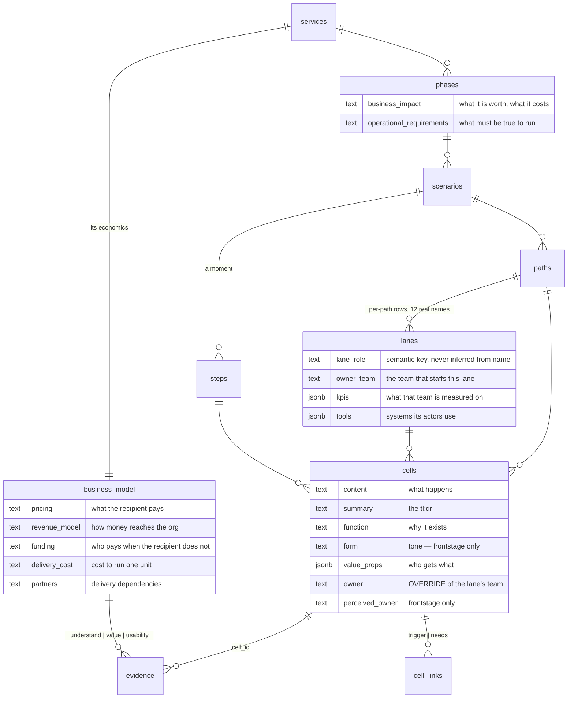

# Entity detail panels

The cell panel is the only way to write a spec field. Three more levels own
spec fields and have no surface at all. This builds them **as one
parameterised panel**, not four copies.

*(Vocabulary: this plan says **lane**. The table is still `layers` until
plan 002 lands; every file path below uses today's names.)*

---

## The proposal — every level, every field

This is the corrected set. Each field has a **definition**, a **reason to
exist**, and **what does not belong in it**, because five of them have never
had documentation beyond a one-line column comment.

*(Field names below are the proposed ones from [plan 002](2026-08-20-002-refactor-database-vocabulary-plan.md):
`services` replaces `service_lifecycles`, `lanes` replaces `layers`,
`summary` replaces `cells.description`.)*

### 🧭 SERVICE — 1 row

The root. Everything else hangs off it. **"Lifecycle" is gone** — plan 002
found `services` and `service_lifecycles` have no foreign key between them at
all, and the `services` row is a placeholder nothing reads.

| Field | Definition | Why it exists | Not this |
|---|---|---|---|
| `name`, `summary` | what the service is | orientation | — |
| `pricing` | **what the person receiving the service pays** | a journey that never mentions money can still cost someone money; this is where that fact lives | how the org gets paid — that's `revenue_model` |
| `revenue_model` | **how money reaches the org** — per session, subscription, institutional budget, grant-funded, free at point of use | separates "the student pays nothing" from "this service has no economics" | the amount |
| `funding` | **who pays when the recipient does not** — grant, department, sponsor | most public-service blueprints are free to the user and funded elsewhere. Without this, `pricing: free` reads as "costs nothing" | the cost of delivery |
| `delivery_cost` | **what it costs to run one unit** of the service | the other half of the sentence `funding` starts | headcount planning |
| `partners` | **who the service depends on to deliver** — Zoom, the university, a payroll vendor | a dependency that fails takes the journey with it; this is the list to check | vendors nobody in the journey touches |

> ⚠️ **Audit note — these five overlap and that is a real risk.** For a service
> that is free to its users, `pricing` and `revenue_model` collapse into one
> answer. **Guidance: fill `revenue_model` first.** If it says "free at point of
> use," then `pricing` is "Free" and `funding` carries the whole story. If the
> two ever say the same thing, one of them should be empty.

**Validation questions** — not columns. Three evidence anchors already
enforced by the schema (`evidence.proposition_question_key in
('understand','value','usability')`):

| Question | What it asks |
|---|---|
| `understand` | Do people know what this service is and what it offers? |
| `value` | Do people want it enough to act? |
| `usability` | Can people actually get through it? |

Zero evidence rows use these today. Empty is meaningful: it means the claim is
an **assumption**, which is the blueprint's own word.

### 🧭 PHASE — 6 rows

A named stage of the journey. **Both fields were vague; here is the split.**

| Field | Definition | Why it exists | Not this |
|---|---|---|---|
| `name`, `summary` | the stage | orientation | — |
| `business_impact` | **what this phase is worth, and what it costs the business** — retention, NPS, brand, opex, growth | prioritisation needs a phase-level anchor. "Which phase should we fix first" is otherwise argued from anecdote | cell-level detail; a metric that belongs to a lane (`lanes.kpis`) |
| `operational_requirements` | **what must be true for this phase to run at all** — process, system, people, legal | the constraints that do not appear as journey steps but stop the phase dead if unmet: a licence, a staffing floor, a data-retention rule | a to-do list; anything already drawn as a cell |

> **Guidance.** The test for `operational_requirements` is *"if this were
> false, would the phase stop?"* Nice-to-haves are not requirements. The test
> for `business_impact` is *"would this change a prioritisation decision?"* If
> it would not, it is description, not impact.

Both hints in the panel are lifted verbatim from the column comments in
`f65efcf` — the only documentation these fields have ever had.

### 🧭 SCENARIO / PATH / STEP — no panel

Audited each, since all three were asked about:

| Level | Rows | Fields it owns | Verdict |
|---|---|---|---|
| scenario | 22 | `name`, `summary`, `view_type` | **no panel** — a drawer holding one summary field is worse than editing the name inline |
| path | 38 | `name`, `path_type`, `summary`, `note` | **no panel** — and `summary` vs `note` have no documented difference. Decide what each means *before* either gets a UI |
| step | 185 | `name` only | **no panel** — there is nothing to edit |

**But step is the open question**, and it is worth stating plainly: the
suspicion that `value_props` belongs to the **step** rather than the cell is
the one thing that would give steps a panel. A step is a *moment*; a lane's
action inside it *contributes* to the value that moment delivers. If the fill
campaign finds the same value text repeated across a step's cells, that is the
answer — and step gets fields, and then a panel. Not decided on 11 rows.

### 🧭 LANE — 299 rows, 166 logical, 12 names

| Field | Definition | Why it exists | Not this |
|---|---|---|---|
| `name` | the actor or stage — "Regular Tutor", "Front Stage Tech" | the swimlane label | — |
| `lane_role` | the semantic key that drives rendering | **never inferred from the name** — that broke every non-English blueprint (`layer-roles.md`) | a display label |
| `owner_team` | **the team that staffs this lane** | the org unit accountable for everything in the row. Answers "who do I talk to about this" once, instead of per cell | the actor's job title — that is `name` |
| `kpis` | **what that team is measured on** | `check-kpi-alignment` compares them against what the lane's cells actually do: measured-but-never-enacted, and enacted-but-never-measured | outcomes nobody is accountable for |
| `tools` | **systems the lane's actors use** | tells the KPI check whether a measured thing is even instrumented | tools mentioned in a cell but not used by this lane |

### 🧭 CELL — 955 rows

| Field | Definition | Why it exists | Not this |
|---|---|---|---|
| `content` | **what happens** in this moment | the grid | why it happens |
| `summary` | the tl;dr the detail fields add up to | *(renamed from `description` — the panel already labels it Summary)* | a copy of `content` |
| `function` | **why this moment exists** | the purpose `content` cannot carry. Pilot: *content* "Enters the student's breakout room" → *function* "Open the tutoring moment: join within the first minute so the student is not left waiting" | a restatement of `content` |
| `form` | **tone and manner** — how it should feel | 🟡 **frontstage only.** A database write has no tone. Pilot filled 8 of 11 | a description of the UI |
| `value_props` | **who gets what** from this moment | `check-value-ledger`: cells that deliver to nobody, audiences who never receive | 🟡 possibly step-level — see above |
| `owner` | 🔴 **an override.** The team accountable for this cell **when it differs from its lane's `owner_team`** | one cell in a lane can be handled by a different team; that exception matters | a field to populate. Empty means "same as the lane" — **0/955 is correct, not a gap** |
| `perceived_owner` | **who the customer believes owns this moment** | a mismatch with `owner` is a deception risk, and `check-perceived-owner` looks for exactly that | 🟡 **frontstage only** — 241 of 955 cells. A customer cannot mis-perceive a backstage row |

### The two grain corrections, in one place

**🔴 Lane fields are stored per-path.** 299 rows hold 166 logical lanes and
only **12 distinct names**. "Regular Tutor" is one concept stored ~25 times.
The database already agrees: `remove_lane(scenario_id, lane_name)` deletes **by
name across the scenario** — it keys on `(scenario, name)`, not the row id, and
that exact mismatch caused the 8.5× undercount fixed in `20260820030000`.

| | Fan-out write | Promote to a `lanes` table |
|---|---|---|
| Shape | panel writes every same-named lane in the scenario | new table keyed `(scenario_id, name)` |
| Matches `remove_lane` | yes | yes |
| Migration | none | one, plus a backfill |
| Drift | impossible after the write | impossible by construction |

**Recommendation: fan-out now.** It is honest about the grain, needs no
migration, and the table is the right end state but should not gate the panel.

**🔴 `cells.owner` duplicates `lanes.owner_team`** — see the cell table above.
The panel shows the inherited value and only writes on override.

### The ERD



## Design

The brief pins the direction: **match the cell panel.** So there is no new
visual identity here — the design work is component selection, and the
success condition is that these panels are indistinguishable from the cell
panel in behaviour. Every choice below comes from
`docs/reference/ui-inventory.md`'s need→primitive map or from an existing
precedent, per its own rule of thumb:

> "a need that seems to lack a primitive usually has a precedent — check
> `OwnerTagSelect`, `SessionChangesSheet`, `SlicesSidebarSection` before
> assuming it's missing."

### Component choices

| Need | Primitive | Precedent / note |
|---|---|---|
| The drawer | `drawer.tsx` via the lifted `PanelDrawerShell` | same shell as the cell panel, footer-host id as a prop |
| Surface switch (service panel) | `editor/SegmentedControl` | composes `toggle-group.tsx`; the inventory names this exact use — "Details │ Differences surface switch … top-level panel chrome" |
| Field label + hint | `Field` (exported from `CellPanelEditor.tsx:53-84`) | already built, already the house label/hint/required wrapper |
| Single-line text (owner_team) | `input.tsx` | |
| Multi-line (business_impact, operational_requirements, pricing…) | the panel's existing bare `<textarea>` treatment | **not** `input-group.tsx` — the inventory reserves that for the composer, where the group owns the border and the single focus ring. Copy `CellPanelEditor.tsx:455-462` exactly |
| Repeating rows (kpis, tools) | `input.tsx` + ghost `Button size="icon-xs"` with `<X className="size-3"/>`, wrapped in `IconTooltip` | **the value_props editor is the precedent** (`CellPanelEditor.tsx:465-530`) — same row height (`h-7`), same `text-xs`, same self-start ghost "add" button |
| Suggesting existing values | `list=` datalist | value_props already does this: *"a datalist suggests, never blocks"* |
| Any icon-only button | `editor/IconTooltip` | THE wrapper. Child keeps its own `aria-label` — *"a tooltip is not an accessible name."* Copy says what it DOES |
| Lane `(i)` affordance | `SidebarNav`'s `NavRowAction` sizing | 24px target, 14px glyph, **no fill of its own** — the row it sits in already has one |
| Empty / loading | `deferred-skeleton.tsx` | |
| "No evidence — this is an assumption" | `alert.tsx` variant `info` | tinted surface + filled icon chip, copy stays `--foreground` |
| Grouped lists (validation questions) | `accordion.tsx`, controlled | the ledger step-groups precedent: one open at a time |

**Nothing new is added to `src/components/ui/`.** Every need above already has
a primitive or a precedent — which is the point of matching.

### Wireframes

Drawn on the cell panel's real anatomy: drawer header with expand toggle and
✕, an always-visible identity block, an always-visible spec block, tabs, and
Save/Cancel portalled to a footer host.

```
┌─ LANE ───────────────────────────────────────────┐
│ ⤢   Goal Setting › Regular Tutor             ✕  │
│                                                   │
│  Regular Tutor                                    │
│  Frontstage · what the customer sees this actor   │  the ROLE in words,
│  do                                               │  not the enum key
│  Appears in 6 paths · 61 cells                    │  where it is, not
│                                                   │  how it is stored
│  Owner team    [ ______________________ ]        │
│  KPIs          [ session completion    ] [×]     │  value_props row shape
│                [ + Add a KPI            ]        │
│  Tools         [ Zoom                   ] [×]     │
│                [ PLUS App               ] [×]     │
│                [ + Add a tool           ]        │
│                                                   │
│  Edits apply to all 6 "Regular Tutor" lanes      │  ← alert, variant=info
│  in this scenario.                                │    the grain, stated
│                                                   │
│  ┌──────────────┬──────────┐                     │
│  │ 61 cells     │ Flagged  │                      │  see "Tabs" below
│  └──────────────┴──────────┘                     │
├───────────────────────────────────────────────────┤
│                            [ Cancel ]  [ Save ]   │
└───────────────────────────────────────────────────┘
```

```
┌─ PHASE ──────────────────────────────────────────┐
│ ⤢   In-session                               ✕  │
│                                                   │
│  In-session                                       │
│  4 scenarios · 312 cells · loops to Pre-session   │
│                                                   │
│  Summary        [ ____________________________ ] │
│  Business       [ ____________________________ ] │
│  impact         [ opex, NPS, brand, retention,  ] │  hints lifted verbatim
│                 [ growth                        ] │  from the column
│  Operational    [ ____________________________ ] │  comments — the only
│  requirements   [ process / system / people /   ] │  docs these have
│                 [ legal                         ] │
│                                                   │
│  ┌──────────────┬──────────┐                     │
│  │ 4 scenarios  │ Flagged  │                      │
│  └──────────────┴──────────┘                     │
├───────────────────────────────────────────────────┤
│                            [ Cancel ]  [ Save ]   │
└───────────────────────────────────────────────────┘
```

```
┌─ SERVICE ────────────────────────────────────────┐
│ ⤢   PLUS Tutoring                            ✕  │
│  ┌────────────────┬───────────────┐              │  SegmentedControl —
│  │ Business model │  Validation   │              │  the only panel with
│  └────────────────┴───────────────┘              │  two surfaces
│                                                   │
│  Pricing        [ ___________________________ ]  │
│  Revenue model  [ ___________________________ ]  │
│  Funding        [ ___________________________ ]  │
│  Partners       [ ___________________________ ]  │
│  Delivery cost  [ ___________________________ ]  │
│                                                   │
│  6 phases · 22 scenarios · 955 cells             │
├───────────────────────────────────────────────────┤
│                            [ Cancel ]  [ Save ]   │
└───────────────────────────────────────────────────┘

── Validation surface ──────────────────────────────
│  ▼ Do people understand the service?             │  accordion, controlled,
│      Session observation, P3        observation  │  one open at a time
│      Tutor sync decision                meeting  │
│                          [ Add a source ]        │
│                                                   │
│  ▶ Do people value it?                            │
│  ▶ Can people use it?                             │
│      ⓘ No sources yet. Until one is attached,     │  alert variant=info
│        this is an assumption.                     │
│                          [ Add a source ]        │
└───────────────────────────────────────────────────┘
```

The validation surface is the half of the schema nothing has ever exercised:
`evidence` already enforces `check (num_nonnulls(cell_id,
proposition_question_key) = 1)`, and zero rows use the question key.

### Copy

Per the design brief's writing rules — plain verbs, sentence case, an action
keeps its name through the flow, and an empty state is an invitation:

| Where | Copy |
|---|---|
| Add button | "Add a KPI" / "Add a tool" / "Add a source" — never "＋" alone |
| Lane grain notice | "Edits apply to all 6 'Regular Tutor' lanes in this scenario." |
| No evidence | "No sources yet. Until one is attached, this is an assumption." |
| Inherited owner | "Owned by Tutoring Ops, from this lane." + "Override for this cell" |
| Save → toast | "Saved" (the button says Save, so the confirmation says Saved) |

### Triggers, corrected

The plan previously said cells open on ⌘-click. **Wrong.**
`BlueprintCellButton.tsx:180-183`:

> "⌘/ctrl reads, everything else picks (when there is a picker), and **a bare
> click on a canvas with no picker opens the panel**"

Plain click is the default; ⌘-click is the escape hatch for when a slice
picker owns the bare click.

| Entity | Opens from | Gesture |
|---|---|---|
| Service | a **Service** row at the top of the left sidebar | click |
| Phase | info button in `PhaseMenubarHeader` | click |
| Lane | `(i)` beside the lane label, **both** render paths | click |
| Cell | the cell | plain click *(unchanged)* |

**Phase gets a button, not a modifier-click.** `CanvasPhaseSection.tsx:180`
already makes the whole section `role="button"` meaning *navigate into this
phase*; a hidden gesture on top of that will not be found.

**Lane needs an affordance in both render paths.**
`ServiceBlueprintGrid.tsx:497-525` renders the label inert;
`BlueprintLabelRail.tsx:189-201` makes it a Design-mode *select-every-cell*
button. The `(i)` must read as neither.

**Close is the shell's job, identical everywhere:** ✕, Escape, or swipe — all
through `onCloseRequest`, all guarded by `panelEditorBusy()` so nothing closes
mid-save. That guard exists already (`BlueprintCellDetailPanel.tsx:274,527`).

**One panel at a time.** Opening a lane panel closes a cell panel. Each panel
still gets its own footer-host id, because `CELL_PANEL_FOOTER_ID` is a single
global DOM id the Save/Cancel row portals into.

---

## Files

```
NEW  src/components/blueprint/panelShell.tsx          lifted: PanelDrawerShell,
                                                      error boundary, Field,
                                                      footer-host id as a prop
NEW  src/contexts/EntityDetailContext.tsx             selection: {kind, id}
NEW  src/components/blueprint/LanePanel.tsx
NEW  src/components/blueprint/PhasePanel.tsx
NEW  src/components/blueprint/ServicePanel.tsx
NEW  src/components/blueprint/ValidationSurface.tsx
NEW  src/hooks/useLaneSpec.ts  usePhaseSpec.ts  useBusinessModel.ts
NEW  src/lib/laneSpecMutations.ts  phaseSpecMutations.ts
     businessModelMutations.ts                        each + a revert case

EDIT src/lib/revertChange.ts                          3 new cases
EDIT src/lib/authoringSession.ts                      3 ledger kinds + labels
EDIT scripts/tests/authoringSession.test.ts           exhaustiveness map
EDIT src/components/blueprint/BlueprintCellDetailPanel.tsx   consume the shell
EDIT src/components/editor/PhaseMenubarHeader.tsx     info button
EDIT src/components/blueprint/BlueprintLabelRail.tsx  (i)
EDIT src/components/blueprint/ServiceBlueprintGrid.tsx (i)
EDIT src/components/editor/ServiceOverviewView.tsx    mount, NOT gated on
                                                      focusedScenarioId
EDIT src/lib/agent/uiBridge.ts                        agentOpenEntityPanel
EDIT src/lib/agent/tools/{specs,registry}.ts          open_entity_panel,
                                                      update_lane, update_phase,
                                                      update_business_model
EDIT scripts/agent-harness/run.mjs                    a case per new read tool
```

## What is deliberately not reused

- **Evidence tab** on lane/phase — `evidence.cell_id` is the only entity link.
  The *service* panel can, because `proposition_question_key` is the second one.
- **Resources tab** — reads `cells.links`; no other level has it.
- **Dependencies tab** — walks `cell_triggers` → `cells.id`.
- **Draft mode** — `CellPanelEditor`'s not-yet-created branch. Phases, lanes and
  the service already exist.
- **The cell panel body** — tech pills, picture resolution, Figma URLs,
  dependency candidates. No phase or lane analog; write lean instead.

## Acceptance criteria

- [ ] The lifted shell serves four panels; the cell panel is unchanged
- [ ] Lane edits fan out to every same-named lane in the scenario, and the
      panel says so before saving
- [ ] `cells.owner` shows the inherited lane team and only writes on override
- [ ] Every new write has a revert case and a ledger label
- [ ] `perceived_owner` and `form` are offered on frontstage cells and not
      pushed elsewhere
- [ ] No new primitive in `src/components/ui/`
- [ ] Every icon-only button is wrapped in `IconTooltip` and keeps its own
      `aria-label`
- [ ] `npm run build`, `npm run lint`, tests, and `toolParity` green

---

## Tabs — what actually goes in them

The first draft put "Cells" and "Findings" tabs on the lane and phase panels
without saying what they were for. Justified or cut:

| Tab | Panel | Contents | Keep? |
|---|---|---|---|
| **Contents** — "61 cells" / "4 scenarios" | lane, phase | the children, in journey order, each a link that navigates and closes the panel | ✅ **keep.** It answers "what am I actually editing the spec *for*", and it is the only way to check that a KPI matches what the lane does — which is exactly what `check-kpi-alignment` asks a human to judge |
| **Flagged** | lane, phase | open findings whose `cell_ids` fall inside this lane / phase | ✅ **keep.** Findings have **no UI anywhere** — 5 real rows a human cannot read. Scoping them to the thing you are looking at is the smallest honest way to surface them, and it costs one `list_findings(cell_id)` call per child |
| ~~Evidence~~ | lane, phase | — | ❌ **cut.** `evidence.cell_id` is the only entity link. No lane or phase link exists without a schema change |
| ~~Resources~~ | lane, phase | — | ❌ **cut.** Reads `cells.links`; no other level has one |
| ~~Dependencies~~ | lane, phase | — | ❌ **cut.** Walks `cell_links` → `cells.id` |

Tab labels carry their count (`61 cells`, not `Cells`) because the count is
the useful part and the panel has room for it — the same reason the difference
ledger puts its count at the end of the group header rather than on the tab.

The **service** panel gets no Contents tab: its children are six phases already
listed in the sidebar, and duplicating navigation inside a properties panel is
noise.

---

## Interaction — how each panel opens

Working rule, taken from the cell panel: **the panel is a selection, not a
mode.** Opening one selects a thing; closing deselects. Nothing else on the
canvas changes — no camera move, no zoom, no filter. That is why the cell panel
can be opened and closed repeatedly while reading, and the new panels must feel
the same.

### Lane

The hard case, because a lane label already means two different things and
neither is "show me its properties":

```
ServiceBlueprintGrid.tsx:497   inert <span>, no onClick
BlueprintLabelRail.tsx:189     a <button> in Design mode = select every cell
                               in this lane (for bulk editing)
```

**Proposal: a dedicated affordance that appears on hover or focus, never a
new meaning for the label itself.**

```
   rest                     hover / focus-within
   ┌──────────────────┐     ┌──────────────────┐
   │ Regular Tutor    │     │ Regular Tutor  ⓘ │
   └──────────────────┘     └──────────────────┘
                                             ↑
                              24px target, 14px glyph, no fill of its own
                              (SidebarNav NavRowAction sizing)
```

- Sized and inked as `NavRowAction`: `--sidebar-foreground/50` at rest →
  full ink on hover/focus. The row already has a fill; the button adds none.
- Wrapped in `IconTooltip`, label **"Lane properties"** — says what it does.
  The button keeps its own `aria-label`; a tooltip is not an accessible name.
- **Always in the tab order**, even while hidden at rest — a hover-only control
  that keyboard users cannot reach is not an affordance.
- Added to **both** render paths. In `BlueprintLabelRail`'s Design mode it sits
  beside the selection button, so the two readings stay visibly separate.
- Right-click on the lane label opens a `context-menu.tsx` with "Lane
  properties" — the discoverable route, mirroring the cell's right-click →
  "View cell detail".

### Phase and scenario

The phase section is already one big navigate button
(`CanvasPhaseSection.tsx:180`), so the affordance goes in the chrome, not on
the canvas shape:

- **Phase:** an `ⓘ` button in `PhaseMenubarHeader`, right of the title.
- **Scenario:** no panel *(nothing to edit — see the proposal above)*. If the
  step question resolves in favour of scenario-level fields, it inherits this
  same pattern on `ScenarioMenubarBreadcrumb`.

### Service

The one level with no shape on the canvas, so it gets a named row rather than
an affordance:

```
┌─ sidebar ────────────┐
│  PLUS Application    │  ← the service. Click = open the service panel.
│  ──────────────────  │
│  Phases              │
│    Application       │
│    …                 │
│  Slices              │
└──────────────────────┘
```

Sits above Phases, styled as a `NavSection` header row rather than a nav item,
because it is the container of everything below it — not a sibling of Phases.

### Steps

**No affordance, because there is nothing to open** — a step owns only its
name. Recorded here so the absence is a decision: if `value_props` moves to the
step, a step header gains the same `ⓘ` treatment as a lane label, and this
section is where that lands.

### The interaction table

| Entity | Affordance | Gesture | Discoverable route |
|---|---|---|---|
| Service | sidebar row, above Phases | click | it is a visible row |
| Phase | `ⓘ` in `PhaseMenubarHeader` | click | visible in chrome |
| Lane | `ⓘ` on the label, hover/focus-revealed, always tabbable | click | right-click → "Lane properties" |
| Cell | the cell itself | **plain click** | right-click → "View cell detail" |
| Scenario · Path · Step | — | — | nothing to edit |

**Close is the shell's job and identical for all of them:** `✕`, `Escape`, or
swipe, each routed through `onCloseRequest` and guarded by `panelEditorBusy()`
so nothing closes mid-save (`BlueprintCellDetailPanel.tsx:274,527`).

**One panel at a time.** Opening a lane panel closes a cell panel. Beyond
simplicity, `CELL_PANEL_FOOTER_ID` is a single global DOM id that Save/Cancel
portals into — so each panel also gets its own footer-host id, and the
collision cannot return through the side door.
