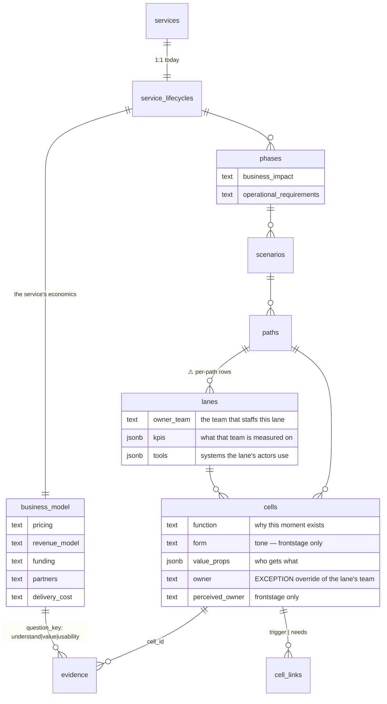

# Entity detail panels

The cell panel is the only way to write a spec field. Three more levels own
spec fields and have no surface at all. This builds them **as one
parameterised panel**, not four copies.

*(Vocabulary: this plan says **lane**. The table is still `layers` until
plan 002 lands; every file path below uses today's names.)*

---

## The properties proposal

Audited every level against the question **"is this field at the right
grain?"** Two are not.



### Field-by-field verdict

| Level | Field | Verdict | Why |
|---|---|---|---|
| service | pricing, revenue_model, funding, partners, delivery_cost | ✅ **correct** | 1 row, whole-service by nature |
| phase | business_impact, operational_requirements | ✅ **correct** | 6 rows, no duplication |
| lane | owner_team, kpis, tools | 🔴 **wrong grain** | see below |
| cell | function | ✅ **correct** | genuinely per-cell — `content` says what happens, `function` says why |
| cell | value_props | 🟡 **suspect** | may belong to the step; not moving on 11 rows of evidence |
| cell | form | 🟡 **frontstage only** | a backstage write has no tone. Pilot: 8 of 11 |
| cell | perceived_owner | 🟡 **frontstage only** | 241 of 955 cells. A customer cannot mis-perceive a backstage row |
| cell | owner | 🔴 **duplicate** | restates the lane's `owner_team` 955 times |

### 🔴 The lane grain problem

```
299  lane rows
166  logical lanes   (distinct scenario × name)
 12  distinct lane names in the entire blueprint
```

"Regular Tutor" is **one** concept stored as ~25 rows. And the database
already agrees: `remove_lane(scenario_id, lane_name)` deletes **by name across
the scenario** — the delete keys on `(scenario, name)`, not on the row id. That
exact mismatch caused the 8.5× undercount fixed in `20260820030000`.

**Two ways to fix it:**

| | Fan-out write | Promote to a `lanes` table |
|---|---|---|
| Shape | panel writes all same-named rows in the scenario | new table keyed `(scenario_id, name)`, `layers` FKs to it |
| Matches `remove_lane` | yes | yes |
| Migration | none | real one, plus a backfill |
| Drift | impossible after the write, possible via direct SQL | impossible by construction |
| Effort | small | medium |

**Recommendation: fan-out now, promote later if drift appears.** The fan-out
write is honest about the grain and needs no migration; the table is the
structurally correct end state but should not gate the panel.

Either way the panel edits **the logical lane**. Editing one row would create
the drift `check-kpi-alignment` then reports — the tool manufacturing its own
findings.

### 🔴 `cells.owner` is an override, not a field to fill

A cell's owning team is its lane's team, unless it deviates. So **0/955 is not
a failure** — empty means "same as the lane."

**Do not populate it.** The panel shows the inherited value greyed, with an
"override" affordance. The fill campaign skips it entirely.

---

## Design

The brief pins the direction: **match the cell panel.** So there is no new
visual identity here — the design work is component selection, and the
success condition is that these panels are indistinguishable from the cell
panel in behaviour. Every choice below comes from
`docs/reference/ui-inventory.md`'s need→primitive map or from an existing
precedent, per its own rule of thumb:

> "a need that seems to lack a primitive usually has a precedent — check
> `OwnerTagSelect`, `SessionChangesSheet`, `SlicesSidebarSection` before
> assuming it's missing."

### Component choices

| Need | Primitive | Precedent / note |
|---|---|---|
| The drawer | `drawer.tsx` via the lifted `PanelDrawerShell` | same shell as the cell panel, footer-host id as a prop |
| Surface switch (service panel) | `editor/SegmentedControl` | composes `toggle-group.tsx`; the inventory names this exact use — "Details │ Differences surface switch … top-level panel chrome" |
| Field label + hint | `Field` (exported from `CellPanelEditor.tsx:53-84`) | already built, already the house label/hint/required wrapper |
| Single-line text (owner_team) | `input.tsx` | |
| Multi-line (business_impact, operational_requirements, pricing…) | the panel's existing bare `<textarea>` treatment | **not** `input-group.tsx` — the inventory reserves that for the composer, where the group owns the border and the single focus ring. Copy `CellPanelEditor.tsx:455-462` exactly |
| Repeating rows (kpis, tools) | `input.tsx` + ghost `Button size="icon-xs"` with `<X className="size-3"/>`, wrapped in `IconTooltip` | **the value_props editor is the precedent** (`CellPanelEditor.tsx:465-530`) — same row height (`h-7`), same `text-xs`, same self-start ghost "add" button |
| Suggesting existing values | `list=` datalist | value_props already does this: *"a datalist suggests, never blocks"* |
| Any icon-only button | `editor/IconTooltip` | THE wrapper. Child keeps its own `aria-label` — *"a tooltip is not an accessible name."* Copy says what it DOES |
| Lane `(i)` affordance | `SidebarNav`'s `NavRowAction` sizing | 24px target, 14px glyph, **no fill of its own** — the row it sits in already has one |
| Empty / loading | `deferred-skeleton.tsx` | |
| "No evidence — this is an assumption" | `alert.tsx` variant `info` | tinted surface + filled icon chip, copy stays `--foreground` |
| Grouped lists (validation questions) | `accordion.tsx`, controlled | the ledger step-groups precedent: one open at a time |

**Nothing new is added to `src/components/ui/`.** Every need above already has
a primitive or a precedent — which is the point of matching.

### Wireframes

Drawn on the cell panel's real anatomy: drawer header with expand toggle and
✕, an always-visible identity block, an always-visible spec block, tabs, and
Save/Cancel portalled to a footer host.

```
┌─ LANE ───────────────────────────────────────────┐
│ ⤢   Goal Setting › Regular Tutor             ✕  │
│                                                   │
│  Regular Tutor                                    │
│  frontstage_actions · 6 lanes · 61 cells         │  role, never inferred
│                                                   │  from the name
│  Owner team    [ ______________________ ]        │
│  KPIs          [ session completion    ] [×]     │  value_props row shape
│                [ + Add a KPI            ]        │
│  Tools         [ Zoom                   ] [×]     │
│                [ PLUS App               ] [×]     │
│                [ + Add a tool           ]        │
│                                                   │
│  Edits apply to all 6 "Regular Tutor" lanes      │  ← alert, variant=info
│  in this scenario.                                │    the grain, stated
│                                                   │
│  ┌──────────┬──────────┐                         │
│  │  Cells   │ Findings │                          │
│  └──────────┴──────────┘                         │
├───────────────────────────────────────────────────┤
│                            [ Cancel ]  [ Save ]   │
└───────────────────────────────────────────────────┘
```

```
┌─ PHASE ──────────────────────────────────────────┐
│ ⤢   In-session                               ✕  │
│                                                   │
│  In-session                                       │
│  4 scenarios · 312 cells · loops to Pre-session   │
│                                                   │
│  Summary        [ ____________________________ ] │
│  Business       [ ____________________________ ] │
│  impact         [ opex, NPS, brand, retention,  ] │  hints lifted verbatim
│                 [ growth                        ] │  from the column
│  Operational    [ ____________________________ ] │  comments — the only
│  requirements   [ process / system / people /   ] │  docs these have
│                 [ legal                         ] │
│                                                   │
│  ┌───────────┬──────────┐                        │
│  │ Scenarios │ Findings │                         │
│  └───────────┴──────────┘                        │
├───────────────────────────────────────────────────┤
│                            [ Cancel ]  [ Save ]   │
└───────────────────────────────────────────────────┘
```

```
┌─ SERVICE ────────────────────────────────────────┐
│ ⤢   PLUS Tutoring                            ✕  │
│  ┌────────────────┬───────────────┐              │  SegmentedControl —
│  │ Business model │  Validation   │              │  the only panel with
│  └────────────────┴───────────────┘              │  two surfaces
│                                                   │
│  Pricing        [ ___________________________ ]  │
│  Revenue model  [ ___________________________ ]  │
│  Funding        [ ___________________________ ]  │
│  Partners       [ ___________________________ ]  │
│  Delivery cost  [ ___________________________ ]  │
│                                                   │
│  6 phases · 22 scenarios · 955 cells             │
├───────────────────────────────────────────────────┤
│                            [ Cancel ]  [ Save ]   │
└───────────────────────────────────────────────────┘

── Validation surface ──────────────────────────────
│  ▼ Do people understand the service?             │  accordion, controlled,
│      Session observation, P3        observation  │  one open at a time
│      Tutor sync decision                meeting  │
│                          [ Add a source ]        │
│                                                   │
│  ▶ Do people value it?                            │
│  ▶ Can people use it?                             │
│      ⓘ No sources yet. Until one is attached,     │  alert variant=info
│        this is an assumption.                     │
│                          [ Add a source ]        │
└───────────────────────────────────────────────────┘
```

The validation surface is the half of the schema nothing has ever exercised:
`evidence` already enforces `check (num_nonnulls(cell_id,
proposition_question_key) = 1)`, and zero rows use the question key.

### Copy

Per the design brief's writing rules — plain verbs, sentence case, an action
keeps its name through the flow, and an empty state is an invitation:

| Where | Copy |
|---|---|
| Add button | "Add a KPI" / "Add a tool" / "Add a source" — never "＋" alone |
| Lane grain notice | "Edits apply to all 6 'Regular Tutor' lanes in this scenario." |
| No evidence | "No sources yet. Until one is attached, this is an assumption." |
| Inherited owner | "Owned by Tutoring Ops, from this lane." + "Override for this cell" |
| Save → toast | "Saved" (the button says Save, so the confirmation says Saved) |

### Triggers, corrected

The plan previously said cells open on ⌘-click. **Wrong.**
`BlueprintCellButton.tsx:180-183`:

> "⌘/ctrl reads, everything else picks (when there is a picker), and **a bare
> click on a canvas with no picker opens the panel**"

Plain click is the default; ⌘-click is the escape hatch for when a slice
picker owns the bare click.

| Entity | Opens from | Gesture |
|---|---|---|
| Service | a **Service** row at the top of the left sidebar | click |
| Phase | info button in `PhaseMenubarHeader` | click |
| Lane | `(i)` beside the lane label, **both** render paths | click |
| Cell | the cell | plain click *(unchanged)* |

**Phase gets a button, not a modifier-click.** `CanvasPhaseSection.tsx:180`
already makes the whole section `role="button"` meaning *navigate into this
phase*; a hidden gesture on top of that will not be found.

**Lane needs an affordance in both render paths.**
`ServiceBlueprintGrid.tsx:497-525` renders the label inert;
`BlueprintLabelRail.tsx:189-201` makes it a Design-mode *select-every-cell*
button. The `(i)` must read as neither.

**Close is the shell's job, identical everywhere:** ✕, Escape, or swipe — all
through `onCloseRequest`, all guarded by `panelEditorBusy()` so nothing closes
mid-save. That guard exists already (`BlueprintCellDetailPanel.tsx:274,527`).

**One panel at a time.** Opening a lane panel closes a cell panel. Each panel
still gets its own footer-host id, because `CELL_PANEL_FOOTER_ID` is a single
global DOM id the Save/Cancel row portals into.

---

## Files

```
NEW  src/components/blueprint/panelShell.tsx          lifted: PanelDrawerShell,
                                                      error boundary, Field,
                                                      footer-host id as a prop
NEW  src/contexts/EntityDetailContext.tsx             selection: {kind, id}
NEW  src/components/blueprint/LanePanel.tsx
NEW  src/components/blueprint/PhasePanel.tsx
NEW  src/components/blueprint/ServicePanel.tsx
NEW  src/components/blueprint/ValidationSurface.tsx
NEW  src/hooks/useLaneSpec.ts  usePhaseSpec.ts  useBusinessModel.ts
NEW  src/lib/laneSpecMutations.ts  phaseSpecMutations.ts
     businessModelMutations.ts                        each + a revert case

EDIT src/lib/revertChange.ts                          3 new cases
EDIT src/lib/authoringSession.ts                      3 ledger kinds + labels
EDIT scripts/tests/authoringSession.test.ts           exhaustiveness map
EDIT src/components/blueprint/BlueprintCellDetailPanel.tsx   consume the shell
EDIT src/components/editor/PhaseMenubarHeader.tsx     info button
EDIT src/components/blueprint/BlueprintLabelRail.tsx  (i)
EDIT src/components/blueprint/ServiceBlueprintGrid.tsx (i)
EDIT src/components/editor/ServiceOverviewView.tsx    mount, NOT gated on
                                                      focusedScenarioId
EDIT src/lib/agent/uiBridge.ts                        agentOpenEntityPanel
EDIT src/lib/agent/tools/{specs,registry}.ts          open_entity_panel,
                                                      update_lane, update_phase,
                                                      update_business_model
EDIT scripts/agent-harness/run.mjs                    a case per new read tool
```

## What is deliberately not reused

- **Evidence tab** on lane/phase — `evidence.cell_id` is the only entity link.
  The *service* panel can, because `proposition_question_key` is the second one.
- **Resources tab** — reads `cells.links`; no other level has it.
- **Dependencies tab** — walks `cell_triggers` → `cells.id`.
- **Draft mode** — `CellPanelEditor`'s not-yet-created branch. Phases, lanes and
  the service already exist.
- **The cell panel body** — tech pills, picture resolution, Figma URLs,
  dependency candidates. No phase or lane analog; write lean instead.

## Acceptance criteria

- [ ] The lifted shell serves four panels; the cell panel is unchanged
- [ ] Lane edits fan out to every same-named lane in the scenario, and the
      panel says so before saving
- [ ] `cells.owner` shows the inherited lane team and only writes on override
- [ ] Every new write has a revert case and a ledger label
- [ ] `perceived_owner` and `form` are offered on frontstage cells and not
      pushed elsewhere
- [ ] No new primitive in `src/components/ui/`
- [ ] Every icon-only button is wrapped in `IconTooltip` and keeps its own
      `aria-label`
- [ ] `npm run build`, `npm run lint`, tests, and `toolParity` green
