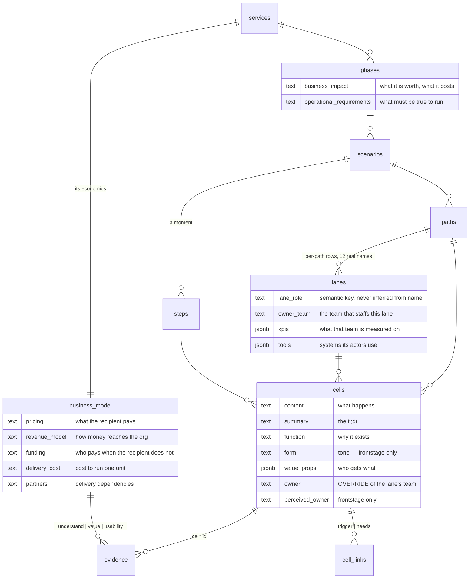
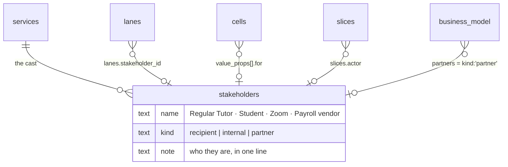

# The data model

What the blueprint stores at each level, what each field means, and the four
open questions. Separated from [plan 003](2026-08-20-003-feat-entity-detail-panels-plan.md),
which builds the surfaces — this document decides *what is worth storing*, that
one decides *how it is edited*.

*(Names below are the proposed ones from [plan 002](2026-08-20-002-refactor-database-vocabulary-plan.md):
`services` replaces `service_lifecycles`, `lanes` replaces `layers`,
`summary` replaces `cells.description`, `moment` replaces `cells.content`.)*

---

## The proposal — every level, every field

This is the corrected set. Each field has a **definition**, a **reason to
exist**, and **what does not belong in it**, because five of them have never
had documentation beyond a one-line column comment.

*(Field names below are the proposed ones from [plan 002](2026-08-20-002-refactor-database-vocabulary-plan.md):
`services` replaces `service_lifecycles`, `lanes` replaces `layers`,
`summary` replaces `cells.description`.)*

### 🧭 SERVICE — 1 row

The root. Everything else hangs off it. **"Lifecycle" is gone** — plan 002
found `services` and `service_lifecycles` have no foreign key between them at
all, and the `services` row is a placeholder nothing reads.

| Field | Definition | Why it exists | Not this |
|---|---|---|---|
| `name`, `summary` | what the service is | orientation | — |
| `pricing` | **what the person receiving the service pays** | a journey that never mentions money can still cost someone money; this is where that fact lives | how the org gets paid — that's `revenue_model` |
| `revenue_model` | **how money reaches the org** — per session, subscription, institutional budget, grant-funded, free at point of use | separates "the student pays nothing" from "this service has no economics" | the amount |
| `funding` | **who pays when the recipient does not** — grant, department, sponsor | most public-service blueprints are free to the user and funded elsewhere. Without this, `pricing: free` reads as "costs nothing" | the cost of delivery |
| `delivery_cost` | **what it costs to run one unit** of the service | the other half of the sentence `funding` starts | headcount planning |
| `partners` | **who the service depends on to deliver** — Zoom, the university, a payroll vendor | a dependency that fails takes the journey with it; this is the list to check | vendors nobody in the journey touches |

> ⚠️ **Audit note — these five overlap and that is a real risk.** For a service
> that is free to its users, `pricing` and `revenue_model` collapse into one
> answer. **Guidance: fill `revenue_model` first.** If it says "free at point of
> use," then `pricing` is "Free" and `funding` carries the whole story. If the
> two ever say the same thing, one of them should be empty.

**Validation questions** — not columns. Three evidence anchors already
enforced by the schema (`evidence.proposition_question_key in
('understand','value','usability')`):

| Question | What it asks |
|---|---|
| `understand` | Do people know what this service is and what it offers? |
| `value` | Do people want it enough to act? |
| `usability` | Can people actually get through it? |

Zero evidence rows use these today. Empty is meaningful: it means the claim is
an **assumption**, which is the blueprint's own word.

### 🧭 PHASE — 6 rows

A named stage of the journey. **Both fields were vague; here is the split.**

| Field | Definition | Why it exists | Not this |
|---|---|---|---|
| `name`, `summary` | the stage | orientation | — |
| `business_impact` | **what this phase is worth, and what it costs the business** — retention, NPS, brand, opex, growth | prioritisation needs a phase-level anchor. "Which phase should we fix first" is otherwise argued from anecdote | cell-level detail; a metric that belongs to a lane (`lanes.kpis`) |
| `operational_requirements` | **what must be true for this phase to run at all** — process, system, people, legal | the constraints that do not appear as journey steps but stop the phase dead if unmet: a licence, a staffing floor, a data-retention rule | a to-do list; anything already drawn as a cell |

> **Guidance.** The test for `operational_requirements` is *"if this were
> false, would the phase stop?"* Nice-to-haves are not requirements. The test
> for `business_impact` is *"would this change a prioritisation decision?"* If
> it would not, it is description, not impact.

Both hints in the panel are lifted verbatim from the column comments in
`f65efcf` — the only documentation these fields have ever had.

### 🧭 SCENARIO / PATH / STEP — no panel

Audited each, since all three were asked about:

| Level | Rows | Fields it owns | Verdict |
|---|---|---|---|
| scenario | 22 | `name`, `summary`, `view_type` | **no panel** — a drawer holding one summary field is worse than editing the name inline |
| path | 38 | `name`, `path_type`, `summary`, `note` | **no panel** — and `summary` vs `note` have no documented difference. Decide what each means *before* either gets a UI |
| step | 185 | `name` only | **no panel** — there is nothing to edit |

**But step is the open question**, and it is worth stating plainly: the
suspicion that `value_props` belongs to the **step** rather than the cell is
the one thing that would give steps a panel. A step is a *moment*; a lane's
action inside it *contributes* to the value that moment delivers. If the fill
campaign finds the same value text repeated across a step's cells, that is the
answer — and step gets fields, and then a panel. Not decided on 11 rows.

### 🧭 LANE — 299 rows, 166 logical, 12 names

| Field | Definition | Why it exists | Not this |
|---|---|---|---|
| `name` | the actor or stage — "Regular Tutor", "Front Stage Tech" | the swimlane label | — |
| `lane_role` | the semantic key that drives rendering | **never inferred from the name** — that broke every non-English blueprint (`layer-roles.md`) | a display label |
| `owner_team` | **the team that staffs this lane** | the org unit accountable for everything in the row. Answers "who do I talk to about this" once, instead of per cell | the actor's job title — that is `name` |
| `kpis` | **what that team is measured on** | `check-kpi-alignment` compares them against what the lane's cells actually do: measured-but-never-enacted, and enacted-but-never-measured | outcomes nobody is accountable for |
| `tools` | **systems the lane's actors use** | tells the KPI check whether a measured thing is even instrumented | tools mentioned in a cell but not used by this lane |

### 🧭 CELL — 955 rows

| Field | Definition | Why it exists | Not this |
|---|---|---|---|
| `content` | **what happens** in this moment | the grid | why it happens |
| `summary` | the tl;dr the detail fields add up to | *(renamed from `description` — the panel already labels it Summary)* | a copy of `content` |
| `function` | **why this moment exists** | the purpose `content` cannot carry. Pilot: *content* "Enters the student's breakout room" → *function* "Open the tutoring moment: join within the first minute so the student is not left waiting" | a restatement of `content` |
| `form` | **tone and manner** — how it should feel | 🟡 **frontstage only.** A database write has no tone. Pilot filled 8 of 11 | a description of the UI |
| `value_props` | **who gets what** from this moment | `check-value-ledger`: cells that deliver to nobody, audiences who never receive | 🟡 possibly step-level — see above |
| `owner` | 🔴 **an override.** The team accountable for this cell **when it differs from its lane's `owner_team`** | one cell in a lane can be handled by a different team; that exception matters | a field to populate. Empty means "same as the lane" — **0/955 is correct, not a gap** |
| `perceived_owner` | **who the customer believes owns this moment** | a mismatch with `owner` is a deception risk, and `check-perceived-owner` looks for exactly that | 🟡 **frontstage only** — 241 of 955 cells. A customer cannot mis-perceive a backstage row |

### The two grain corrections, in one place

**🔴 Lane fields are stored per-path.** 299 rows hold 166 logical lanes and
only **12 distinct names**. "Regular Tutor" is one concept stored ~25 times.
The database already agrees: `remove_lane(scenario_id, lane_name)` deletes **by
name across the scenario** — it keys on `(scenario, name)`, not the row id, and
that exact mismatch caused the 8.5× undercount fixed in `20260820030000`.

| | Fan-out write | Promote to a `lanes` table |
|---|---|---|
| Shape | panel writes every same-named lane in the scenario | new table keyed `(scenario_id, name)` |
| Matches `remove_lane` | yes | yes |
| Migration | none | one, plus a backfill |
| Drift | impossible after the write | impossible by construction |

**Recommendation: fan-out now.** It is honest about the grain, needs no
migration, and the table is the right end state but should not gate the panel.

**🔴 `cells.owner` duplicates `lanes.owner_team`** — see the cell table above.
The panel shows the inherited value and only writes on override.

### The ERD




---

# Open questions

## `scenario.view_type` is not a spec field

Answering it because it looked like an undocumented property. It is a **view
preference**, not content: which compare layout this scenario opens in.

```
DB      single | side-by-side | integrated     (historical tokens)
Client  single | stacked      | merged         (Compare v3)
```

`viewTypeVocabulary.ts` is the only place the two meet, deliberately —
*"Everything above the two seams uses client tokens only."* Persisted
`integrated` rows coerce to stacked, so no migration was needed and old data
did not change meaning.

**It belongs in no panel.** It is set by using the compare control, which is
where a view preference should be set.

## Stakeholders — the one genuinely missing concept

Asked whether the service should carry stakeholder info, and how that relates
to partners and employees. It should, and there is evidence the model already
wants it.

**Stakeholders exist today in three unlinked places:**

| Where | What it is | Example |
|---|---|---|
| `lanes.name` | the actor whose row this is | "Regular Tutor" |
| `cells.value_props[].for` | the audience a value goes to | "tutor" |
| `slices.actor` | whose view a slice takes | "Regular Tutor" |
| `business_model.partners` | orgs the service depends on | free text |

Four strings for the same cast of characters, none of them connected. And
`check-value-ledger` **already tries to cross-check two of them**:

> "An actor present as a lane but never named as a value audience anywhere →
> info"

That check compares lane names to `value_props[].for` — two free-text
vocabularies with nothing keeping them aligned. It will report false findings
the moment someone writes "tutor" in one place and "Regular Tutor" in the
other.

### Proposal: one stakeholder registry on the service



| `kind` | Who | Replaces |
|---|---|---|
| `recipient` | who the service is for — student, applicant, family | the customer half of `value_props[].for` |
| `internal` | who delivers it — tutor, lead tutor, supervisor | lane names, the employee question |
| `partner` | orgs it depends on — Zoom, the university, payroll | `business_model.partners`, which becomes a **derived view** of this list rather than its own free-text field |

**What this buys, concretely:**

1. `check-value-ledger`'s cross-check becomes real instead of string-matching.
2. "Which stakeholders never receive value?" is answerable — today it is a
   guess across three vocabularies.
3. `partners` stops being a fifth money field with fuzzy edges (see the
   overlap warning in the service section above) and becomes a filter over a
   list that has structure.
4. A slice's actor is validated rather than typed.

**Honest cost:** a new table, a nullable FK on `lanes`, a migration for
`value_props[].for`, and a decision about whether existing free text is
back-filled or left as a fallback. This is **not** part of plan 003 — it is
its own plan, and it should be written only if you want the cross-check to
work. Recording it here because the panels are where the pressure showed up:
a lane panel with a free-text `owner_team` beside a value editor with a
free-text `for` is two places to type the same wrong thing.

**Recommendation: defer, but do not fill `owner_team` as free text at scale
until this is decided** — 166 lanes of hand-typed team names is exactly the
vocabulary drift the registry would prevent, and the fill campaign
(plan 005) is what would create it.

## Is phase sufficient?

Current: `name`, `summary`, `business_impact`, `operational_requirements`,
`loops_to_phase_id`, `position`.

The two spec fields **are** complementary — one is worth-and-cost, the other
is preconditions — and `loops_to_phase_id` already carries the structural
fact that a phase can send you back.

**Recommendation: add nothing.** Two fields at 0/6 is not evidence that a
third is needed. The honest test is whether anyone reaches for something that
is not there *after* the first two are filled. Candidates people usually ask
for, and why they are not proposed now:

| Candidate | Why not yet |
|---|---|
| Entry / exit criteria | that is `operational_requirements` ("what must be true") pointed at the boundary |
| Duration | real, but a phase's duration is a property of a *journey through* it, not of the phase — and nothing measures it today |
| Phase owner | a phase spans lanes, each with its own `owner_team`. A phase-level owner would either duplicate them or contradict them |

## Path, step and scenario without a panel — where the information shows

The question is right: cutting the panel does not mean the information has
nowhere to live.

| Level | What it holds | Where it shows |
|---|---|---|
| Scenario | `name`, `summary` | the **sidebar row** already lists it; `summary` belongs in a hover card there, not on the canvas |
| Path | `name`, `path_type`, `summary`, `note` | the path label already carries name and type. `summary`/`note` — **decide what each means first**; today they are two undocumented free-text fields |
| Step | `name` only | the column header. Nothing else to show |
| Lane | name, role, owner, KPIs, tools | the panel |

**On tooltips specifically:** the instinct is right for one-line facts and
wrong for content. `ui-inventory.md` is firm that `IconTooltip` copy *"says
what it DOES"* — tooltips are for naming a control, not for holding prose. So:

- **Tooltip** — the lane label truncated on a narrow rail, the step header's
  full name. One line, no interaction.
- **Hover card** (`popover.tsx` on hover-intent) — a scenario's `summary`
  from the sidebar. Multi-line, selectable text.
- **Neither** — anything a user would want to *edit*. That is a panel, and if
  the level has nothing worth editing it does not get one.

## Should step get a panel like lane?

**Not today, and the reason is worth writing down: a step has the same grain
problem lanes do, and no fields to make it worth solving.**

A step belongs to a scenario but is *positioned per path* through
`path_steps`. So "the step" is already a `(scenario, name)` concept
represented by many `path_steps` rows — the same shape as a lane's
`(scenario, name)` across 299 rows.

If `value_props` moves from cell to step, then step gains real fields, and
the panel and the fan-out write pattern both arrive together. Until then a
step panel would edit a name.

## `content` → `preview`? No — but `content` is the wrong word

Pushing back on the specific rename while agreeing with the instinct.

**"Preview" is misleading.** A preview is a truncated view of something
longer. The cell's text is not a shortened version of anything — it is the
canonical statement of what happens in that moment. Calling it a preview
implies the real thing lives elsewhere.

**But `content` and `summary` are a genuinely confusing pair.** Both are
short text on the same row, and neither name says which is which.

`upsert_cell`'s own spec already supplies a better word:

> "content is REQUIRED and must be real journey text — **a journey moment**,
> not a system capability."

| Candidate | Verdict |
|---|---|
| `preview` | ❌ implies a fuller version exists elsewhere |
| `label` | ❌ a label names a thing; this states an action |
| `moment` | ✅ **the domain word**, already used in the spec and the playbooks |
| `content` | ⚠️ workable, but says nothing |

**Recommendation: `cells.moment`.** It pairs cleanly with `summary` — the
moment is what happens, the summary is the tl;dr of the detail around it —
and it is the word the codebase already reaches for when it has to explain
the field. Folded into [plan 002](2026-08-20-002-refactor-database-vocabulary-plan.md)
as the largest of the renames; call it if you disagree, it is the one with the
widest blast radius.

## Owner inheritance — display it, do not store it

Agreed on the behaviour, with one correction on the mechanism.

**Storing the lane's team on 955 cells is the drift bug in advance.** Change
a lane's `owner_team` and 61 stored copies are instantly wrong, with nothing
to detect it. That is the same failure the lane grain section describes, one
level down.

**Instead: an effective owner, computed.**

```sql
-- read-time, no writes, cannot drift
coalesce(cells.owner, lanes.owner_team) as effective_owner
```

| | Panel shows | Stored |
|---|---|---|
| No override | "Tutoring Ops — inherited from this lane" *(muted)* | `owner` = null |
| Override set | "Contracted Support" + "Reset to the lane's team" | `owner` = the exception |

`check-perceived-owner` reads **`effective_owner`**, not `owner` — otherwise
it compares an empty field and finds nothing, which is exactly why it has
never produced a result.

**This is what "do not leave it empty" should mean:** never show a user an
empty owner. The column stays empty because empty is the correct
representation of "same as the lane."

## Perceived owner — same rule, different default

Agreed it should not read as empty. But there is nothing to inherit from:
lanes have no perceived owner.

**Proposal: for frontstage cells, the default perceived owner is the lane's
own stakeholder** — the customer sees the tutor doing the thing, so absent
any signal, the tutor is who they think is responsible.

```
effective_perceived_owner =
  coalesce(cells.perceived_owner,
           case when lanes.lane_role like 'frontstage%' or
                     lanes.lane_role = 'customer_actions'
                then lanes.name end)
```

That makes the deception check meaningful: a finding fires when the customer
believes it is **someone other than the visible actor** — the school when it
is a contractor, the app when it is a person. Backstage cells stay null,
because a customer perceives nothing there and a forced default would
manufacture findings.

## A template for value props

There is one already, unwritten, in the 11 pilot cells:

```json
{"for": "tutor",    "value": "greets a name, not a username"}
{"for": "business", "value": "attendance data stays clean downstream"}
{"for": "student",  "value": "permission to ask lowers the cost of being stuck"}
```

**The pattern: `for <stakeholder>` → `<what becomes possible, or what stops
being costly>`.** Every one names a consequence, not a feature. None of them
says "better experience."

**The rule to write into the house style:**

> A value must be **falsifiable**. If you cannot imagine the sentence being
> false for some cell, it is not a value — it is a slogan. "Greets a name,
> not a username" is false wherever the roster has not loaded. "Improves the
> experience" is never false, and therefore says nothing.

| Guidance | |
|---|---|
| Two entries | one human audience, one business audience — the pilot's shape |
| `for` | a stakeholder, ideally from the registry above; never a system |
| `value` | present tense, concrete, ≤ ~12 words |
| Not this | features, adjectives, anything true of every cell |

The panel enforces shape (two fields, a datalist for `for`) and the house
style enforces quality. Neither can enforce truth — that is what evidence is
for.
