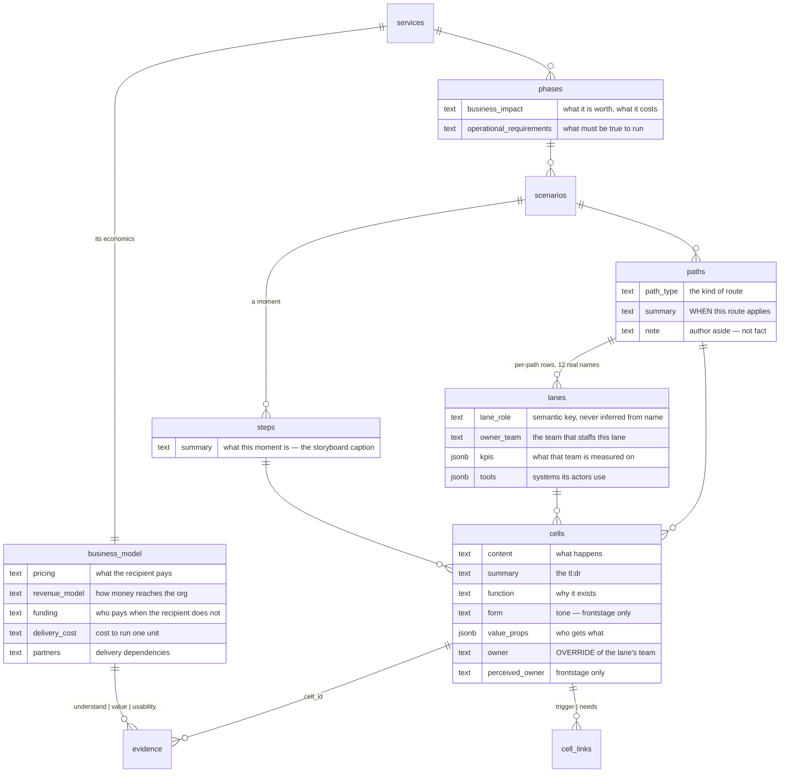
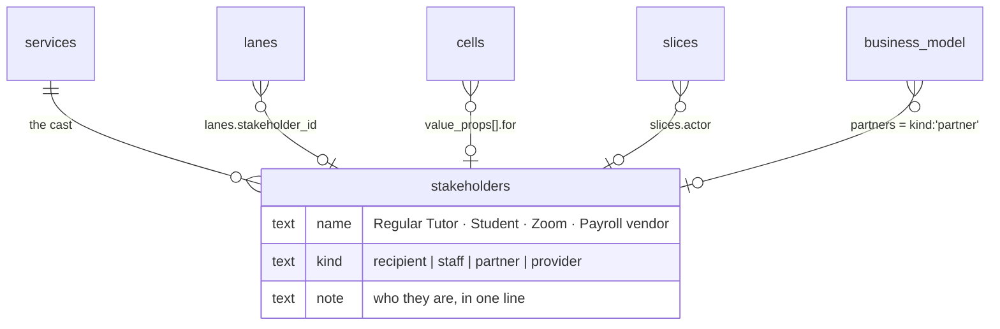

# The data model

What the blueprint stores at each level, what each field means, and the four
open questions. Separated from [plan 003](2026-08-20-003-feat-entity-detail-panels-plan.md),
which builds the surfaces — this document decides *what is worth storing*, that
one decides *how it is edited*.

*(Names below are the proposed ones from [plan 002](2026-08-20-002-refactor-database-vocabulary-plan.md):
`services` replaces `service_lifecycles`, `lanes` replaces `layers`,
`summary` replaces `cells.description`. **`cells.content` keeps its name** —
see "content stays content" below.)*

---

## The map — read this first

Every level, what it holds, and where a user sees it. Everything after this
section is the reasoning behind one row of this table.

| Level | Rows | Fields it owns | Where you see it | Where you edit it |
|---|---|---|---|---|
| **Service** | 1 | `name`, `summary`, + business model: `pricing`, `revenue_model`, `funding`, `delivery_cost`, `partners` | sidebar row, top | **Service panel** |
| **Phase** | 6 | `name`, `summary`, `business_impact`, `operational_requirements`, `loops_to_phase_id` | phase section on the canvas | **Phase panel** (ⓘ in the menubar header) |
| **Scenario** | 22 | `name`, `summary`, `view_type` | sidebar row + breadcrumb | **Scenario panel** (ⓘ on the breadcrumb) — *and it hosts the paths* |
| **Path** | 38 | `name`, `path_type`, `summary`, `note` | path label on the canvas | **inside the scenario panel**, one row per path — a path has no canvas shape of its own to hang an affordance on |
| **Step** | 185 | `name`, **`summary` (new)** | column header; `summary` is the **caption on the storyboard frame** | hover card on the header |
| **Lane** | 299 rows / **166 logical** | `name`, `lane_role`, `owner_team`, `kpis`, `tools` | lane label on the rail | **Lane panel** (ⓘ on the label) |
| **Cell** | 955 | `content`, `summary`, `function`, `form`, `value_props`, `owner`, `perceived_owner`, `links`, `picture` | the grid | **Cell panel** (plain click) |

Four panels are new — service, phase, lane, **scenario**. The cell panel
exists. Step gets **one column and one caption slot** — no panel.

**The scenario panel is a reversal, and the reason is paths.** The earlier
verdict — "a drawer holding one summary field is worse than editing the name
inline" — measured the scenario alone. It owns one editable field. But **38
paths own three each and have no surface anywhere**, and a path is a child of a
scenario. Folding them in turns a one-field drawer into the only place path
`name`, `path_type`, `summary` and `note` can ever be written. That is worth a
panel.

**Two fields are computed, never stored empty-and-shown-empty:**

| Shown | Computed as |
|---|---|
| a cell's effective owner | `coalesce(cells.owner, lanes.owner_team)` |
| a cell's effective perceived owner | `coalesce(cells.perceived_owner, lanes.name)` — **frontstage lanes only** |

---

## The proposal — every level, every field

This is the corrected set. Each field has a **definition**, a **reason to
exist**, and **what does not belong in it**, because five of them have never
had documentation beyond a one-line column comment.

*(Field names below are the proposed ones from [plan 002](2026-08-20-002-refactor-database-vocabulary-plan.md):
`services` replaces `service_lifecycles`, `lanes` replaces `layers`,
`summary` replaces `cells.description`.)*

### 🧭 SERVICE — 1 row

The root. Everything else hangs off it. **"Lifecycle" is gone** — plan 002
found `services` and `service_lifecycles` have no foreign key between them at
all, and the `services` row is a placeholder nothing reads.

| Field | Definition | Why it exists | Not this |
|---|---|---|---|
| `name`, `summary` | what the service is | orientation | — |
| `pricing` | **what the person receiving the service pays** | a journey that never mentions money can still cost someone money; this is where that fact lives | how the org gets paid — that's `revenue_model` |
| `revenue_model` | **how money reaches the org** — per session, subscription, institutional budget, grant-funded, free at point of use | separates "the student pays nothing" from "this service has no economics" | the amount |
| `funding` | **who pays when the recipient does not** — grant, department, sponsor | most public-service blueprints are free to the user and funded elsewhere. Without this, `pricing: free` reads as "costs nothing" | the cost of delivery |
| `delivery_cost` | **what it costs to run one unit** of the service | the other half of the sentence `funding` starts | headcount planning |
| `partners` | **who the service depends on to deliver** — Zoom, the university, a payroll vendor | a dependency that fails takes the journey with it; this is the list to check | vendors nobody in the journey touches |

> ⚠️ **Audit note — these five overlap and that is a real risk.** For a service
> that is free to its users, `pricing` and `revenue_model` collapse into one
> answer. **Guidance: fill `revenue_model` first.** If it says "free at point of
> use," then `pricing` is "Free" and `funding` carries the whole story. If the
> two ever say the same thing, one of them should be empty.

**Validation questions** — not columns. Three evidence anchors already
enforced by the schema (`evidence.proposition_question_key in
('understand','value','usability')`):

| Question | What it asks |
|---|---|
| `understand` | Do people know what this service is and what it offers? |
| `value` | Do people want it enough to act? |
| `usability` | Can people actually get through it? |

Zero evidence rows use these today. Empty is meaningful: it means the claim is
an **assumption**, which is the blueprint's own word.

### 🧭 PHASE — 6 rows

A named stage of the journey. **Both fields were vague; here is the split.**

| Field | Definition | Why it exists | Not this |
|---|---|---|---|
| `name`, `summary` | the stage | orientation | — |
| `business_impact` | **what this phase is worth, and what it costs the business** — retention, NPS, brand, opex, growth | prioritisation needs a phase-level anchor. "Which phase should we fix first" is otherwise argued from anecdote | cell-level detail; a metric that belongs to a lane (`lanes.kpis`) |
| `operational_requirements` | **what must be true for this phase to run at all** — process, system, people, legal | the constraints that do not appear as journey steps but stop the phase dead if unmet: a licence, a staffing floor, a data-retention rule | a to-do list; anything already drawn as a cell |

> **Guidance.** The test for `operational_requirements` is *"if this were
> false, would the phase stop?"* Nice-to-haves are not requirements. The test
> for `business_impact` is *"would this change a prioritisation decision?"* If
> it would not, it is description, not impact.

Both hints in the panel are lifted verbatim from the column comments in
`f65efcf` — the only documentation these fields have ever had.

### 🧭 SCENARIO — 22 rows, and the home of paths

| Field | Definition | Why it exists | Not this |
|---|---|---|---|
| `name`, `summary` | the situation this blueprint covers | orientation | — |
| `view_type` | which compare layout it opens in | a **view preference**, set by using the compare control — never a panel field | a spec field |

### 🧭 PATH — 38 rows, edited inside the scenario panel

A path is a route through a scenario — happy, exception, variant. It has a
label on the canvas but no shape of its own, which is why it gets no affordance
and lives in its parent's panel instead.

| Field | Definition | Why it exists | Not this |
|---|---|---|---|
| `name` | the route — "Happy Path", "No-show" | the label | — |
| `path_type` | the kind of route | drives ordering and comparison | a description |
| `summary` | 🔴 **what this route is** — the condition that puts someone on it | "the student joins on time" vs "the student never joins" is the whole reason two paths exist, and today it is nowhere | commentary |
| `note` | 🔴 **an author's aside** — open questions, provenance, "confirm with ops" | working state that should not read as fact | the definition of the route |

> **The split, decided.** `summary` answers *when does this path apply*;
> `note` is the author talking to the next author. If a sentence would embarrass
> you in front of a stakeholder, it is a `note`. The panel labels them **Route**
> and **Author note**, and the note gets muted styling so the difference is
> visible without reading the hint.

### 🧭 STEP — 185 rows, and the storyboard row is its surface

**Reversed.** The previous draft proposed a new `steps.summary` column. The
consolidation instinct is better, and the measurement supports it rather than
blocking it.

**What the storyboard row actually is.** The `visual` lane exists in **all 38
paths**, and its cells occupy a real grid position — one per `(path, step)`:

```
215  (path, step) positions across the blueprint
147  visual cells that exist    ← 0 content, 0 description, 0 picture
 68  positions with no cell yet ← created on first write, like any cell
```

Every position is reachable. Nothing is missing structurally — 68 cells simply
have never been written, which is true of any empty cell and is what
`upsert_cell` is for. My earlier "47 steps have no slot" was counting
materialised rows, not positions. **The slot is there for every step.**

### 🧭 STEP — 185 rows · `steps.summary`, shown as the storyboard caption

**Resolved.** Storage is step-grained; display is in the storyboard row. Each
half goes where it belongs, and neither pretends to be the other.

#### Why not the storyboard cell's own `content` — the renderer settles it

The first consolidation attempt was measured against the *data* (215 grid
positions, every one blank). The *renderer* says something different:

```tsx
// src/components/blueprint/BlueprintStepVisual.tsx:105-107
if (!hasRealPictures) {
  return null
}
```

```tsx
// src/components/blueprint/MergedCompareGrid.tsx:184-185
// A visual lane's face comes from the walkthrough layers' pictures,
// NOT from its own cell text, so it merges on the picture set.
```

A visual cell's `content` is read by **no renderer**, and with no pictures the
cell renders nothing — so it is not clickable and the cell panel cannot reach
it. Writing a step description there would put it in exactly the position this
brief exists to fix: a filled column with no front door.

#### The design

```
        ┌───────────────────────┐
Step    │  Confirm the booking  │  ← steps.name. Hover opens the card.
        └───────────────────────┘
        ┌───────────────────────┐
Story-  │      [ frame ]        │  ← pictures, resolved BY step.id
board   │ ───────────────────── │
        │ The student picks a   │  ← steps.summary, as the caption
        │ slot; the system      │
        │ holds it 10 minutes.  │
        └───────────────────────┘
Student │ Picks a slot          │
Fr.Tech │ Holds the slot 10 min │
```

| | Where |
|---|---|
| **Stored** | `steps.summary` — one row per step, keyed on `service_scenario_id` |
| **Shown, when the step has a storyboard** | as the **caption under the frame**, in the storyboard row |
| **Shown, always** | the step header's hover card — the only surface when there is no picture |
| **Edited** | inline in that hover card. One field, so it commits on blur |

#### Three facts make this cheap

**1. The row is already step-grained.** `resolveVisualStepPictureEntries(blueprint, step.id)`
resolves by step id, not by path — so a step-keyed caption is the shape the
renderer is already reaching for. No per-path ambiguity, and nothing to decide
about which path's caption wins in side-by-side compare.

**2. There are two render call sites, not five.** `BlueprintStepVisual` is
rendered from `ServiceBlueprintGrid.tsx:764` and `CompareCellBlock.tsx:127`
only; merged compare routes through the latter. **One `caption` prop threaded
through two call sites reaches every geometry.**

**3. The caption slot already exists one level down.** `VisualPictureStrip`
renders a per-picture `label` at 8px beneath each image
(`BlueprintStepVisual.tsx:70-74`). The step caption is its sibling — under the
strip rather than under each frame — so it inherits an established treatment
instead of inventing one.

#### What each field means

| Field | Definition | Why it exists | Not this |
|---|---|---|---|
| `name` | the moment — "Confirm the booking" | the column header | — |
| `summary` **(new)** | **what this moment is, across every lane** — the one sentence that makes the column legible without reading five cells, and the caption the storyboard frame has never had | a step is the only level a reader scans horizontally and has nothing to read | any single lane's action — that is a cell |

**A storyboard cell's own `content` stays unused**, and that is now a
deliberate null rather than an oversight: the picture is the content.

#### Still true, and unchanged by this

The step has **no grain problem**. `steps` holds one row per step keyed on
`service_scenario_id`; `path_steps` only carries `column_position`. An earlier
read called this a lane-shaped fan-out. It is not — which is exactly why
`steps.summary` is cheap and `lanes.owner_team` is not.

One label change belongs to [plan 002](2026-08-20-002-refactor-database-vocabulary-plan.md):
the lane reads `Visual`, which names a medium. It should read **Storyboard**.
`layer_role` stays `visual`.

### 🧭 LANE — 299 rows, 166 logical, 12 names

| Field | Definition | Why it exists | Not this |
|---|---|---|---|
| `name` | the actor or stage — "Regular Tutor", "Front Stage Tech" | the swimlane label | — |
| `lane_role` | the semantic key that drives rendering | **never inferred from the name** — that broke every non-English blueprint (`layer-roles.md`) | a display label |
| `owner_team` | **the team that staffs this lane** | the org unit accountable for everything in the row. Answers "who do I talk to about this" once, instead of per cell | the actor's job title — that is `name` |
| `kpis` | **what that team is measured on** | `check-kpi-alignment` compares them against what the lane's cells actually do: measured-but-never-enacted, and enacted-but-never-measured | outcomes nobody is accountable for |
| `tools` | **systems the lane's actors use** | 🟡 **one reader, and only as a secondary signal** — see below | tools mentioned in a cell but not used by this lane |

> **What `tools` is actually for — asked directly, so here is the whole answer.**
> Grepped every check and every renderer. `tools` has **exactly one consumer**,
> and it is a supporting clause inside another check:
>
> ```
> check-kpi-alignment.md:10-12
>   "Per lane with non-empty `kpis`: the KPI list vs that lane's cells across
>    all steps and paths. `tools` for whether the measured thing is even
>    instrumented."
> ```
>
> That is it. Nothing renders it, no other check reads it, and
> `check-channel-conflict`'s use of the word "tools" is prose, not the column.
>
> **So the field answers one question: "you say you measure this — is there a
> system that could even record it?"** A lane measured on session completion
> with no tool that records attendance has a KPI nobody can report. That is a
> real finding, and it is the only one `tools` produces.
>
> **Consequence for the fill campaign:** `tools` is worth filling *only where
> `kpis` is filled*, and after it. A lane with tools and no KPIs feeds nothing.
> Plan 005 orders them together; it should order them `owner_team` → `kpis` →
> `tools`, and stop if `kpis` comes back empty.

### 🧭 CELL — 955 rows

| Field | Definition | Why it exists | Not this |
|---|---|---|---|
| `content` | **what happens** in this moment | the grid | why it happens |
| `summary` | the tl;dr the detail fields add up to | *(renamed from `description` — the panel already labels it Summary)* | a copy of `content` |
| `function` | **why this moment exists** | the purpose `content` cannot carry. Pilot: *content* "Enters the student's breakout room" → *function* "Open the tutoring moment: join within the first minute so the student is not left waiting" | a restatement of `content` |
| `form` | **tone and manner** — how it should feel | 🟡 **frontstage only.** A database write has no tone. Pilot filled 8 of 11 | a description of the UI |
| `value_props` | **who gets what** from this moment | `check-value-ledger`: cells that deliver to nobody, audiences who never receive | 🟡 possibly step-level — see above |
| `owner` | 🔴 **an override.** The team accountable for this cell **when it differs from its lane's `owner_team`** | one cell in a lane can be handled by a different team; that exception matters | a field to populate. Empty means "same as the lane" — **0/955 is correct, not a gap** |
| `perceived_owner` | **who the customer believes owns this moment** | a mismatch with `owner` is a deception risk, and `check-perceived-owner` looks for exactly that | 🟡 **frontstage only** — 241 of 955 cells. A customer cannot mis-perceive a backstage row |

### The two grain corrections, in one place

**🔴 Lane fields are stored per-path.** 299 rows hold 166 logical lanes and
only **12 distinct names**. "Regular Tutor" is one concept stored ~25 times.
The database already agrees: `remove_lane(scenario_id, lane_name)` deletes **by
name across the scenario** — it keys on `(scenario, name)`, not the row id, and
that exact mismatch caused the 8.5× undercount fixed in `20260820030000`.

| | Fan-out write | Promote to a `lanes` table |
|---|---|---|
| Shape | panel writes every same-named lane in the scenario | new table keyed `(scenario_id, name)` |
| Matches `remove_lane` | yes | yes |
| Migration | none | one, plus a backfill |
| Drift | impossible after the write | impossible by construction |

**Recommendation: fan-out now.** It is honest about the grain, needs no
migration, and the table is the right end state but should not gate the panel.

**🔴 `cells.owner` duplicates `lanes.owner_team`** — see the cell table above.
The panel shows the inherited value and only writes on override.

### The ERD




---

# Open questions

## `scenario.view_type` — not a spec field, and the two vocabularies should collapse

It is a **view preference**: which compare layout a scenario opens in. It
belongs in no panel — it is set by using the compare control, which is where a
view preference should be set.

But the wording needs the same treatment as everything else, because there are
two vocabularies with a translation seam between them:

```
DB      single | side-by-side | integrated     historical
Client  single | stacked      | merged         Compare v3
```

`viewTypeVocabulary.ts` exists solely to map one to the other, and its comment
says persisted `integrated` rows *"keep coercing to the plain stacked view …
so no migration is needed and old data does not change meaning."*

**Checked what is actually stored:**

```
side-by-side   22 scenarios
single          0
integrated      0
```

**Every row holds one value, and the two the seam exists to translate are
unused.** The migration that was avoided is now three lines:

```sql
update public.service_scenarios set view_type = 'stacked';   -- all 22
alter table public.service_scenarios drop constraint <view_type_check>;
alter table public.service_scenarios add check (view_type in ('single','stacked','merged'));
```

Then `viewTypeVocabulary.ts` and both seams delete. One vocabulary, the one
the product speaks. Added to
[plan 002](2026-08-20-002-refactor-database-vocabulary-plan.md).

## Stakeholders — the one genuinely missing concept

Asked whether the service should carry stakeholder info, and how that relates
to partners and employees. It should, and there is evidence the model already
wants it.

**Stakeholders exist today in three unlinked places:**

| Where | What it is | Example |
|---|---|---|
| `lanes.name` | the actor whose row this is | "Regular Tutor" |
| `cells.value_props[].for` | the audience a value goes to | "tutor" |
| `slices.actor` | whose view a slice takes | "Regular Tutor" |
| `business_model.partners` | orgs the service depends on | free text |

Four strings for the same cast of characters, none of them connected. And
`check-value-ledger` **already tries to cross-check two of them**:

> "An actor present as a lane but never named as a value audience anywhere →
> info"

That check compares lane names to `value_props[].for` — two free-text
vocabularies with nothing keeping them aligned. It will report false findings
the moment someone writes "tutor" in one place and "Regular Tutor" in the
other.

### Proposal: one stakeholder registry on the service



### The drift is already visible in 11 cells

Only 11 cells carry `value_props`, and the vocabularies have **already**
diverged:

| Lane name | Audience written in `value_props` |
|---|---|
| `Student` | `student` — case differs |
| `Regular Tutor` **and** `Tutor` | `tutor` — two lane names, one role |
| `Lead Tutor` | `lead tutor` |
| *(no lane)* | **`business`** — 10 mentions, the most common audience of all |

Two things fall out of that:

1. **`check-value-ledger` would already be wrong.** It looks for "an actor
   present as a lane but never named as a value audience" — `Regular Tutor`
   and `tutor` are the same person and the check cannot know it.
2. **The most-cited audience is not a lane at all.** The organisation receives
   value from 10 of 22 value entries and takes no action in the journey. A
   registry has to hold it.

### `recipient`, not `user` or `customer`

Asked directly, so here is the reasoning rather than a preference:

| Word | Problem |
|---|---|
| `customer` | implies paying. Students pay nothing; the canonical lane role `customer_actions` exists in the vocabulary and **no lane in this blueprint uses it** |
| `user` | overloaded — a system user (auth) and a service user are different things, and this app has both |
| `recipient` | accurate, and neutral about payment. Clinical, but it is a `kind` value read by developers, not a UI label |

The **names** stay concrete and human — the lane is literally called
`Student`. `kind` is the classification behind it, not what anyone reads.

| `kind` | Who | Evidence in the data |
|---|---|---|
| `recipient` | who the service is for | the `Student` lane |
| `staff` | who delivers it | `Tutor`, `Regular Tutor`, `Lead Tutor`, `Supervisor` |
| `partner` | external orgs it depends on | the `Partner Action: Teacher` lane — the model already prefixes it |
| `provider` | **the organisation running the service** — it receives value but takes no action on the canvas | `business`, 10 mentions, no lane |

> **`provider`, not `organisation` — asked what that kind even was.**
> It is **the org running the service** — PLUS itself. It earned a kind because
> it is the most-cited audience in the data and the only one with no lane:
> `value_props` names `business` 10 times ("attendance data stays clean
> downstream"), and no actor on any canvas is the business. It receives value
> and acts nowhere, so a lane can never represent it.
>
> `organisation` was the wrong word because **partners are organisations too** —
> Zoom is an organisation, the university is an organisation. The kind has to
> say *which* org, and `provider` does: the one delivering the service. The four
> kinds then read as one sentence — a **provider** delivers to a **recipient**,
> staffed by **staff**, depending on **partners**.

**On personas:** a persona is a *characterisation* of a stakeholder, not a
stakeholder — "a first-time tutor, anxious about tech" describes the `Tutor`
role, it is not a second role. `slice.md:64` already draws this line:
*"Personas, never participants."* So a persona is at most a field **on** a
stakeholder, and not proposed now: nothing reads one yet, and adding an
unused field is the mistake this whole brief is about.

**What this buys, concretely:**

1. `check-value-ledger`'s cross-check becomes real instead of string-matching.
2. "Which stakeholders never receive value?" is answerable — today it is a
   guess across three vocabularies.
3. `partners` stops being a fifth money field with fuzzy edges (see the
   overlap warning in the service section above) and becomes a filter over a
   list that has structure.
4. A slice's actor is validated rather than typed.

**Honest cost:** a new table, a nullable FK on `lanes`, a migration for
`value_props[].for`, and a decision about whether existing free text is
back-filled or left as a fallback. This is **not** part of plan 003 — it is
its own plan, and it should be written only if you want the cross-check to
work. Recording it here because the panels are where the pressure showed up:
a lane panel with a free-text `owner_team` beside a value editor with a
free-text `for` is two places to type the same wrong thing.

**Recommendation: defer the registry — and fill `owner_team` from a closed
list, not free text.**

An earlier draft said "do not fill `owner_team` at scale until this is
decided," which contradicts [plan 005](2026-08-20-005-feat-spec-fill-campaign-plan.md)
ordering it first. **Resolved, and the resolution is smaller than either
position.** There are **12 distinct lane names**, so there are at most a
dozen owning teams — the drift risk is not 166 hand-typed strings, it is
whether the twelfth one is spelled like the first.

So: agree the team list **once, before the campaign runs**, write it into
`docs/reference/lane-vocabulary.md` (which plan 005's agent brief already
reads), and have the panel offer it as a `datalist` — *"a datalist suggests,
never blocks"*, the same rule `value_props` already follows.

That is a stakeholder registry's discipline without its schema. If the registry
is built later, a closed 12-item list is exactly what back-fills cleanly; 166
free-text strings are not.

## Is phase sufficient?

Current: `name`, `summary`, `business_impact`, `operational_requirements`,
`loops_to_phase_id`, `position`.

The two spec fields **are** complementary — one is worth-and-cost, the other
is preconditions — and `loops_to_phase_id` already carries the structural
fact that a phase can send you back.

**Recommendation: add nothing.** Two fields at 0/6 is not evidence that a
third is needed. The honest test is whether anyone reaches for something that
is not there *after* the first two are filled. Candidates people usually ask
for, and why they are not proposed now:

| Candidate | Why not yet |
|---|---|
| Entry / exit criteria | that is `operational_requirements` ("what must be true") pointed at the boundary |
| Duration | real, but a phase's duration is a property of a *journey through* it, not of the phase — and nothing measures it today |
| Phase owner | a phase spans lanes, each with its own `owner_team`. A phase-level owner would either duplicate them or contradict them |

## Where each level's information shows — resolved

| Level | What it holds | Where it shows | Where it is edited |
|---|---|---|---|
| Scenario | `name`, `summary` | sidebar row; `summary` in a hover card there | **scenario panel** |
| Path | `name`, `path_type`, `summary`, `note` | the path label carries name and type | **scenario panel**, one row per path |
| Step | `name`, `summary` | column header; the summary captions the storyboard frame when one exists | hover card on the header, inline |
| Lane | name, role, owner, KPIs, tools | the lane label | **lane panel** |
| Cell | the spec block | the grid | **cell panel** |

**On tooltips vs hover cards, unchanged and still the rule.**
`ui-inventory.md` is firm that `IconTooltip` copy *"says what it DOES"* —
tooltips name a control, they do not hold prose.

- **Tooltip** — a truncated lane label on a narrow rail. One line, no
  interaction.
- **Hover card** (`popover.tsx` on hover-intent) — a step's `summary` on its
  column header, and a scenario's `summary` in the sidebar. Multi-line,
  selectable, can hold a control.
- **Panel** — anything with more than one editable field.

## Should step get a panel like lane? — no. A caption and a hover card

`steps` owns two columns. A drawer for two fields is the mistake the scenario
panel only avoids by adopting 38 orphan paths, and a step has no orphan
children to adopt.

| Want | Surface |
|---|---|
| Read what a step is | the **storyboard caption**, visible in the grid |
| Read it where there is no storyboard | the header hover card |
| Edit it | inline in that card — one field, commits on blur |
| Rename the step | inline on the column header, as today |

**Escalation path, recorded:** if `value_props` moves from cell to step, `steps`
gains real columns and inherits the lane's `ⓘ` + panel treatment. Only then.

## `content` stays `content` — decided

Considered `preview` and `moment`. **Keeping `content`.**

`preview` was rejected on the argument that a preview implies a fuller version
lives elsewhere, and the cell's text is the canonical statement of what
happens. `moment` was floated because `upsert_cell`'s spec uses the phrase
"a journey moment" — but it reads as invented vocabulary for a field that
already communicates, and it carries the widest blast radius of any rename in
plan 002 for the smallest gain.

**The pair is still imperfect** — `content` and `summary` are both short text
on the same row and neither name says which is which. The panel resolves it
with labels and hints rather than column names, which is where it belongs:

```
Content   what happens in this moment
Summary   the tl;dr — what the detail fields below add up to
```

Recorded so it is not re-opened: this was considered and closed.

## Owner inheritance — display it, do not store it

Agreed on the behaviour, with one correction on the mechanism.

**Storing the lane's team on 955 cells is the drift bug in advance.** Change
a lane's `owner_team` and 61 stored copies are instantly wrong, with nothing
to detect it. That is the same failure the lane grain section describes, one
level down.

**Instead: an effective owner, computed.**

```sql
-- read-time, no writes, cannot drift
coalesce(cells.owner, lanes.owner_team) as effective_owner
```

| | Panel shows | Stored |
|---|---|---|
| No override | "Tutoring Ops — inherited from this lane" *(muted)* | `owner` = null |
| Override set | "Contracted Support" + "Reset to the lane's team" | `owner` = the exception |

`check-perceived-owner` reads **`effective_owner`**, not `owner` — otherwise
it compares an empty field and finds nothing, which is exactly why it has
never produced a result.

**This is what "do not leave it empty" should mean:** never show a user an
empty owner. The column stays empty because empty is the correct
representation of "same as the lane."

## Perceived owner — same rule, different default

Agreed it should not read as empty. But there is nothing to inherit from:
lanes have no perceived owner.

**Proposal: for frontstage cells, the default perceived owner is the lane's
own stakeholder** — the customer sees the tutor doing the thing, so absent
any signal, the tutor is who they think is responsible.

```
effective_perceived_owner =
  coalesce(cells.perceived_owner,
           case when lanes.lane_role like 'frontstage%' or
                     lanes.lane_role = 'customer_actions'
                then lanes.name end)
```

That makes the deception check meaningful: a finding fires when the customer
believes it is **someone other than the visible actor** — the school when it
is a contractor, the app when it is a person. Backstage cells stay null,
because a customer perceives nothing there and a forced default would
manufacture findings.

## A template for value props

There is one already, unwritten, in the 11 pilot cells:

```json
{"for": "tutor",    "value": "greets a name, not a username"}
{"for": "business", "value": "attendance data stays clean downstream"}
{"for": "student",  "value": "permission to ask lowers the cost of being stuck"}
```

**The pattern: `for <stakeholder>` → `<what becomes possible, or what stops
being costly>`.** Every one names a consequence, not a feature. None of them
says "better experience."

**The rule to write into the house style:**

> A value must be **falsifiable**. If you cannot imagine the sentence being
> false for some cell, it is not a value — it is a slogan. "Greets a name,
> not a username" is false wherever the roster has not loaded. "Improves the
> experience" is never false, and therefore says nothing.

| Guidance | |
|---|---|
| Two entries | one human audience, one business audience — the pilot's shape |
| `for` | a stakeholder, ideally from the registry above; never a system |
| `value` | present tense, concrete, ≤ ~12 words |
| Not this | features, adjectives, anything true of every cell |

The panel enforces shape (two fields, a datalist for `for`) and the house
style enforces quality. Neither can enforce truth — that is what evidence is
for.
