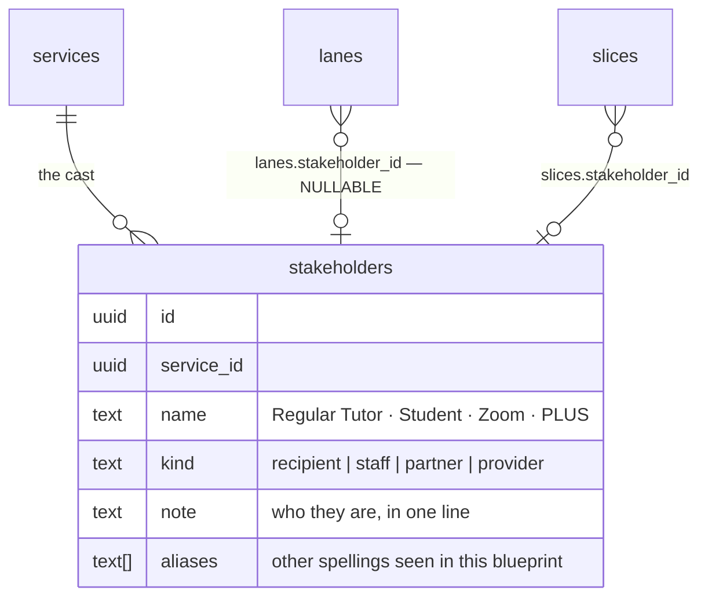

# Stakeholder registry

Four free-text fields name the same cast of characters and none of them are
connected. One audit check already tries to cross-reference two of them by
string match, and **it would produce six false warnings per scenario today.**

---

## Problem statement

| Where | What it is | Example |
|---|---|---|
| `layers.name` | the actor whose row this is | `Regular Tutor` |
| `cells.value_props[].for` | the audience a value goes to | `tutor` |
| `slices.actor` | whose view a slice takes | `Regular Tutor` |
| `business_model.partners` | orgs the service depends on | free text |

`check-value-ledger.md:16-18` already asks the database to reconcile the first
two:

> "An actor present as a lane but never named as a value audience anywhere →
> warn; scope-key fingerprint; note asks *who is this lane for?*"

### 🔴 The check is broken in two directions, measured

**Direction one: most lanes are not actors.** Of 12 distinct lane names, only
**six** name a person or an organisation. The other six are structural rows —
the blueprint's own scaffolding:

```
STRUCTURAL — 224 of 299 rows, no stakeholder exists
  Back Stage Tech 38 · Visual 38 · Front Stage Tech 38
  Front Stage Actions 37 · Back Stage Actions 37 · Support Actions 36

ACTORS — 75 of 299 rows
  Regular Tutor 35 · Lead Tutor 19 · Partner Action: Teacher 16
  Tutor 2 · Student 2 · Supervisor 1
```

`check-value-ledger` cannot tell those apart, so it would warn *"Front Stage
Tech is never a value audience — who is this lane for?"* **Six false warnings,
in every one of 22 scenarios.** This is not a hypothetical about future drift;
it is why the check has never been trusted.

**Direction two: the real actors already drifted.**

| Lane | Rows | Written in `value_props[].for` |
|---|---|---|
| `Regular Tutor` | 35 | `tutor` — different string |
| `Tutor` | 2 | `tutor` |
| `Lead Tutor` | 19 | `lead tutor` — case differs |
| `Student` | 2 | `student` — case differs |
| `Supervisor` | 1 | never |
| *(no lane at all)* | — | **`business` — 10 of 22 entries** |

`Regular Tutor` and `Tutor` are the same person authored in two sessions —
confirmed by where they sit: `Tutor` appears only in *Post-Session Growth Loop*
(7 cells) and *Session Prep & Resources* (4 cells), two scenarios that use the
long name nowhere.

And **the most-cited audience is not a lane at all.** `business` receives value
ten times and acts nowhere on any canvas. No lane can ever represent it.

`slices.actor` is the one clean field: `Regular Tutor` ×5, `Lead Tutor` ×2,
null ×3 — every value already matches a lane name exactly.

---

## Proposed solution

One registry on the service. Four kinds, decided in
[plan 006](2026-08-20-006-design-data-model.md).



| `kind` | Who | Evidence |
|---|---|---|
| `recipient` | who the service is for | the `Student` lane |
| `staff` | who delivers it | `Tutor`, `Regular Tutor`, `Lead Tutor`, `Supervisor` |
| `partner` | external orgs it depends on | `Partner Action: Teacher` — the model already prefixes it |
| `provider` | the org running the service | `business`, 10 mentions, no lane |

### 🔴 `lanes.stakeholder_id` is nullable, and that is the whole design

**224 of 299 lane rows have no stakeholder and never will.** A structural lane
is a rendering band, not a person. Null is the correct value, and the check
reads it as *"not an actor — skip"* rather than *"an actor with no name."*

That single predicate is what fixes direction one:

```sql
-- check-value-ledger, after
where l.stakeholder_id is not null      -- ← the six false warnings, gone
```

### 🟡 `value_props[].for` stays text — deliberately

The instinct is to put a stakeholder id inside the jsonb. **Postgres cannot
enforce a foreign key into a jsonb array element**, so an id there buys the
appearance of integrity and none of the substance, while making the field
unreadable to a human and unwritable by hand.

**What actually prevents drift is a shared vocabulary, not a column type.** So:

- `for` stays a name.
- The cell panel's `for` input takes its `list=` datalist from the registry —
  the precedent is already in the codebase: *"a datalist suggests, never
  blocks"* (`CellPanelEditor.tsx:465-530`).
- `check-value-ledger` resolves `for` through `stakeholders.name` **and**
  `stakeholders.aliases`, case-insensitively. `tutor` matches `Regular Tutor`
  because `tutor` is one of its aliases.

`aliases` exists for exactly this: eleven cells were authored before any
registry, and rewriting their prose to satisfy a schema would be the tail
wagging the dog.

### `slices.actor` — rename with care, it is read cross-repo

`slices.actor` maps cleanly (5 + 2 + 3 nulls), so the migration is trivial.
**The consumer is not.**

```ts
// plus-uno · agents/uno-bot/src/integrations/blueprint.ts:1033-1036
const filter = words.length
  ? `or=(${words.flatMap((w) => [`title.ilike.*${w}*`, `actor.ilike.*${w}*`]).join(",")})`
  : "order=updated_at.desc";
```

uno-bot ILIKEs `actor` **as text**. Replace it with a uuid FK and that filter
silently matches nothing — the same failure mode
`blueprint.ts:1029-1032` already documents from last time: *"the old
`name.ilike` filter 400d on every call and this read has been returning nothing
since it shipped."*

**Two options, and the second is better:**

| | Replace `actor` with `stakeholder_id` | **Add `stakeholder_id`, keep `actor`** |
|---|---|---|
| uno-bot | breaks — needs a coordinated deploy | **keeps working unchanged** |
| Integrity | full | full, on the new column |
| Cost | a cross-repo window | one denormalised column |
| Drift | none | `actor` must track the FK |

**Recommendation: add the column, keep `actor`, and keep it true with a
trigger** that writes `stakeholders.name` into `actor` on insert/update. The
bot keeps its text search — which is the right search for *"which slice is
about tutors"* — and the app gets its FK. This also removes this plan from
[plan 007](2026-08-20-007-feat-cross-repo-blueprint-contract-plan.md)'s
coordination window entirely.

---

## Implementation phases

### Phase 1 — the table, and nothing reads it yet

```sql
-- supabase/migrations/*_stakeholders.sql
create table public.stakeholders (
  id uuid primary key default gen_random_uuid(),
  service_id uuid not null references public.services(id) on delete cascade,
  name text not null,
  kind text not null check (kind in ('recipient','staff','partner','provider')),
  note text,
  aliases text[] not null default '{}',
  created_at timestamptz not null default now(),
  updated_at timestamptz not null default now(),
  unique (service_id, name)
);
```

- [ ] RLS on, `authenticated` write policy, `anon` read — matching every other
      root-scoped table
- [ ] Column-level grants, not table-level, per `access-and-security.md`

### Phase 2 — seed it from what exists

Six actors and one provider, all derivable. **No invention.**

| name | kind | aliases | from |
|---|---|---|---|
| Student | `recipient` | `student` | the `Student` lane |
| Regular Tutor | `staff` | `tutor`, `Tutor` | 35 lanes + 2 drifted |
| Lead Tutor | `staff` | `lead tutor` | 19 lanes |
| Supervisor | `staff` | — | 1 lane |
| Partner Action: Teacher | `partner` | `teacher` | 16 lanes |
| PLUS | `provider` | `business` | 10 value entries, no lane |

- [ ] Seeded as a **migration**, not a script — it is reference data
- [ ] `Tutor` is an alias of `Regular Tutor`, **not** a seventh row. Its two
      lanes get `Regular Tutor`'s id; the lane label stays `Tutor` because
      renaming someone's authored label to satisfy a lookup is the wrong
      direction

### Phase 3 — link lanes and slices

```sql
alter table public.lanes  add column stakeholder_id uuid references public.stakeholders(id);
alter table public.slices add column stakeholder_id uuid references public.stakeholders(id);
```

- [ ] Backfill lanes by name **and alias**, leaving the 224 structural rows null
- [ ] Backfill slices by name — 7 of 10 match, 3 are legitimately null
- [ ] A trigger keeps `slices.actor` equal to the linked stakeholder's name
- [ ] Assert after backfill: every lane whose `lane_role` is `visual`,
      `frontstage_tech`, `backstage_tech` or `support_systems` has a **null**
      stakeholder

### Phase 4 — make the check real

- [ ] `check-value-ledger` skips lanes with a null stakeholder
- [ ] It resolves `value_props[].for` through name **and** aliases,
      case-insensitively
- [ ] It can now answer *"which stakeholders never receive value?"* — including
      `Supervisor`, which is a lane, is an actor, and is named in zero value
      entries. That is a **true** finding and the check has never been able to
      make it
- [ ] Re-run `/audit`; record which findings changed and why

### Phase 5 — the surfaces

- [ ] The **service panel** ([plan 003](2026-08-20-003-feat-entity-detail-panels-plan.md))
      gains a Stakeholders surface — the same repeating-row editor as
      `value_props`, with `kind` as a `select`
- [ ] The **lane panel** gets a stakeholder picker, empty and clearly optional,
      because most lanes have none
- [ ] The **cell panel**'s `for` field takes its datalist from the registry
- [ ] Agent tools: `list_stakeholders`, `create_stakeholder`, `update_stakeholder`
      — each with a ledger entry and a revert case, and a harness case, or
      `toolParity` fails

---

## System-wide impact

**Interaction graph.** Editing a stakeholder's `name` → the trigger rewrites
`slices.actor` on every linked slice → uno-bot's next ILIKE sees the new text.
A rename is therefore **visible in Slack**, which is correct but worth stating:
the registry is not a private lookup table.

**Error propagation.** The backfill is the risky step and it is idempotent by
construction — it matches on name and writes an id, so re-running is a no-op.
A name that matches nothing leaves null, which is a legal state, not an error.

**State lifecycle.** `on delete cascade` from `services` is right. From
`stakeholders` to `lanes`, deletion must **null the FK, not the lane** — a lane
outlives whoever was assigned to it. Set `on delete set null` explicitly;
the default would be `no action` and would block the delete.

**API surface parity.** Four readers of the cast today — the lane panel, the
cell panel's `for`, the slice editor's actor, and `check-value-ledger`. All
four must read the registry or none should; a half-migrated vocabulary is
worse than the free text it replaced.

**Integration scenarios unit tests will not catch:**

1. Rename `Regular Tutor` → the trigger updates 5 slices, and uno-bot's actor
   search finds them under the new name.
2. Delete a stakeholder still assigned to 35 lanes → the lanes survive with a
   null FK, and `check-value-ledger` skips them.
3. `/audit` before and after Phase 4 → six per-scenario false warnings
   disappear, and `Supervisor` appears as a **new true** finding.
4. A cell whose `for` is `tutor` → resolves to `Regular Tutor` via alias, and
   the ledger stops reporting the lane as unserved.
5. A second service (plan 004) → its registry is separate; no stakeholder is
   visible across services.

---

## Acceptance criteria

- [ ] 224 structural lane rows carry a **null** stakeholder after backfill
- [ ] All 75 actor lane rows carry one, including the two `Tutor` rows via alias
- [ ] `slices.actor` still returns rows for uno-bot's ILIKE, with **no** change
      deployed to the bot
- [ ] `check-value-ledger` produces zero structural-lane warnings
- [ ] `check-value-ledger` produces the `Supervisor` finding, which it could
      not before
- [ ] `value_props[].for` is unchanged on disk — the vocabulary moved, the data
      did not
- [ ] Every new agent tool has a ledger entry, a revert case and a harness case
- [ ] `npm run build`, lint, tests, `toolParity` green; retrieval evals 26/26

## Success metrics

| | Now | After |
|---|---|---|
| False warnings per scenario from `check-value-ledger` | **6** | **0** |
| Vocabularies naming the cast | 4, unlinked | 1 |
| Answerable: "which stakeholders never receive value?" | no | yes |
| uno-bot changes required | — | **none** |

## Risks

| Risk | Severity | Mitigation |
|---|---|---|
| `slices.actor` replaced rather than kept | **Critical** — silent empty reads in Slack | Keep the column; trigger-maintained |
| A structural lane gets a stakeholder | High — reintroduces the false warnings | Post-backfill assertion on `lane_role` |
| Deleting a stakeholder deletes lanes | High | `on delete set null`, stated explicitly |
| Half-migrated vocabulary | Medium | All four readers in one release |
| `Tutor` seeded as its own stakeholder | Medium — the drift survives the fix | Alias, asserted in the migration |

## Sources

- `src/lib/agent/skill/references/check-value-ledger.md:16-18` — the cross-check
- `src/lib/agent/skill/references/layer-roles.md` — the structural roles, and
  *"Never infer semantics from the display name"*
- `plus-uno · agents/uno-bot/src/integrations/blueprint.ts:1029-1052` —
  `fetchSlices` and its documented history of a silently-empty read
- `src/components/blueprint/CellPanelEditor.tsx:465-530` — the datalist precedent
- Lane, slice and `value_props` distributions read from the live database on
  2026-08-20
