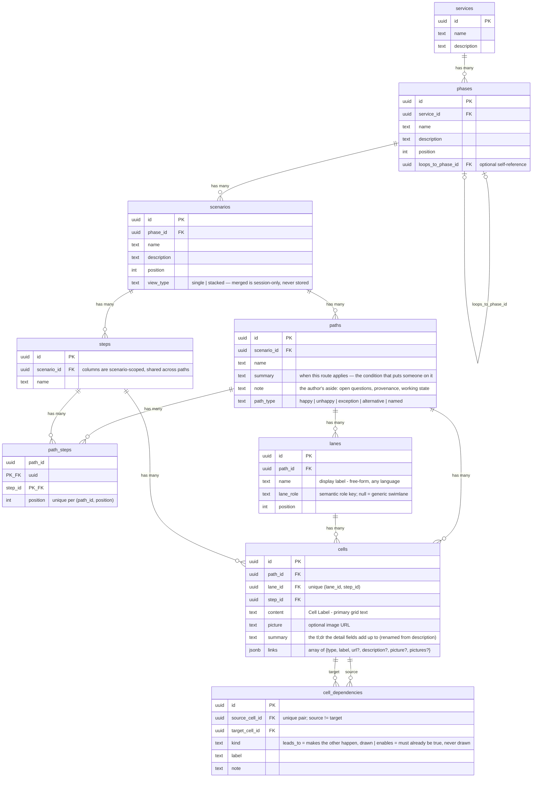

# Data Model

The template's blueprint data model. Source of truth:
`supabase/migrations/20260716200000_template_schema.sql` (snapshot:
`supabase/schema.reference.sql`, diagram: `docs/erd.mmd`). The IR
(`references/ir-schema.json`) mirrors this shape one-to-one with locale maps
and stable keys in place of UUIDs.

## Contents

- Hierarchy
- ERD
- Tables in brief
- Enums
- Integrity trigger (why import order matters)
- ⚠ REQUIRED: import order
- Re-import semantics
- Ordering fields
- Working precedent
- Canvas dialect: cell slots
- Derived layer: findings and slices

## Hierarchy

```
services → phases → scenarios → paths → {lanes, cells, cell_dependencies}
                                                → steps (scenario-scoped)
                                        paths ⇄ steps via path_steps (column order)
```

## ERD



## Tables in brief

| Table | Purpose | Notes |
| --- | --- | --- |
| `services` | Top container (one per blueprint deployment, usually) | |
| `phases` | Lifecycle stages, ordered by `position` | `loops_to_phase_id` self-reference renders the lifecycle loop |
| `scenarios` | The unit users navigate; owns steps and paths | `view_type` enum below |
| `paths` | A journey variant within a scenario | `path_type` enum below; optional `note` |
| `steps` | Scenario-scoped step columns, SHARED across paths | A step exists once per scenario; paths select/ordr via `path_steps` |
| `path_steps` | Which steps a path uses and in what column order | `position` unique per path |
| `lanes` | Swimlanes, per PATH (each path carries its own lane rows) | `name` free-form any language; `lane_role` semantic key (see `references/lane-roles.md`) |
| `cells` | Grid content at (lane × step) on a path | `unique (lane_id, step_id)`; `links` JSONB array; `content` newline-separated items render as pills on pill-role lanes |
| `cell_dependencies` | Directed arrows cell → cell. `kind` is `leads_to` (this cell makes the other happen — drawn) or `enables` (the other must already be true — recorded, never drawn). Not inverses: "follows" is `leads_to` read from the other end, and a precondition causes nothing | Unique pair, `source != target`, both cells must be on the same path |

## Enums

- `scenarios.view_type`: `single` \| `stacked` — ONE vocabulary. The
  stored token is the token the UI names. (It used to store
  `single | side-by-side | integrated` with a translation module; all rows held
  `side-by-side` and the other two were unused, so the translation was deleted.)
  - `single`: one path at a time (path picker)
  - `stacked`: labeled variant comparison — any two labeled variants
    ("as designed" vs "reality" is just the default labeling)
  - **`merged` is not storable.** The Merged canvas (compared paths drawn as
    one combined blueprint) is a per-session display chosen in the compare
    control. The CHECK constraint rejects it, and `create_scenario` refuses it
    by name with a hint rather than coercing it
- `paths.path_type`: `happy` \| `unhappy` \| `exception` \| `alternative` \| `named` (a labeled variant that is none of the canonical four)

## Integrity trigger (why import order matters)

The DB trigger `cells_validate_path_match` enforces, on every cell insert:

1. `cells.path_id` must equal its lane's `lanes.path_id`, and
2. `(path_id, step_id)` must already exist in `path_steps`.

A cell referencing a step the path never registered **aborts the import
mid-transaction**. This is exactly what `scripts/validate_ir.py` catches
before any adapter runs.

## ⚠ REQUIRED: import order

```
paths → steps → path_steps → lanes → cells → cell_dependencies
```

(with `services → phases → scenarios` before all of the
above). Any other order violates FKs or the integrity trigger.

## Re-import semantics

Scenario-scoped **delete-and-reinsert in one transaction**: delete the
scenario's paths/steps (FK cascades remove path_steps, lanes, cells,
dependencies), then insert fresh rows in the order above. Never
`on conflict do update` — rows removed from the IR must not survive as
orphans. IDs are UUIDv5 from IR keys + locale (NFC-normalized), so identical
IR re-imports produce identical rows. See `references/adapter-contract.md`.

## Ordering fields

All sibling order is explicit integers: `phases.position`,
`scenarios.position`, `path_steps.position` (per path),
`lanes.position` (per path). The frontend sorts by these — gaps are
harmless, duplicates are not (validator checks).

## Working precedent

`scripts/generate_scale_fixture.mjs` generates the template's sample content
(TS fallback module + `supabase/seed.sql`) from one source of truth with
deterministic IDs and correct insert order — it is the pattern the IR
generators follow.

## Canvas dialect: cell slots

The canvas deployment splits tech-lane touchpoints into multiple cells
per (lane, step), ordered by `position` (unique on
`(lane_id, step_id, position)`; rows predating the split carry no
value and read as slot 0). Deployments scaffolded from the plain
template keep one cell per (lane, step). Tools and the IR never expose
slot management directly — treat "the" cell of a slot as slot 0.

## Derived layer: findings and slices

Both skills' outputs land in three derived tables (present in the canvas
deployment; template workspaces without them must route through the
upgrade recipe rather than failing mid-import):

| Table | What it is | Notes |
|---|---|---|
| `findings` | One triageable audit/whatif finding | `source` (`audit`\|`whatif`), `check_name`, `severity` (`info`\|`warn`\|`critical`), `note`, `cell_ids`/`cell_keys`, `status` (`open`\|`resolved`\|`dismissed`), `run_id`, `fingerprint` (dedupe: open updates in place, dismissed stays dismissed, resolved reopens as a new row) |
| `slices` | A stakeholder view that REFERENCES cells | `title`, `description`, `slice_type` (`journey`\|`lane`\|`step`\|`custom`), `actor`, `origin` |
| `slice_items` | One frame of a slice | `position`, `cell_ids` (ordered), `caption`, `narrative` — full-replacement semantics on rework |
