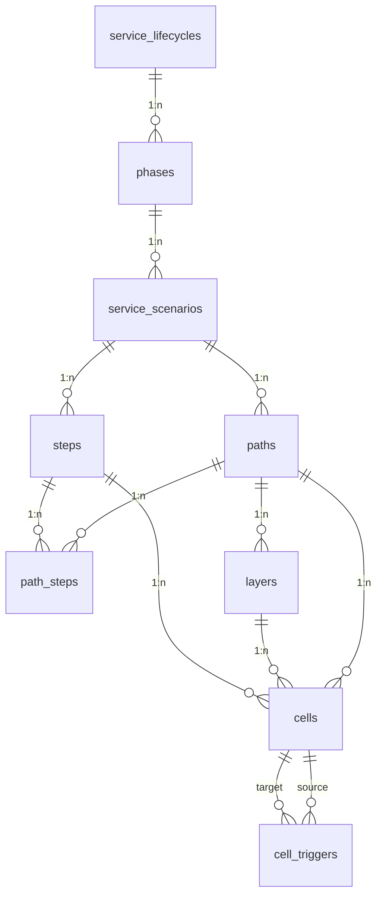

# Database

Postgres database managed by [Supabase](https://supabase.com/) for **PLUS Service Hub**.

| Property | Value |
| --- | --- |
| **Engine** | PostgreSQL 17 |
| **Primary schema** | `public` |
| **Migrations** | `supabase/migrations/` |
| **Seed data** | `supabase/seed.sql` |
| **ERD source** | `docs/erd.mmd` |
| **TypeScript types** | `src/types/database.ts` |
| **Verification SQL** | `docs/seed-verification.sql` |

## Connection (application)

| Variable | Description |
| --- | --- |
| `VITE_SUPABASE_URL` | Project API URL |
| `VITE_SUPABASE_ANON_KEY` | Public anon key (**Settings → API**) |

## Entity relationship (Service Blueprint)



## Hierarchy

| Level | Table | Ordering |
| --- | --- | --- |
| Service Lifecycle | `service_lifecycles` | — |
| Phase | `phases` | `order_position` |
| Service Scenario | `service_scenarios` | `order_position` |
| Path | `paths` | `path_type`: happy, unhappy, exception, alternative |
| Blueprint row | `layers` | `row_position` (per path) |
| Blueprint column | `steps` | canonical per `service_scenario` |
| Path column order | `path_steps` | `column_position` per `(path_id, step_id)` |
| Cell content | `cells` | unique `(layer_id, step_id)` per path |
| Cell dependency | `cell_triggers` | unique `(source_cell_id, target_cell_id)` |

**Cascade deletes:** Deleting a lifecycle removes phases, scenarios, paths, layers, steps, path_steps, cells, and triggers. Deleting a phase removes its descendants.

**Path integrity:** `cells.path_id` must match `layers.path_id`, and `cells.step_id` must appear in `path_steps` for that path (trigger `cells_validate_path_match`).

**Shared steps:** Multiple paths under the same scenario can reference the same `steps.id` via `path_steps` with different `column_position` values. See [`docs/scenario-steps-design.md`](../docs/scenario-steps-design.md).

## Seed data (fixed UUIDs)

| UUID suffix | Entity |
| --- | --- |
| `…000001` | Lifecycle: PLUS Application |
| `…000101` | Phase: Application |
| `…000102` | Phase: Onboarding |
| `…000103` | Phase: Pre-session |
| `…000104` | Phase: in-session |
| `…000105` | Phase: post-session (loops to Pre-session) |
| `…000201–206` | Pre-session scenarios (Before Students Join → Wrap-up) |

Stack/Canvas UI loads phases and nested scenarios via `useLifecyclePhases`.

**Warm-Up Happy Path** (`supabase/seeds/warm_up_happy_path.sql`): 9 layers, 8 steps, 38 cells, 7 Regular Tutor triggers. ID map: [`docs/warm-up-happy-path-ids.md`](../docs/warm-up-happy-path-ids.md).

## Row Level Security

Blueprint tables and `services` have RLS **enabled** with public `SELECT` policies. No write policies yet.

## Migration history

| File | Description |
| --- | --- |
| `20250602160000_initial.sql` | `services` catalog |
| `20250602170000_service_workflow_erd.sql` | Legacy ERD (superseded) |
| `20250603120000_service_blueprint.sql` | Service Blueprint schema; drops legacy workflow tables |
| `20250604000000_scenario_steps_path_steps.sql` | Scenario-scoped steps + `path_steps` ordering |

## Example query (path blueprint)

```ts
const { data } = await supabase
  .from('paths')
  .select(`
    id,
    name,
    path_type,
    service_scenarios (
      id,
      name,
      phases (
        id,
        name,
        order_position,
        service_lifecycles ( id, name )
      )
    ),
    layers ( id, name, row_position ),
    path_steps (
      column_position,
      steps ( id, name )
    ),
    cells (
      id,
      content,
      layer_id,
      step_id
    )
  `)
  .eq('id', pathId)
  .single()
```

## Local commands

```bash
npm run supabase:reset          # migrations + seed
npm run supabase:types:local    # regenerate src/types/database.ts
```

## Hosted seed

```bash
supabase db execute --file supabase/seed.sql --linked
```
